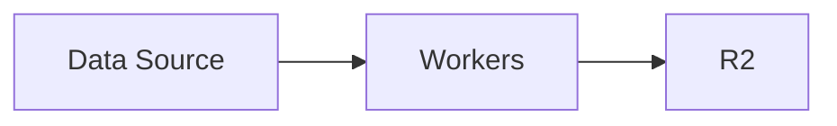
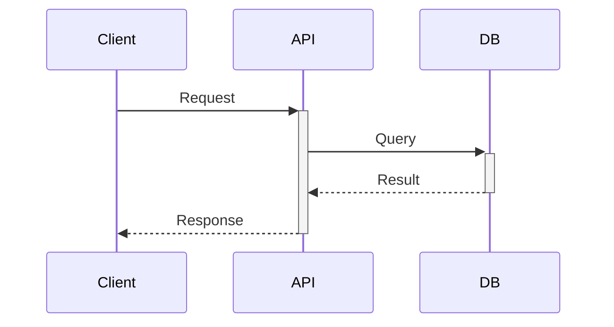

# Cloudflare Data Infrastructure Project

このドキュメントは、Cloudflareをベースとしたデータ基盤プロジェクトの開発ガイドです。

## プロジェクト概要

Cloudflareのエッジコンピューティングプラットフォームを活用し、グローバルに分散された低レイテンシ、高スケーラビリティなデータ基盤を構築するプロジェクトです。

### 主な特徴

- **エッジファースト**: Cloudflareのグローバルネットワークを活用した低レイテンシ処理
- **サーバーレス**: 自動スケーリングと運用負荷の削減
- **コスト最適化**: R2のエグレス無料など、従来のクラウドより低コスト
- **統合プラットフォーム**: Workers、KV、R2、D1など、統合されたサービス群

## 技術スタック

### コアテクノロジー

- **Cloudflare Workers**: エッジコンピューティングプラットフォーム
- **TypeScript**: 型安全な開発（メイン言語）
- **Hono**: Workers用軽量Webフレームワーク
- **Python**: dbt変換パイプライン
- **Wrangler**: Cloudflare Workers用CLI

### データストレージ

| サービス | 用途 | 特徴 |
|---------|------|------|
| **Workers KV** | キー・バリューストア | 低レイテンシ読み取り、最終的整合性 |
| **R2** | オブジェクトストレージ | S3互換、エグレス無料 |
| **D1** | SQLデータベース | SQLite、リレーショナルデータ |
| **Analytics Engine** | 時系列データ | 高カーディナリティ、SQL分析 |
| **Durable Objects** | ステートフル処理 | 強整合性、WebSocket対応 |
| **Queues** | メッセージキュー | 非同期処理、リトライ機能 |
| **Hyperdrive** | DB接続プール | PostgreSQL高速接続 |

## プロジェクト構造

```
data-engineering-with-cloudflare/
├── .claude/                    # Claude Code設定
│   └── CLAUDE.md              # このファイル
├── .github/workflows/          # GitHub Actions CI/CD
├── ingestion/                  # データ取り込みWorker (TypeScript/Hono)
│   ├── src/
│   │   ├── index.ts           # メインエントリ
│   │   ├── types.ts           # 型定義
│   │   ├── services/          # サービス層
│   │   └── __tests__/         # テスト
│   ├── biome.json             # Biome設定
│   ├── wrangler.jsonc         # Wrangler設定
│   └── package.json           # pnpm依存関係
├── transform/
│   └── core/                  # dbtプロジェクト (DuckDB)
│       ├── models/            # dbtモデル
│       ├── macros/            # dbtマクロ
│       ├── tests/             # dbtテスト
│       ├── seeds/             # シードデータ
│       ├── dbt_project.yml    # dbt設定
│       ├── .sqruff.toml       # SQLリンター設定
│       └── pyproject.toml     # Python依存関係 (uv)
├── mcp-server/                # MCPサーバー（予定）
├── ai/                        # AI関連（予定）
├── dashboard/                 # ダッシュボード（予定）
├── ml/                        # ML関連（予定）
├── infrastructure/
│   └── d1/                    # D1マイグレーション
│       └── migrations/        # SQLマイグレーションファイル
├── docs/                      # ドキュメント
├── scripts/                   # ユーティリティスクリプト
└── README.md                 # プロジェクト概要
```

## 開発ガイドライン

### コーディング規約

1. **TypeScript優先**: 型安全性を確保するため、TypeScriptを使用
2. **Biome**: Linting & Formattingに Biome を使用（ESLint/Prettier不使用）
3. **pnpm**: パッケージマネージャーにpnpmを使用
4. **エラーハンドリング**: すべての非同期処理で適切なエラーハンドリングを実装
5. **レスポンス時間**: Workers実行時間は50ms以内を目標（CPU time制限考慮）
6. **セキュリティ**: APIキーや認証情報は環境変数で管理、コードに埋め込まない

### Workersベストプラクティス

#### TypeScript

```typescript
// ✅ Good: 環境変数からの読み取り
export default {
  async fetch(request: Request, env: Env) {
    const apiKey = env.API_KEY;
    // ...
  }
}

// ❌ Bad: ハードコード
const apiKey = "sk-xxx...";

// ✅ Good: 適切なエラーハンドリング
try {
  const data = await env.DB.prepare("SELECT * FROM users").all();
  return new Response(JSON.stringify(data), { status: 200 });
} catch (error) {
  console.error("Database error:", error);
  return new Response("Internal Server Error", { status: 500 });
}
```

#### Hono（Webフレームワーク）

```typescript
// ingestion Workerの基本構造
import { Hono } from "hono";

type Bindings = {
  DB: D1Database;
  GITHUB_TOKEN: string;
  GITHUB_USERNAME: string;
};

const app = new Hono<{ Bindings: Bindings }>();

app.get("/health", (c) => c.text("OK"));

app.get("/api/data", async (c) => {
  const result = await c.env.DB.prepare("SELECT * FROM data").all();
  return c.json(result);
});

export default app;
```

#### Biome設定

```jsonc
// ingestion/biome.json
{
  "formatter": {
    "indentStyle": "space",
    "indentWidth": 2,
    "lineWidth": 100
  },
  "javascript": {
    "formatter": {
      "quoteStyle": "double",
      "semicolons": "always",
      "trailingCommas": "es5"
    }
  }
}
```

#### dbt (SQL変換)

```bash
# transform/core/ で実行
uv run dbt run                    # モデル実行
uv run dbt test                   # テスト
uv run sqruff lint models/        # SQLリント（sqruff）
```

### ストレージ選択の判断基準

```typescript
// KV: 頻繁な読み取り、更新頻度が低い
await env.KV.put("config:theme", "dark");
const theme = await env.KV.get("config:theme");

// D1: リレーショナルデータ、トランザクション
const result = await env.DB.prepare(
  "INSERT INTO users (name, email) VALUES (?, ?)"
).bind(name, email).run();

// R2: 大容量ファイル
await env.BUCKET.put("uploads/file.pdf", fileData);

// Analytics Engine: メトリクス、イベント
env.ANALYTICS.writeDataPoint({
  blobs: ["user_action", userId],
  doubles: [responseTime],
  indexes: ["action_timestamp"]
});
```

### パフォーマンス考慮事項

1. **KVのキャッシュ活用**
   - 頻繁にアクセスするデータはKVでキャッシュ
   - TTL（Time To Live）を適切に設定

2. **バッチ処理**
   - Queuesを使った非同期処理
   - Cron Triggersでの定期実行

3. **データローカリティ**
   - エッジで完結できる処理は最大限エッジで実行
   - 外部API呼び出しは最小限に

## Cloudflare固有の考慮事項

### 制限値

| リソース | 制限 | 備考 |
|---------|------|------|
| Workers CPU時間 | 50ms（Free）/ 30秒（Paid） | CPU集約的な処理に注意 |
| Workers メモリ | 128MB | 大きなオブジェクトの処理に注意 |
| KV キーサイズ | 512バイト | |
| KV バリューサイズ | 25MB | |
| D1 データベースサイズ | 10GB（有料プラン） | |
| R2 オブジェクトサイズ | 5TB | マルチパートアップロード使用 |

### コスト最適化

1. **R2の活用**: S3からのマイグレーションでエグレス料金削減
2. **KVの書き込み制限**: 書き込みは有料なので、更新頻度を最小化
3. **Workers実行時間**: 処理を効率化してCPU時間を削減
4. **Analytics Engineのサンプリング**: 必要に応じてデータをサンプリング

## デプロイメント

### Wranglerを使ったデプロイ

```bash
# 開発環境での実行
wrangler dev

# プロダクションへのデプロイ
wrangler deploy

# 環境変数の設定
wrangler secret put API_KEY

# D1マイグレーション
wrangler d1 migrations apply <DATABASE_NAME>
```

### CI/CDパイプライン

GitHub Actionsを使用した自動デプロイ（推奨）:

```yaml
name: Deploy to Cloudflare Workers

on:
  push:
    branches:
      - main

jobs:
  deploy:
    runs-on: ubuntu-latest
    steps:
      - uses: actions/checkout@v3
      - uses: cloudflare/wrangler-action@v3
        with:
          apiToken: ${{ secrets.CLOUDFLARE_API_TOKEN }}
```

## テスト戦略

1. **Workers テスト**: Vitest + @cloudflare/vitest-pool-workers
2. **dbt テスト**: dbt test + Elementary
3. **E2Eテスト**: 本番環境でのスモークテスト

```typescript
// テスト例（Vitest + Workers Pool）
// ingestion/src/__tests__/index.test.ts
import { describe, it, expect } from "vitest";
import { SELF } from "cloudflare:test";

describe("Ingestion Worker", () => {
  it("should return health check", async () => {
    const response = await SELF.fetch("http://localhost/health");
    expect(response.status).toBe(200);
  });
});
```

```bash
# テスト実行コマンド
cd ingestion && pnpm test:run       # Vitest
cd transform/core && uv run dbt test # dbt
```

## セキュリティ

### 認証・認可

- **API認証**: Workers SecretsでAPIキー管理
- **ユーザー認証**: Cloudflare Access または外部IdP連携
- **CORS**: 適切なCORSヘッダー設定

### データ保護

- **暗号化**: R2はデフォルトで保存時暗号化
- **アクセス制御**: Service BindingsでWorkers間通信を制限
- **監査ログ**: Analytics Engineで重要なイベントを記録

## 監視とオブザーバビリティ

### Workers Observability

ingestion Workerは Workers Observability が有効化されています（`wrangler.jsonc`）:

```jsonc
{
  "observability": {
    "enabled": true,
    "head_sampling_rate": 1  // 全リクエストをサンプリング
  }
}
```

### メトリクス

- **Workers Observability**: ログ、トレース、メトリクスの統合ダッシュボード
- **Workers Analytics**: リクエスト数、レイテンシ、エラー率
- **Analytics Engine**: カスタムメトリクスの記録

### ログ管理

```typescript
// Workers Observabilityでは console.log が自動収集される
console.log("User created", { userId, timestamp: new Date().toISOString() });
```

### アラート設定

- エラー率が閾値を超えた場合
- レスポンス時間の異常
- ストレージ容量の警告

## トラブルシューティング

### よくある問題

1. **Workers CPU時間超過**
   - 解決策: 処理を分割、Queuesで非同期化

2. **KV整合性の問題**
   - 解決策: 最終的整合性を考慮した設計、D1への移行検討

3. **D1接続エラー**
   - 解決策: リトライロジック実装、エラーハンドリング強化

## 参考リソース

### 公式ドキュメント

- [Cloudflare Workers Docs](https://developers.cloudflare.com/workers/)
- [Wrangler CLI](https://developers.cloudflare.com/workers/wrangler/)
- [Workers KV](https://developers.cloudflare.com/kv/)
- [R2 Storage](https://developers.cloudflare.com/r2/)
- [D1 Database](https://developers.cloudflare.com/d1/)
- [Analytics Engine](https://developers.cloudflare.com/analytics/analytics-engine/)

### コミュニティ

- [Cloudflare Developers Discord](https://discord.gg/cloudflaredev)
- [Cloudflare Community](https://community.cloudflare.com/)
- [GitHub - cloudflare/workers-sdk](https://github.com/cloudflare/workers-sdk)

### ブログ・チュートリアル

- [Cloudflare Blog](https://blog.cloudflare.com/)
- [Workers Examples](https://developers.cloudflare.com/workers/examples/)

## プロジェクトロードマップ

### Phase 1: 基盤構築（完了）
- [x] アーキテクチャ設計ドキュメント作成
- [x] Wrangler環境セットアップ
- [x] リポジトリ構造リストラクチャリング
- [x] D1スキーマ設計（初期マイグレーション）

- [x] Biome Linting導入
- [x] Workers Observability有効化

### Phase 2: コア機能実装（進行中）
- [x] データ取り込みWorker（ingestion / Hono）
- [x] ストレージ層の実装（D1バインディング）
- [ ] Analytics Engine統合
- [ ] 基本的なダッシュボード
- [x] dbtプロジェクトセットアップ（transform/core）
- [x] Elementaryデータ品質監視統合
- [ ] MCPサーバー実装

### Phase 3: 拡張機能
- [ ] リアルタイム処理（Durable Objects）
- [ ] 高度な分析機能
- [ ] 外部システム連携（Hyperdrive）
- [ ] 監視・アラート体制

### Phase 4: 最適化
- [ ] パフォーマンスチューニング
- [ ] コスト最適化
- [ ] セキュリティ強化
- [ ] ドキュメント整備

## 開発ワークフロー

### ⚠️ 重要なルール

#### mainブランチでの直接作業の禁止

**絶対に `main` ブランチで直接コミットしないこと**

```bash
# ❌ 絶対にやってはいけない
git checkout main
# コード変更
git add .
git commit -m "変更"

# ✅ 正しい方法
git checkout main
git pull
git checkout -b feat/new-feature
# コード変更
git add .
git commit -m "feat: 新機能追加"
git push -u origin feat/new-feature
```

**理由:**
- mainは常にデプロイ可能な状態を保つ
- CI/CDパイプラインが正しく動作する
- レビュープロセスを経由することで品質を保つ
- 変更履歴が明確になる

**もしmainで誤ってコミットしてしまった場合:**

```bash
# まだpushしていない場合
git reset --soft HEAD~1  # コミットを取り消し（変更は保持）
git stash                # 変更を退避
git checkout -b feat/your-feature  # 新ブランチ作成
git stash pop            # 変更を復元
git add .
git commit -m "feat: your feature"
```

### ツール構成

| 用途 | ツール | 備考 |
|------|--------|------|
| Issue管理 | [Linear](https://linear.app/ta93abe/project/de-study-11c86e96b24b) | de-studyプロジェクト |
| PR管理 | [Graphite](https://app.graphite.com/) | スタック型PR |
| リポジトリ | GitHub | コードホスティング |

### Linear Issue記述ルール

- **図はMermaidで記述**: アーキテクチャ図やフロー図はMermaid記法を使用する
- LinearはMermaidをネイティブサポートしているため、コードブロックで記述すれば自動でレンダリングされる

````markdown
# 例: フローチャート


# 例: シーケンス図

````

### 開発フロー

**重要な原則:**
- ⚠️ **mainブランチでは絶対に直接作業しない**
- すべての変更はフィーチャーブランチで行う
- コミット前に必ずCIが通ることを確認

```text
1. Issue作成 (Linear)
   └── Backlog → Todo に移動

2. 開発開始
   ├── Linear: Todo → In Progress
   ├── mainブランチから最新を取得: git checkout main && git pull
   └── フィーチャーブランチ作成: git checkout -b <type>/<description>

3. 実装
   ├── コード実装
   ├── 適切な粒度でコミット
   │   └── 例: 1機能1コミット、refactorは別コミット
   └── コミットメッセージ: <type>: <description>
       └── Co-Authored-By: Claude Sonnet 4.5 <noreply@anthropic.com>

4. PR作成 (Graphite)
   ├── Graphiteでトラッキング: gt track
   ├── PRを作成: gt submit --no-interactive
   ├── Draft PRが作成される
   └── CI確認（claude-code-review、biome-check、GitGuardian等）

5. レビュー & 修正
   ├── Linear: In Progress → In Review
   ├── AIレビュー結果を確認（claude-code-review）
   ├── 必要に応じて修正
   │   ├── 修正コミット
   │   └── git push（自動でPR更新）
   └── 全CI通過を確認

6. マージ
   ├── DraftからReady for reviewに変更（必要に応じて）
   ├── 全CI通過を確認
   ├── gh pr merge <pr-number> --squash --delete-branch
   │   または Graphite/GitHub UIでマージ
   └── ローカルmain更新: git checkout main && git pull

7. 完了
   ├── Linear: In Review → Done
   └── ローカルブランチクリーンアップ（自動削除済み）
```

### ブランチ命名規則

```bash
<type>/<description>

例:
feat/add-r2-bucket-management

chore/update-dependencies
refactor/restructure-repository
docs/update-development-workflow
```

**Type:**
- `feat/`: 新機能
- `fix/`: バグ修正
- `chore/`: 依存関係更新、設定変更
- `refactor/`: リファクタリング
- `docs/`: ドキュメント更新
- `test/`: テスト追加・修正

### Graphiteコマンド

#### 基本フロー

```bash
# 初期化（初回のみ）
gt init

# 既存ブランチをトラッキング
git checkout feat/your-branch
gt track  # または gt branch track（推奨される新コマンド）

# PRを作成/更新
gt submit --no-interactive

# 現在の状態確認
gt state
```

#### よく使うコマンド

```bash
# 最新のmainを取得＆スタック全体をリベース
gt sync

# 外部変更を取得（リモートでコミットが追加された場合）
gt get

# ブランチ間移動（スタック型開発時）
gt up    # 上のブランチへ
gt down  # 下のブランチへ

# スタック全体をsubmit
gt submit --stack --no-interactive
```

#### トラブルシューティング

```bash
# force-pushが必要な場合（外部変更があった時）
gt submit --no-interactive --force

# ブランチの親を変更
gt branch parent <parent-branch>

# 現在のスタック構造を確認
gt log
gt log --short
```

### CI/CD確認

PR作成後、以下のCIが自動実行されます:

| CI | 用途 | 確認内容 |
|---|---|---|
| **biome-check** | Lint & Format | TypeScript/JSコード品質 |
| **claude-code-review** | AIコードレビュー | コード品質、潜在的バグ |
| **GitGuardian** | セキュリティチェック | シークレット漏洩検知 |

**マージ前の確認事項:**
- ✅ 全CIが pass していること
- ✅ レビューコメントに対応済み

### インフラ開発サイクル

#### D1マイグレーション

```bash
# 1. マイグレーションファイル作成
vim infrastructure/d1/migrations/0002_add_new_table.sql

# 2. ローカルで確認
cd infrastructure/d1
wrangler d1 migrations apply raw --local

# 3. コミット＆PR作成
git add infrastructure/d1/migrations/
git commit -m "feat: Add new table for analytics"
git push

# 4. マージ後、自動適用
# → d1-migrations.yml が wrangler d1 migrations apply raw を実行
```

#### Workers デプロイ

Workersは Cloudflare Dashboard の GitHub連携で自動デプロイされます:

- **mainへのpush** → 本番デプロイ
- **PRの作成/更新** → プレビューURL発行

手動デプロイ（必要な場合）:
```bash
cd ingestion
wrangler deploy
```

### 依存関係のアップデート

定期的に依存関係を更新します:

```bash
# 1. 新ブランチ作成
git checkout -b chore/update-dependencies

# 2. Wrangler更新
npm view wrangler version  # 最新版確認
# .github/workflows/d1-migrations.yml の wranglerVersion を更新

# 3. コミット＆PR
git add .
git commit -m "chore: Update Wrangler dependencies"
git push
```

### コミットメッセージ規約

Conventional Commits形式:

```text
<type>: <description>

[optional body]

[optional footer]
```

**Type一覧**:
- `feat`: 新機能
- `fix`: バグ修正
- `docs`: ドキュメント
- `refactor`: リファクタリング
- `test`: テスト
- `chore`: その他

### Linear Issue連携

PRタイトルまたはdescriptionにLinear issue IDを含めると自動連携:

```text
# PRタイトル例
feat: Add user authentication [DEC-123]

# PR description例
Closes DEC-123
```

## 貢献ガイドライン

1. **ブランチ戦略**: `main` ブランチは常にデプロイ可能な状態を維持
2. **コミットメッセージ**: Conventional Commits形式を推奨
3. **プルリクエスト**: Graphiteでスタック型PRを作成
4. **Issue管理**: Linearでissueを作成・管理
5. **ドキュメント**: 新機能追加時は必ずドキュメント更新

## ライセンス

TBD

---

最終更新: 2026-02-07
