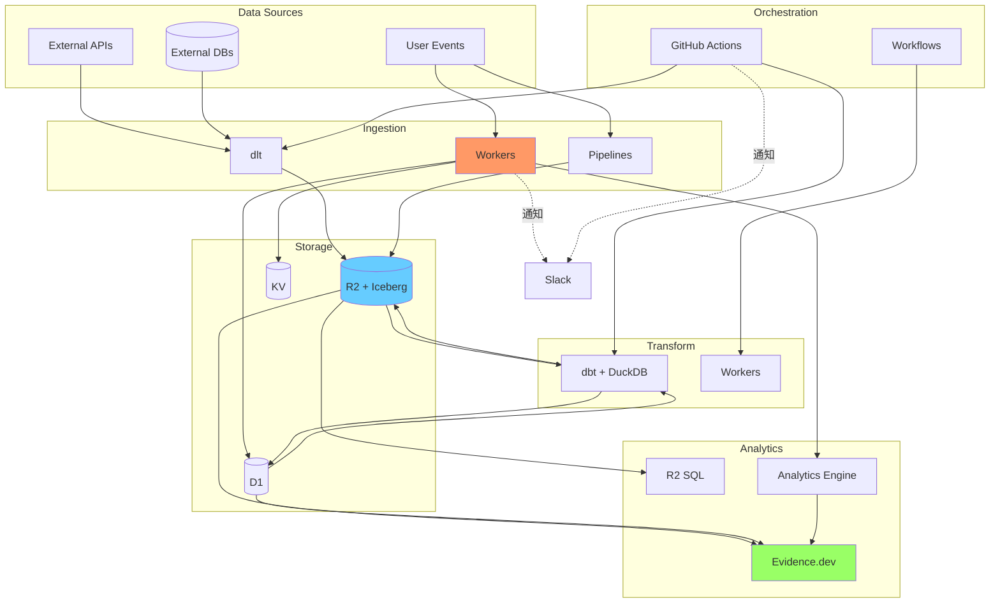

# Data Engineering with Cloudflare

Cloudflareのエッジコンピューティングプラットフォームを活用したデータ基盤のリポジトリです。

## 📚 ドキュメント

- [アーキテクチャ設計概要](./docs/architecture-design.md) - Cloudflareデータ基盤の全体設計
- [アーキテクチャ図](./docs/architecture-diagrams.md) - Mermaid形式の視覚的なアーキテクチャ図（9種類）
- [Cloudflareサービスカタログ](./docs/cloudflare-services-catalog.md) - 全サービスの詳細とデータ基盤での活用方法（2025年最新版）
- [外部サービス統合ガイド](./docs/external-services.md) - dbt、dlt、DuckDB、Evidence.dev等との連携方法
- [情報源リンク集](./docs/resources.md) - 公式ドキュメント、ブログ、コミュニティリソース

## 🚀 Cloudflare データサービス

このプロジェクトでは、以下のCloudflareサービスを活用します：

### コア基盤
- **Workers**: サーバーレスコンピューティング（フルスタック対応）
- **Workflows**: 耐久性のある実行エンジン（Python対応 ✨NEW）
- **Containers**: フルLinuxコンテナ（2025年6月公開予定 🚧）

### ストレージ・データベース
- **D1**: サーバーレスSQLデータベース（パフォーマンス向上 ⚡）
- **Workers KV**: キー・バリューストレージ
- **R2**: S3互換オブジェクトストレージ（エグレス無料、R2 SQL対応 ✨NEW）
- **Vectorize**: ベクトルデータベース（GA ✨NEW）
- **Hyperdrive**: PostgreSQL/MySQL接続プール

### データ処理・AI
- **Pipelines**: ストリーミングETL（SQL変換対応 ✨NEW）
- **Workers AI**: AI推論プラットフォーム（50+モデル）
- **AI Gateway**: AI制御・監視プレーン
- **Analytics Engine**: 時系列メトリクスDB

### メッセージング・イベント
- **Queues**: メッセージキューサービス
- **R2 Event Notifications**: R2イベント駆動処理（ベータ 🔵）
- **Durable Objects**: ステートフルアプリケーション

### その他
- **Calls**: WebRTCリアルタイム通信（ベータ 🔵）
- **Stream**: 動画ストリーミング
- **Pages**: フルスタックホスティング
- **Browser Rendering**: ヘッドレスブラウザ（ベータ 🔵）

詳細は[サービスカタログ](./docs/cloudflare-services-catalog.md)をご覧ください。

## 🎯 プロジェクト目標

- グローバルに分散された低レイテンシなデータ基盤の構築
- コスト効率の高いデータストレージと処理
- スケーラブルで信頼性の高いアーキテクチャ
- 開発・運用の効率化

## 🔧 外部サービス統合

Cloudflareサービスと組み合わせて、エンドツーエンドのデータパイプラインを構築します：

### データ変換・処理
- **dbt**: SQLベースのデータ変換・モデリング
- **dlt**: Pythonベースのデータ抽出・ロードツール
- **DuckDB**: R2上のParquet/Icebergファイルを直接クエリ

### データフォーマット
- **Apache Iceberg**: R2上でのACIDトランザクション対応テーブルフォーマット

### データ可視化
- **Evidence.dev**: コードベースのBIツール（Cloudflare Pagesへデプロイ）

### CI/CD・開発
- **GitHub**: バージョン管理・コラボレーション
- **GitHub Actions**: ETLパイプライン自動実行・Workers自動デプロイ

### 通知・監視
- **Slack**: パイプライン実行結果・アラート通知

詳細は[外部サービス統合ガイド](./docs/external-services.md)をご覧ください。

## 📐 アーキテクチャ概要

詳細は[アーキテクチャ図](./docs/architecture-diagrams.md)をご覧ください（9種類のMermaid図を提供）。

## 📖 はじめに

詳細な設計と実装ガイドについては、[アーキテクチャ設計概要](./docs/architecture-design.md)をご覧ください。

