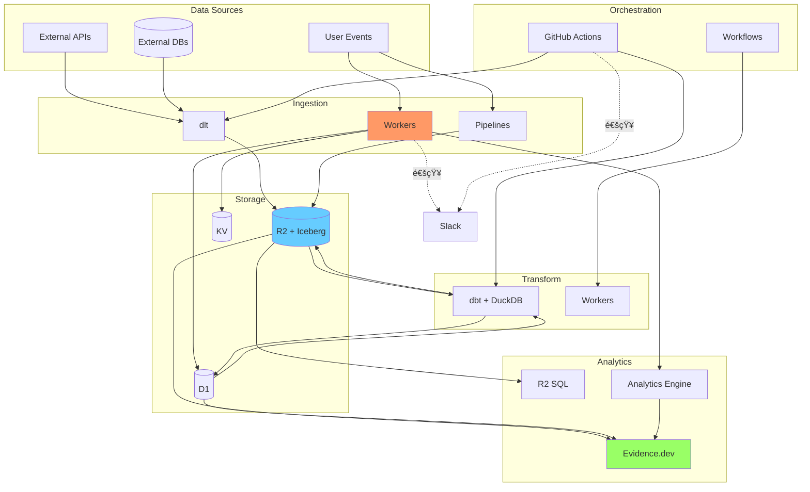

# Data Engineering with Cloudflare

Cloudflareã®ã‚¨ãƒƒã‚¸ã‚³ãƒ³ãƒ”ューティングプラットフォームを活用ã—ãŸãƒ‡ãƒ¼ã‚¿åŸºç›¤ã®ãƒªãƒã‚¸ãƒˆãƒªã§ã™ã€‚

## 📚 ドキュメント

- [アーキテクãƒãƒ£è¨­è¨ˆæ¦‚è¦](./docs/architecture-design.md) - Cloudflareデータ基盤ã®å…¨ä½“設計
- [アーキテクãƒãƒ£å›³](./docs/architecture-diagrams.md) - Mermaidå½¢å¼ã®è¦–覚的ãªã‚¢ãƒ¼ã‚­ãƒ†ã‚¯ãƒãƒ£å›³ï¼ˆ9種é¡ï¼‰
- [Cloudflareサービスカタログ](./docs/cloudflare-services-catalog.md) - 全サービスã®è©³ç´°ã¨ãƒ‡ãƒ¼ã‚¿åŸºç›¤ã§ã®æ´»ç”¨æ–¹æ³•ï¼ˆ2025年最新版）
- [外部サービス統åˆã‚¬ã‚¤ãƒ‰](./docs/external-services.md) - dbtã€dltã€DuckDBã€Evidence.devç­‰ã¨ã®é€£æºæ–¹æ³•
- [R2ストレージ設計](./docs/r2-storage-design.md) - ãƒã‚±ãƒƒãƒˆæˆ¦ç•¥ã¨ãƒ•ã‚©ãƒ«ãƒ€æ§‹é€ ã®è©³ç´°è¨­è¨ˆï¼ˆ4ãƒã‚±ãƒƒãƒˆæ§‹æˆï¼‰
- [dlt Workers実装ガイド](./docs/dlt-workers-implementation.md) - Workers上ã§ã®dltパイプライン実装
- [Iceberg実装ガイド](./docs/iceberg-implementation.md) - Apache Iceberg on Cloudflare（PyIceberg + R2 Data Catalog）
- **[🚀 Icebergセットアップガイド](./docs/iceberg-setup-guide.md)** - R2 Data Catalogを使ã£ãŸå®Ÿè·µçš„ãªã‚»ãƒƒãƒˆã‚¢ãƒƒãƒ—手順（ベータ版対応）
- **[💰 コスト分æ](./docs/cost-analysis.md)** - 固定費・変動費ã®è©³ç´°è©¦ç®—ã¨ã‚³ã‚¹ãƒˆæœ€é©åŒ–戦略
- **[🙠GitHubデータパイプライン](./docs/github-data-pipeline.md)** - 全リãƒã‚¸ãƒˆãƒªã®ãƒ¡ãƒˆãƒªã‚¯ã‚¹ãƒ»ã‚¢ã‚¯ãƒ†ã‚£ãƒ“ティ自動å集（dltçµ±åˆï¼‰
- **[âš¡ GitHub Workers設計](./docs/github-workers-design.md)** - Cloudflare Workersベースã®GitHubデータå–得アーキテクãƒãƒ£ï¼ˆè¨­è¨ˆãƒ•ã‚§ãƒ¼ã‚ºï¼‰
- **[🔄 GitHub dbt変æ›è¨­è¨ˆ](./docs/github-dbt-design.md)** - dbtã§Raw→Staging→Marts変æ›ã€ãƒ¡ãƒˆãƒªã‚¯ã‚¹ãƒ»KPI定義（設計フェーズ）
- **[📊 GitHub Evidence.devå¯è¦–化設計](./docs/github-evidence-design.md)** - Evidence.devダッシュボードã€Workers+R2デプロイ（設計フェーズ）
- **[🯠GitHub実装計画](./docs/github-implementation-plan.md)** - 6週間MVP実装ロードãƒãƒƒãƒ—ã€ãƒ•ã‚§ãƒ¼ã‚ºåˆ¥ã‚¿ã‚¹ã‚¯ï¼ˆå®Ÿè£…開始）
- **[ğŸ› ï¸ GitHub Workersセットアップガイド](./docs/github-workers-setup.md)** - Workers実装ã®ã‚»ãƒƒãƒˆã‚¢ãƒƒãƒ—ã¨ãƒ‡ãƒ—ロイ手順
- **[🧪 GitHub Workersテストガイド](./docs/github-workers-testing.md)** - Vitestを使ã£ãŸãƒ¦ãƒ‹ãƒƒãƒˆ/çµ±åˆãƒ†ã‚¹ãƒˆã€ã‚«ãƒãƒ¬ãƒƒã‚¸æ¸¬å®š
- **[📋 セットアップTODOリスト](./docs/SETUP_TODO.md)** - 手動セットアップ手順ã¨ãƒã‚§ãƒƒã‚¯ãƒªã‚¹ãƒˆï¼ˆTerraform + Secrets設定）
- [情報æºãƒªãƒ³ã‚¯é›†](./docs/resources.md) - å…¬å¼ãƒ‰ã‚­ãƒ¥ãƒ¡ãƒ³ãƒˆã€ãƒ–ログã€ã‚³ãƒŸãƒ¥ãƒ‹ãƒ†ã‚£ãƒªã‚½ãƒ¼ã‚¹

## 🚀 Cloudflare データサービス

ã“ã®ãƒ—ロジェクトã§ã¯ã€ä»¥ä¸‹ã®Cloudflareサービスを活用ã—ã¾ã™ï¼š

### コア基盤
- **Workers**: サーãƒãƒ¼ãƒ¬ã‚¹ã‚³ãƒ³ãƒ”ューティング（フルスタック対応）
- **Workflows**: è€ä¹…性ã®ã‚る実行エンジン（Python対応 ✨NEW）
- **Containers**: フルLinuxコンテナ（2025年6月公開予定 🚧）

### ストレージ・データベース
- **D1**: サーãƒãƒ¼ãƒ¬ã‚¹SQLデータベース（パフォーãƒãƒ³ã‚¹å‘上 ⚡）
- **Workers KV**: キー・ãƒãƒªãƒ¥ãƒ¼ã‚¹ãƒˆãƒ¬ãƒ¼ã‚¸
- **R2**: S3互æ›ã‚ªãƒ–ジェクトストレージ（エグレス無料ã€R2 SQL対応 ✨NEW）
- **Vectorize**: ベクトルデータベース（GA ✨NEW）
- **Hyperdrive**: PostgreSQL/MySQLæ¥ç¶šãƒ—ール

### データ処ç†ãƒ»AI
- **Pipelines**: ストリーミングETL（SQL変æ›å¯¾å¿œ ✨NEW）
- **Workers AI**: AIæ¨è«–プラットフォーム（50+モデル）
- **AI Gateway**: AI制御・監視プレーン
- **Analytics Engine**: 時系列メトリクスDB

### メッセージング・イベント
- **Queues**: メッセージキューサービス
- **R2 Event Notifications**: R2イベント駆動処ç†ï¼ˆãƒ™ãƒ¼ã‚¿ 🔵）
- **Durable Objects**: ステートフルアプリケーション

### ãã®ä»–
- **Calls**: WebRTCリアルタイム通信（ベータ 🔵）
- **Stream**: 動画ストリーミング
- **Pages**: フルスタックホスティング
- **Browser Rendering**: ヘッドレスブラウザ（ベータ 🔵）

詳細ã¯[サービスカタログ](./docs/cloudflare-services-catalog.md)ã‚’ã”覧ãã ã•ã„。

## 🯠プロジェクト目標

- グローãƒãƒ«ã«åˆ†æ•£ã•ã‚ŒãŸä½ãƒ¬ã‚¤ãƒ†ãƒ³ã‚·ãªãƒ‡ãƒ¼ã‚¿åŸºç›¤ã®æ§‹ç¯‰
- コスト効ç‡ã®é«˜ã„データストレージã¨å‡¦ç†
- スケーラブルã§ä¿¡é ¼æ€§ã®é«˜ã„アーキテクãƒãƒ£
- 開発・é‹ç”¨ã®åŠ¹ç‡åŒ–

## 🔧 外部サービス統åˆ

Cloudflareサービスã¨çµ„ã¿åˆã‚ã›ã¦ã€ã‚¨ãƒ³ãƒ‰ãƒ„ーエンドã®ãƒ‡ãƒ¼ã‚¿ãƒ‘イプラインを構築ã—ã¾ã™ï¼š

### データ変æ›ãƒ»å‡¦ç†
- **dbt**: SQLベースã®ãƒ‡ãƒ¼ã‚¿å¤‰æ›ãƒ»ãƒ¢ãƒ‡ãƒªãƒ³ã‚°
- **dlt**: Pythonベースã®ãƒ‡ãƒ¼ã‚¿æŠ½å‡ºãƒ»ãƒ­ãƒ¼ãƒ‰ãƒ„ール
- **DuckDB**: R2上ã®Parquet/Icebergファイルを直æ¥ã‚¯ã‚¨ãƒª

### データå“質
- **Elementary**: dbtå‘ã‘データå“質監視・オブザーãƒãƒ“リティツール ✨NEW
- **Great Expectations**: Pythonベースã®ãƒ‡ãƒ¼ã‚¿æ¤œè¨¼ãƒ»ãƒ—ロファイリングツール ✨NEW

### データフォーãƒãƒƒãƒˆ
- **Apache Iceberg**: R2上ã§ã®ACIDトランザクション対応テーブルフォーãƒãƒƒãƒˆ

### データå¯è¦–化
- **Evidence.dev**: コードベースã®BIツール（Cloudflare Pagesã¸ãƒ‡ãƒ—ロイ）
- **marimo**: Git-friendlyãªãƒªã‚¢ã‚¯ãƒ†ã‚£ãƒ–Pythonãƒãƒ¼ãƒˆãƒ–ック ✨NEW

### CI/CD・開発
- **GitHub**: ãƒãƒ¼ã‚¸ãƒ§ãƒ³ç®¡ç†ãƒ»ã‚³ãƒ©ãƒœãƒ¬ãƒ¼ã‚·ãƒ§ãƒ³
- **GitHub Actions**: ETLパイプライン自動実行・Workers自動デプロイ

### 通知・監視
- **Slack**: パイプライン実行çµæœãƒ»ã‚¢ãƒ©ãƒ¼ãƒˆé€šçŸ¥

詳細ã¯[外部サービス統åˆã‚¬ã‚¤ãƒ‰](./docs/external-services.md)ã‚’ã”覧ãã ã•ã„。

## 📠アーキテクãƒãƒ£æ¦‚è¦


```mermaid
graph TB
    subgraph "Data Sources"
        API[External APIs]
        Events[User Events]
        DB[(External DBs)]
    end

    subgraph "Ingestion"
        dlt[dlt]
        Workers[Workers]
        Pipelines[Pipelines]
    end

    subgraph "Storage"
        R2[(R2 + Iceberg)]
        D1[(D1)]
        KV[(KV)]
    end

    subgraph "Transform"
        dbt[dbt + DuckDB]
        WorkersT[Workers]
    end

    subgraph "Analytics"
        Evidence[Evidence.dev]
        R2SQL[R2 SQL]
        Engine[Analytics Engine]
    end

    subgraph "Orchestration"
        GHA[GitHub Actions]
        WF[Workflows]
    end

    API --> dlt
    Events --> Workers
    Events --> Pipelines
    DB --> dlt

    dlt --> R2
    Workers --> D1
    Workers --> KV
    Workers --> Engine
    Pipelines --> R2

    R2 --> dbt
    D1 --> dbt
    dbt --> R2
    dbt --> D1

    R2 --> Evidence
    R2 --> R2SQL
    D1 --> Evidence
    Engine --> Evidence

    GHA --> dlt
    GHA --> dbt
    WF --> WorkersT

    Workers -.通知.-> Slack[Slack]
    GHA -.通知.-> Slack

    style Workers fill:#f96
    style R2 fill:#6cf
    style Evidence fill:#9f6
```

詳細ã¯[アーキテクãƒãƒ£å›³](./docs/architecture-diagrams.md)ã‚’ã”覧ãã ã•ã„（11種é¡ã®Mermaid図をæ供）。

## ğŸ—ï¸ Infrastructure as Code (IaC)

ã“ã®ãƒ—ロジェクトã§ã¯ **Terraform** 㨠**Makefile** を使ã£ã¦ã‚¤ãƒ³ãƒ•ãƒ©ã¨ãƒ‡ãƒ—ロイを自動化ã—ã¦ã„ã¾ã™ã€‚

### Terraform ã§ç®¡ç†ã•ã‚Œã‚‹ãƒªã‚½ãƒ¼ã‚¹:

- ✅ **R2 Buckets** (data-lake-raw, data-lake-raw-preview)
- ✅ **Queues** (github-fetch-queue, github-fetch-dlq)
- ✅ **KV Namespaces** (METADATA_KV, METADATA_KV_PRODUCTION)
- ✅ **Workers** (github-scheduler, github-fetcher)
- ✅ **Queue Consumers** (Fetcher Worker ãƒã‚¤ãƒ³ãƒ‡ã‚£ãƒ³ã‚°)
- ✅ **Cron Triggers** (æ¯æ—¥ 2:00 AM UTC)

### クイックセットアップ:

```bash
# 1. åˆæœŸã‚»ãƒƒãƒˆã‚¢ãƒƒãƒ—
make setup

# 2. terraform.tfvars を編集
nano terraform/terraform.tfvars

# 3. Cloudflare API Token を設定
export CLOUDFLARE_API_TOKEN="your-api-token"

# 4. インフラ作æˆ
make init
make plan
make apply

# 5. Secrets 設定（手動）
make setup-secrets

# 6. テスト実行
make test

# 7. デプロイ（本番ã®å ´åˆã®ã¿ï¼‰
make deploy
```

### 便利ãªã‚³ãƒãƒ³ãƒ‰:

```bash
make help           # 利用å¯èƒ½ãªã‚³ãƒãƒ³ãƒ‰ä¸€è¦§
make test           # 全テスト実行
make test-coverage  # ã‚«ãƒãƒ¬ãƒƒã‚¸ãƒ¬ãƒãƒ¼ãƒˆç”Ÿæˆ
make logs-scheduler # Scheduler Worker ã®ãƒ­ã‚°ç¢ºèª
make logs-fetcher   # Fetcher Worker ã®ãƒ­ã‚°ç¢ºèª
make trigger        # Scheduler 手動実行
make status         # デプロイ状æ³ç¢ºèª
```

### 手動設定ãŒå¿…è¦ãªã‚‚ã®:

- ⌠**GitHub Personal Access Token** (セキュリティ上 Terraform 管ç†å¤–)
- ⌠**Cloudflare API Token** (åˆå›ã®ã¿)
- ⌠**wrangler.toml ã® ID æ›´æ–°** (Terraform outputs ã‹ã‚‰å–å¾—)

詳細ã¯ä»¥ä¸‹ã‚’å‚ç…§:
- **[📋 SETUP_TODO.md](./docs/SETUP_TODO.md)** - 手動セットアップ手順（TODO リスト）
- **[📖 terraform/README.md](./terraform/README.md)** - Terraform 設定ガイド
- **[ğŸ› ï¸ Makefile](./Makefile)** - 自動化コãƒãƒ³ãƒ‰ä¸€è¦§

## 📖 ã¯ã˜ã‚ã«

### 🚀 クイックスタート

**R2 Data Catalog + Iceberg環境を15分ã§ã‚»ãƒƒãƒˆã‚¢ãƒƒãƒ—:**

👉 **[QUICKSTART.md](./QUICKSTART.md)** - 3ステップã§å³åº§ã«å§‹ã‚られるガイド

### 📚 詳細ドキュメント

詳細ãªè¨­è¨ˆã¨å®Ÿè£…ガイドã«ã¤ã„ã¦ã¯ã€[アーキテクãƒãƒ£è¨­è¨ˆæ¦‚è¦](./docs/architecture-design.md)ã‚’ã”覧ãã ã•ã„。

