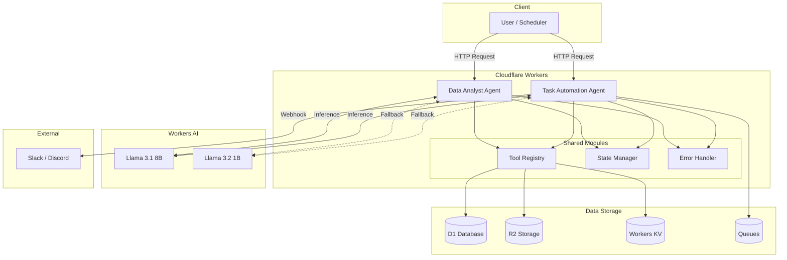
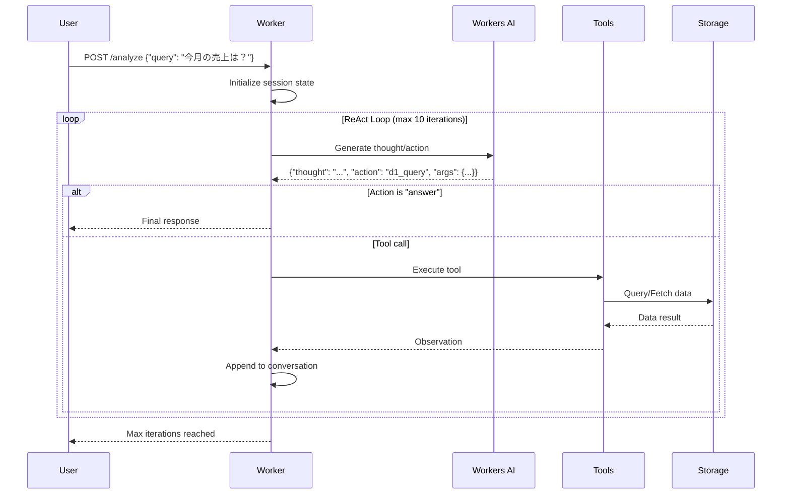
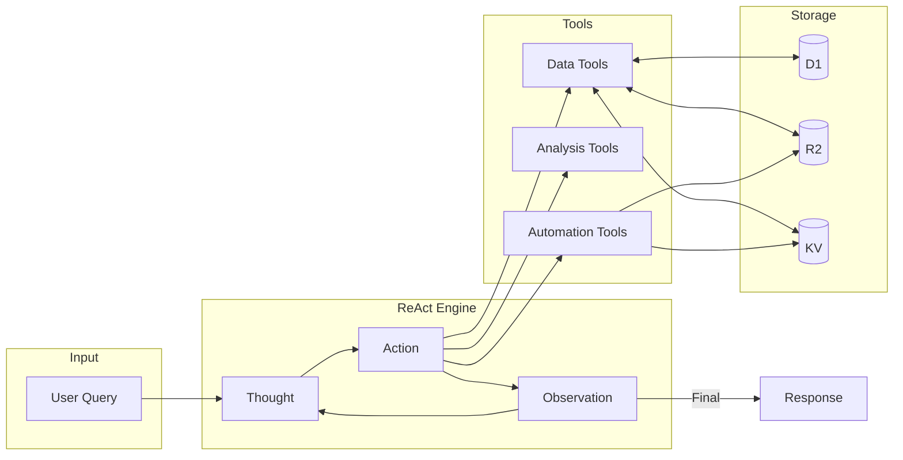

# AIエージェント設計ドキュメント

Cloudflare Workers + Workers AIを使用したAIエージェントの設計と実装ガイドです。

## 目次

1. [概要](#概要)
2. [アーキテクチャ](#アーキテクチャ)
3. [ツール定義](#ツール定義)
4. [実装コード例](#実装コード例)
5. [状態管理設計](#状態管理設計)
6. [エラーハンドリング](#エラーハンドリング)
7. [Cloudflare制約への対応](#cloudflare制約への対応)
8. [API仕様](#api仕様)
9. [検証方法](#検証方法)

---

## 概要

### 対象エージェント

本設計では以下の2種類のAIエージェントを定義します。

| エージェント | 役割 | 主なユースケース |
|-------------|------|------------------|
| **データ分析エージェント** | D1/R2のデータを分析・レポート生成 | 売上分析、トレンド把握、異常検知 |
| **タスク自動化エージェント** | ワークフローの自動実行 | 定期レポート、アラート通知、データ変換 |

### ReActアーキテクチャ

両エージェントは **ReAct (Reasoning + Acting)** パターンを採用します。

```
User Query → [Thought → Action → Observation] × N → Final Answer
```

**ReActの特徴:**
- **Thought**: 現在の状況を分析し、次のアクションを決定
- **Action**: ツールを呼び出してデータを取得・操作
- **Observation**: ツールの結果を観察し、次の思考に反映

Workers AIはネイティブFunction Callingをサポートしていないため、**プロンプトベースのツール呼び出し**を実装します。

### 設計原則

1. **読み取り専用データアクセス**: D1はSELECTのみ、R2は読み取り優先
2. **べき等性**: 同じ入力に対して同じ結果を返す
3. **タイムアウト対応**: 各ステップに制限時間を設定
4. **トレーサビリティ**: 全ステップをログ記録

---

## アーキテクチャ

### システム構成図



### ReActフロー図



### データフロー図



### ファイル構成

```
workers/agents/
├── shared/                    # 共通モジュール
│   ├── types.ts              # 型定義
│   ├── tool-registry.ts      # ツール管理
│   ├── state-manager.ts      # 状態管理
│   └── error-handler.ts      # エラー処理・リトライ
│
├── tools/                     # ツール定義
│   ├── data-tools.ts         # d1_query, r2_list, r2_get_json, kv_get
│   ├── analysis-tools.ts     # calculate_statistics, compare_periods, generate_summary
│   ├── automation-tools.ts   # send_notification, schedule_task, write_report, kv_put
│   └── index.ts              # ツールエクスポート
│
├── data-analyst/              # データ分析エージェント
│   ├── index.ts              # Workerエントリポイント
│   ├── agent.ts              # ReActループ実装
│   ├── prompts.ts            # システムプロンプト
│   └── wrangler.toml         # Workers設定
│
└── task-automation/           # タスク自動化エージェント
    ├── index.ts              # Workerエントリポイント
    ├── agent.ts              # ワークフロー実行エンジン
    ├── workflows/            # ワークフロー定義
    │   ├── daily-report.ts   # 日次レポート
    │   └── anomaly-alert.ts  # 異常アラート
    ├── prompts.ts            # システムプロンプト
    └── wrangler.toml         # Workers設定
```

---

## ツール定義

### ツールインターフェース

MCP形式を踏襲したツール定義インターフェースです。

```typescript
interface Tool {
  name: string;
  description: string;
  parameters: {
    type: "object";
    properties: Record<string, JSONSchema>;
    required: string[];
  };
  execute: (args: Record<string, unknown>, env: Env) => Promise<ToolResult>;
}

interface ToolResult {
  success: boolean;
  data?: unknown;
  error?: string;
}

interface JSONSchema {
  type: string;
  description: string;
  enum?: string[];
  items?: JSONSchema;
  default?: unknown;
}
```

### データツール

データソース（D1/R2/KV）へのアクセスを提供します。

#### d1_query

D1データベースへのSELECTクエリ実行（読み取り専用）。

```json
{
  "name": "d1_query",
  "description": "D1データベースにSELECTクエリを実行して結果を取得します。INSERT/UPDATE/DELETEは許可されていません。",
  "parameters": {
    "type": "object",
    "properties": {
      "sql": {
        "type": "string",
        "description": "実行するSELECTクエリ。必ずLIMIT句を含めてください（最大1000行）"
      },
      "params": {
        "type": "array",
        "description": "SQLパラメータ（プレースホルダー?用）",
        "items": { "type": ["string", "number", "boolean", "null"] }
      }
    },
    "required": ["sql"]
  }
}
```

#### r2_list

R2バケット内のオブジェクト一覧を取得。

```json
{
  "name": "r2_list",
  "description": "R2バケット内のオブジェクト一覧を取得します",
  "parameters": {
    "type": "object",
    "properties": {
      "prefix": {
        "type": "string",
        "description": "フィルタするプレフィックス（例: 'reports/2024/'）"
      },
      "limit": {
        "type": "number",
        "description": "最大取得件数（1〜1000、デフォルト: 100）",
        "default": 100
      }
    },
    "required": []
  }
}
```

#### r2_get_json

R2からJSONファイルを取得してパース。

```json
{
  "name": "r2_get_json",
  "description": "R2バケットからJSONファイルを取得してパースします",
  "parameters": {
    "type": "object",
    "properties": {
      "key": {
        "type": "string",
        "description": "取得するオブジェクトのキー（例: 'data/sales.json'）"
      }
    },
    "required": ["key"]
  }
}
```

#### kv_get

KVストアから値を取得。

```json
{
  "name": "kv_get",
  "description": "Workers KVから値を取得します",
  "parameters": {
    "type": "object",
    "properties": {
      "key": {
        "type": "string",
        "description": "取得するキー"
      }
    },
    "required": ["key"]
  }
}
```

### 分析ツール

データの分析・変換を行います。

#### calculate_statistics

数値データの基本統計量を計算。

```json
{
  "name": "calculate_statistics",
  "description": "数値配列の基本統計量（min, max, avg, median, sum, count）を計算します",
  "parameters": {
    "type": "object",
    "properties": {
      "values": {
        "type": "array",
        "description": "統計を計算する数値の配列",
        "items": { "type": "number" }
      }
    },
    "required": ["values"]
  }
}
```

#### compare_periods

期間比較と変化率を計算。

```json
{
  "name": "compare_periods",
  "description": "2つの期間のデータを比較し、変化率を計算します",
  "parameters": {
    "type": "object",
    "properties": {
      "current_value": {
        "type": "number",
        "description": "現在期間の値"
      },
      "previous_value": {
        "type": "number",
        "description": "前期間の値"
      },
      "metric_name": {
        "type": "string",
        "description": "メトリクス名（例: '売上'）"
      }
    },
    "required": ["current_value", "previous_value"]
  }
}
```

#### generate_summary

AIによるデータ要約生成。

```json
{
  "name": "generate_summary",
  "description": "データをAIで要約します。大量のデータポイントを人間が理解しやすい形式にまとめます",
  "parameters": {
    "type": "object",
    "properties": {
      "data": {
        "type": "object",
        "description": "要約するデータ（JSON形式）"
      },
      "focus": {
        "type": "string",
        "description": "要約の焦点（例: '売上トレンド', '異常値', '前年比較'）"
      }
    },
    "required": ["data"]
  }
}
```

### 自動化ツール

外部連携・データ書き込みを行います。

#### send_notification

Slack/Discordへの通知送信。

```json
{
  "name": "send_notification",
  "description": "Slack/Discordに通知を送信します",
  "parameters": {
    "type": "object",
    "properties": {
      "channel": {
        "type": "string",
        "description": "通知先チャンネル（設定済みのWebhook名）",
        "enum": ["slack-alerts", "discord-reports"]
      },
      "message": {
        "type": "string",
        "description": "通知メッセージ"
      },
      "level": {
        "type": "string",
        "description": "通知レベル",
        "enum": ["info", "warning", "error"],
        "default": "info"
      }
    },
    "required": ["channel", "message"]
  }
}
```

#### schedule_task

Queuesへのタスクスケジュール。

```json
{
  "name": "schedule_task",
  "description": "タスクをQueuesにスケジュールします（非同期実行）",
  "parameters": {
    "type": "object",
    "properties": {
      "task_type": {
        "type": "string",
        "description": "タスクの種類",
        "enum": ["generate_report", "send_alert", "data_backup"]
      },
      "payload": {
        "type": "object",
        "description": "タスクに渡すパラメータ"
      },
      "delay_seconds": {
        "type": "number",
        "description": "遅延実行秒数（0〜604800）",
        "default": 0
      }
    },
    "required": ["task_type", "payload"]
  }
}
```

#### write_report

R2へレポートを保存。

```json
{
  "name": "write_report",
  "description": "生成したレポートをR2に保存します",
  "parameters": {
    "type": "object",
    "properties": {
      "filename": {
        "type": "string",
        "description": "ファイル名（例: 'report-2024-01.json'）"
      },
      "content": {
        "type": "object",
        "description": "レポートコンテンツ（JSON形式）"
      },
      "content_type": {
        "type": "string",
        "description": "Content-Type",
        "enum": ["application/json", "text/markdown", "text/csv"],
        "default": "application/json"
      }
    },
    "required": ["filename", "content"]
  }
}
```

#### kv_put

KVストアへの値保存。

```json
{
  "name": "kv_put",
  "description": "Workers KVに値を保存します",
  "parameters": {
    "type": "object",
    "properties": {
      "key": {
        "type": "string",
        "description": "保存するキー"
      },
      "value": {
        "type": "string",
        "description": "保存する値"
      },
      "expiration_ttl": {
        "type": "number",
        "description": "有効期限（秒、60〜31536000）"
      }
    },
    "required": ["key", "value"]
  }
}
```

### ツール一覧サマリ

| カテゴリ | ツール名 | 読み書き | 用途 |
|---------|---------|----------|------|
| データ | `d1_query` | 読取専用 | SQLクエリ実行 |
| データ | `r2_list` | 読取専用 | オブジェクト一覧 |
| データ | `r2_get_json` | 読取専用 | JSON取得 |
| データ | `kv_get` | 読取専用 | KV値取得 |
| 分析 | `calculate_statistics` | - | 統計計算 |
| 分析 | `compare_periods` | - | 期間比較 |
| 分析 | `generate_summary` | - | AI要約 |
| 自動化 | `send_notification` | 書込 | 通知送信 |
| 自動化 | `schedule_task` | 書込 | タスクスケジュール |
| 自動化 | `write_report` | 書込 | レポート保存 |
| 自動化 | `kv_put` | 書込 | KV値保存 |

---

## 実装コード例

### 型定義 (`shared/types.ts`)

```typescript
// 環境バインディング
export interface Env {
  // Workers AI
  AI: Ai;

  // ストレージ
  DB: D1Database;
  STORAGE: R2Bucket;
  DATA: KVNamespace;
  TASKS: Queue;

  // Analytics
  ANALYTICS?: AnalyticsEngineDataset;

  // シークレット
  SLACK_WEBHOOK_URL?: string;
  DISCORD_WEBHOOK_URL?: string;
}

// ツール定義
export interface Tool {
  name: string;
  description: string;
  parameters: ToolParameters;
  execute: (args: Record<string, unknown>, env: Env) => Promise<ToolResult>;
}

export interface ToolParameters {
  type: "object";
  properties: Record<string, JSONSchemaProperty>;
  required: string[];
}

export interface JSONSchemaProperty {
  type: string | string[];
  description: string;
  enum?: string[];
  items?: JSONSchemaProperty;
  default?: unknown;
}

export interface ToolResult {
  success: boolean;
  data?: unknown;
  error?: string;
  truncated?: boolean;
}

// エージェント状態
export interface AgentState {
  sessionId: string;
  query: string;
  messages: Message[];
  currentIteration: number;
  maxIterations: number;
  status: "running" | "completed" | "error" | "timeout";
  startedAt: string;
  completedAt?: string;
}

export interface Message {
  role: "system" | "user" | "assistant";
  content: string;
}

// ReActステップ
export interface ReActStep {
  thought: string;
  action: string;
  actionInput: Record<string, unknown>;
}

export interface ReActResponse {
  thought: string;
  action: "answer" | string;
  actionInput: Record<string, unknown>;
}

// ワークフロー
export interface Workflow {
  id: string;
  name: string;
  description: string;
  steps: WorkflowStep[];
  schedule?: string; // Cron形式
}

export interface WorkflowStep {
  id: string;
  tool: string;
  args: Record<string, unknown> | ((context: WorkflowContext) => Record<string, unknown>);
  onSuccess?: string; // 次のステップID
  onError?: "abort" | "continue" | string;
}

export interface WorkflowContext {
  workflowId: string;
  runId: string;
  results: Record<string, ToolResult>;
  variables: Record<string, unknown>;
}
```

### ツールレジストリ (`shared/tool-registry.ts`)

```typescript
import type { Tool, Env, ToolResult } from "./types";

export class ToolRegistry {
  private tools: Map<string, Tool> = new Map();

  register(tool: Tool): void {
    this.tools.set(tool.name, tool);
  }

  get(name: string): Tool | undefined {
    return this.tools.get(name);
  }

  list(): Tool[] {
    return Array.from(this.tools.values());
  }

  // プロンプト用のツール説明を生成
  getToolDescriptions(): string {
    return this.list()
      .map((tool) => {
        const params = Object.entries(tool.parameters.properties)
          .map(([name, schema]) => `  - ${name}: ${schema.description}`)
          .join("\n");
        return `## ${tool.name}\n${tool.description}\nParameters:\n${params}`;
      })
      .join("\n\n");
  }

  // ツール実行
  async execute(
    name: string,
    args: Record<string, unknown>,
    env: Env
  ): Promise<ToolResult> {
    const tool = this.get(name);
    if (!tool) {
      return { success: false, error: `Unknown tool: ${name}` };
    }

    // パラメータ検証
    const validation = this.validateArgs(tool, args);
    if (!validation.valid) {
      return { success: false, error: validation.error };
    }

    try {
      return await tool.execute(args, env);
    } catch (error) {
      const message = error instanceof Error ? error.message : String(error);
      return { success: false, error: `Tool execution failed: ${message}` };
    }
  }

  private validateArgs(
    tool: Tool,
    args: Record<string, unknown>
  ): { valid: boolean; error?: string } {
    for (const required of tool.parameters.required) {
      if (!(required in args) || args[required] === undefined) {
        return { valid: false, error: `Missing required parameter: ${required}` };
      }
    }
    return { valid: true };
  }
}
```

### データツール実装 (`tools/data-tools.ts`)

```typescript
import type { Tool, Env, ToolResult } from "../shared/types";

// 結果サイズ制限
const MAX_RESULT_SIZE = 50000; // 50KB

function truncateResult(data: unknown): { data: unknown; truncated: boolean } {
  const json = JSON.stringify(data);
  if (json.length <= MAX_RESULT_SIZE) {
    return { data, truncated: false };
  }

  if (Array.isArray(data)) {
    // 配列の場合は要素数を減らす
    const ratio = MAX_RESULT_SIZE / json.length;
    const newLength = Math.floor(data.length * ratio * 0.8);
    return {
      data: data.slice(0, newLength),
      truncated: true,
    };
  }

  // オブジェクトの場合は文字列として切り詰め
  return {
    data: json.slice(0, MAX_RESULT_SIZE) + "...(truncated)",
    truncated: true,
  };
}

export const d1QueryTool: Tool = {
  name: "d1_query",
  description: "D1データベースにSELECTクエリを実行して結果を取得します",
  parameters: {
    type: "object",
    properties: {
      sql: {
        type: "string",
        description: "実行するSELECTクエリ。必ずLIMIT句を含めてください",
      },
      params: {
        type: "array",
        description: "SQLパラメータ",
      },
    },
    required: ["sql"],
  },
  async execute(args, env): Promise<ToolResult> {
    const sql = String(args.sql).trim();

    // SELECTのみ許可
    if (!sql.toUpperCase().startsWith("SELECT")) {
      return {
        success: false,
        error: "Only SELECT queries are allowed",
      };
    }

    // LIMIT強制（なければ追加）
    let querySql = sql;
    if (!sql.toUpperCase().includes("LIMIT")) {
      querySql = `${sql} LIMIT 1000`;
    }

    try {
      let stmt = env.DB.prepare(querySql);

      // パラメータバインド
      if (args.params && Array.isArray(args.params)) {
        stmt = stmt.bind(...args.params);
      }

      const result = await stmt.all();
      const { data, truncated } = truncateResult(result.results);

      return {
        success: true,
        data: {
          rows: data,
          meta: {
            rowCount: result.results?.length ?? 0,
            duration: result.meta?.duration,
          },
        },
        truncated,
      };
    } catch (error) {
      const message = error instanceof Error ? error.message : String(error);
      return { success: false, error: message };
    }
  },
};

export const r2ListTool: Tool = {
  name: "r2_list",
  description: "R2バケット内のオブジェクト一覧を取得します",
  parameters: {
    type: "object",
    properties: {
      prefix: {
        type: "string",
        description: "フィルタするプレフィックス",
      },
      limit: {
        type: "number",
        description: "最大取得件数（1〜1000）",
      },
    },
    required: [],
  },
  async execute(args, env): Promise<ToolResult> {
    try {
      const options: R2ListOptions = {
        limit: Math.min(Math.max(Number(args.limit) || 100, 1), 1000),
      };

      if (args.prefix) {
        options.prefix = String(args.prefix);
      }

      const listed = await env.STORAGE.list(options);
      const objects = listed.objects.map((obj) => ({
        key: obj.key,
        size: obj.size,
        uploaded: obj.uploaded.toISOString(),
      }));

      return {
        success: true,
        data: {
          objects,
          truncated: listed.truncated,
          cursor: listed.cursor,
        },
      };
    } catch (error) {
      const message = error instanceof Error ? error.message : String(error);
      return { success: false, error: message };
    }
  },
};

export const r2GetJsonTool: Tool = {
  name: "r2_get_json",
  description: "R2バケットからJSONファイルを取得してパースします",
  parameters: {
    type: "object",
    properties: {
      key: {
        type: "string",
        description: "取得するオブジェクトのキー",
      },
    },
    required: ["key"],
  },
  async execute(args, env): Promise<ToolResult> {
    const key = String(args.key);

    try {
      const object = await env.STORAGE.get(key);

      if (!object) {
        return { success: false, error: `Object not found: ${key}` };
      }

      const text = await object.text();
      const data = JSON.parse(text);
      const { data: truncatedData, truncated } = truncateResult(data);

      return {
        success: true,
        data: truncatedData,
        truncated,
      };
    } catch (error) {
      const message = error instanceof Error ? error.message : String(error);
      return { success: false, error: message };
    }
  },
};

export const kvGetTool: Tool = {
  name: "kv_get",
  description: "Workers KVから値を取得します",
  parameters: {
    type: "object",
    properties: {
      key: {
        type: "string",
        description: "取得するキー",
      },
    },
    required: ["key"],
  },
  async execute(args, env): Promise<ToolResult> {
    const key = String(args.key);

    try {
      const value = await env.DATA.get(key);

      if (value === null) {
        return { success: true, data: { found: false, key } };
      }

      // JSONとしてパースを試みる
      try {
        const parsed = JSON.parse(value);
        return { success: true, data: { found: true, key, value: parsed } };
      } catch {
        return { success: true, data: { found: true, key, value } };
      }
    } catch (error) {
      const message = error instanceof Error ? error.message : String(error);
      return { success: false, error: message };
    }
  },
};

export const dataTools = [d1QueryTool, r2ListTool, r2GetJsonTool, kvGetTool];
```

### 分析ツール実装 (`tools/analysis-tools.ts`)

```typescript
import type { Tool, Env, ToolResult } from "../shared/types";

export const calculateStatisticsTool: Tool = {
  name: "calculate_statistics",
  description: "数値配列の基本統計量を計算します",
  parameters: {
    type: "object",
    properties: {
      values: {
        type: "array",
        description: "統計を計算する数値の配列",
      },
    },
    required: ["values"],
  },
  async execute(args): Promise<ToolResult> {
    const values = args.values;

    if (!Array.isArray(values) || values.length === 0) {
      return { success: false, error: "values must be a non-empty array" };
    }

    const numbers = values.map(Number).filter((n) => !isNaN(n));

    if (numbers.length === 0) {
      return { success: false, error: "No valid numbers in values" };
    }

    const sorted = [...numbers].sort((a, b) => a - b);
    const sum = numbers.reduce((acc, n) => acc + n, 0);
    const count = numbers.length;
    const avg = sum / count;

    // 中央値
    const mid = Math.floor(count / 2);
    const median = count % 2 === 0
      ? (sorted[mid - 1] + sorted[mid]) / 2
      : sorted[mid];

    // 標準偏差
    const variance = numbers.reduce((acc, n) => acc + Math.pow(n - avg, 2), 0) / count;
    const stdDev = Math.sqrt(variance);

    return {
      success: true,
      data: {
        count,
        sum,
        min: sorted[0],
        max: sorted[count - 1],
        avg: Math.round(avg * 100) / 100,
        median: Math.round(median * 100) / 100,
        stdDev: Math.round(stdDev * 100) / 100,
      },
    };
  },
};

export const comparePeriodsTool: Tool = {
  name: "compare_periods",
  description: "2つの期間のデータを比較し、変化率を計算します",
  parameters: {
    type: "object",
    properties: {
      current_value: {
        type: "number",
        description: "現在期間の値",
      },
      previous_value: {
        type: "number",
        description: "前期間の値",
      },
      metric_name: {
        type: "string",
        description: "メトリクス名",
      },
    },
    required: ["current_value", "previous_value"],
  },
  async execute(args): Promise<ToolResult> {
    const current = Number(args.current_value);
    const previous = Number(args.previous_value);
    const metricName = String(args.metric_name || "value");

    if (isNaN(current) || isNaN(previous)) {
      return { success: false, error: "Invalid number values" };
    }

    const absoluteChange = current - previous;
    const percentChange = previous !== 0
      ? ((current - previous) / Math.abs(previous)) * 100
      : current !== 0 ? Infinity : 0;

    const trend = absoluteChange > 0 ? "increase"
      : absoluteChange < 0 ? "decrease"
      : "unchanged";

    return {
      success: true,
      data: {
        metricName,
        current,
        previous,
        absoluteChange: Math.round(absoluteChange * 100) / 100,
        percentChange: isFinite(percentChange)
          ? Math.round(percentChange * 100) / 100
          : "N/A",
        trend,
      },
    };
  },
};

export const generateSummaryTool: Tool = {
  name: "generate_summary",
  description: "データをAIで要約します",
  parameters: {
    type: "object",
    properties: {
      data: {
        type: "object",
        description: "要約するデータ",
      },
      focus: {
        type: "string",
        description: "要約の焦点",
      },
    },
    required: ["data"],
  },
  async execute(args, env): Promise<ToolResult> {
    const data = args.data;
    const focus = String(args.focus || "概要");

    try {
      const prompt = `以下のデータを「${focus}」の観点から簡潔に要約してください。

データ:
${JSON.stringify(data, null, 2).slice(0, 3000)}

要約（3〜5文で）:`;

      const response = await env.AI.run("@cf/meta/llama-3.2-1b-instruct", {
        messages: [
          { role: "user", content: prompt },
        ],
        max_tokens: 256,
      });

      return {
        success: true,
        data: {
          summary: response.response,
          focus,
        },
      };
    } catch (error) {
      const message = error instanceof Error ? error.message : String(error);
      return { success: false, error: message };
    }
  },
};

export const analysisTools = [
  calculateStatisticsTool,
  comparePeriodsTool,
  generateSummaryTool,
];
```

### 自動化ツール実装 (`tools/automation-tools.ts`)

```typescript
import type { Tool, Env, ToolResult } from "../shared/types";

export const sendNotificationTool: Tool = {
  name: "send_notification",
  description: "Slack/Discordに通知を送信します",
  parameters: {
    type: "object",
    properties: {
      channel: {
        type: "string",
        description: "通知先チャンネル",
        enum: ["slack-alerts", "discord-reports"],
      },
      message: {
        type: "string",
        description: "通知メッセージ",
      },
      level: {
        type: "string",
        description: "通知レベル",
        enum: ["info", "warning", "error"],
      },
    },
    required: ["channel", "message"],
  },
  async execute(args, env): Promise<ToolResult> {
    const channel = String(args.channel);
    const message = String(args.message);
    const level = String(args.level || "info");

    // Webhook URLの取得
    let webhookUrl: string | undefined;
    if (channel === "slack-alerts") {
      webhookUrl = env.SLACK_WEBHOOK_URL;
    } else if (channel === "discord-reports") {
      webhookUrl = env.DISCORD_WEBHOOK_URL;
    }

    if (!webhookUrl) {
      return {
        success: false,
        error: `Webhook not configured for channel: ${channel}`,
      };
    }

    // レベルに応じた絵文字
    const emoji = level === "error" ? ":x:"
      : level === "warning" ? ":warning:"
      : ":information_source:";

    try {
      const payload = channel.startsWith("slack")
        ? { text: `${emoji} ${message}` }
        : { content: `${emoji} ${message}` };

      const response = await fetch(webhookUrl, {
        method: "POST",
        headers: { "Content-Type": "application/json" },
        body: JSON.stringify(payload),
      });

      if (!response.ok) {
        return {
          success: false,
          error: `Webhook failed: ${response.status}`,
        };
      }

      return {
        success: true,
        data: { channel, level, sent: true },
      };
    } catch (error) {
      const message = error instanceof Error ? error.message : String(error);
      return { success: false, error: message };
    }
  },
};

export const scheduleTaskTool: Tool = {
  name: "schedule_task",
  description: "タスクをQueuesにスケジュールします",
  parameters: {
    type: "object",
    properties: {
      task_type: {
        type: "string",
        description: "タスクの種類",
        enum: ["generate_report", "send_alert", "data_backup"],
      },
      payload: {
        type: "object",
        description: "タスクに渡すパラメータ",
      },
      delay_seconds: {
        type: "number",
        description: "遅延実行秒数",
      },
    },
    required: ["task_type", "payload"],
  },
  async execute(args, env): Promise<ToolResult> {
    const taskType = String(args.task_type);
    const payload = args.payload || {};
    const delaySeconds = Math.min(
      Math.max(Number(args.delay_seconds) || 0, 0),
      604800 // 最大7日
    );

    const taskId = crypto.randomUUID();
    const task = {
      id: taskId,
      type: taskType,
      payload,
      scheduledAt: new Date().toISOString(),
    };

    try {
      const options: MessageSendRequest<unknown> = {};
      if (delaySeconds > 0) {
        options.delaySeconds = delaySeconds;
      }

      await env.TASKS.send(task, options);

      return {
        success: true,
        data: {
          taskId,
          taskType,
          delaySeconds,
          queued: true,
        },
      };
    } catch (error) {
      const message = error instanceof Error ? error.message : String(error);
      return { success: false, error: message };
    }
  },
};

export const writeReportTool: Tool = {
  name: "write_report",
  description: "生成したレポートをR2に保存します",
  parameters: {
    type: "object",
    properties: {
      filename: {
        type: "string",
        description: "ファイル名",
      },
      content: {
        type: "object",
        description: "レポートコンテンツ",
      },
      content_type: {
        type: "string",
        description: "Content-Type",
        enum: ["application/json", "text/markdown", "text/csv"],
      },
    },
    required: ["filename", "content"],
  },
  async execute(args, env): Promise<ToolResult> {
    const filename = String(args.filename);
    const content = args.content;
    const contentType = String(args.content_type || "application/json");

    // ファイル名のサニタイズ
    const safeName = filename.replace(/[^a-zA-Z0-9._-]/g, "_");
    const key = `reports/${new Date().toISOString().slice(0, 10)}/${safeName}`;

    try {
      let body: string;
      if (contentType === "application/json") {
        body = JSON.stringify(content, null, 2);
      } else {
        body = String(content);
      }

      await env.STORAGE.put(key, body, {
        httpMetadata: { contentType },
        customMetadata: {
          createdAt: new Date().toISOString(),
          generator: "ai-agent",
        },
      });

      return {
        success: true,
        data: {
          key,
          size: body.length,
          contentType,
        },
      };
    } catch (error) {
      const message = error instanceof Error ? error.message : String(error);
      return { success: false, error: message };
    }
  },
};

export const kvPutTool: Tool = {
  name: "kv_put",
  description: "Workers KVに値を保存します",
  parameters: {
    type: "object",
    properties: {
      key: {
        type: "string",
        description: "保存するキー",
      },
      value: {
        type: "string",
        description: "保存する値",
      },
      expiration_ttl: {
        type: "number",
        description: "有効期限（秒）",
      },
    },
    required: ["key", "value"],
  },
  async execute(args, env): Promise<ToolResult> {
    const key = String(args.key);
    const value = String(args.value);
    const ttl = args.expiration_ttl ? Number(args.expiration_ttl) : undefined;

    try {
      const options: KVNamespacePutOptions = {};
      if (ttl && ttl >= 60 && ttl <= 31536000) {
        options.expirationTtl = ttl;
      }

      await env.DATA.put(key, value, options);

      return {
        success: true,
        data: { key, stored: true, ttl: options.expirationTtl },
      };
    } catch (error) {
      const message = error instanceof Error ? error.message : String(error);
      return { success: false, error: message };
    }
  },
};

export const automationTools = [
  sendNotificationTool,
  scheduleTaskTool,
  writeReportTool,
  kvPutTool,
];
```

### ReActエージェント実装 (`data-analyst/agent.ts`)

```typescript
import type { Env, AgentState, ReActResponse, ToolResult, Message } from "../shared/types";
import { ToolRegistry } from "../shared/tool-registry";
import { dataTools } from "../tools/data-tools";
import { analysisTools } from "../tools/analysis-tools";
import { SYSTEM_PROMPT, formatToolCall, formatObservation, parseReActResponse } from "./prompts";

export class DataAnalystAgent {
  private registry: ToolRegistry;
  private env: Env;
  private maxIterations: number = 10;
  private model: string = "@cf/meta/llama-3.1-8b-instruct";
  private fallbackModel: string = "@cf/meta/llama-3.2-1b-instruct";

  constructor(env: Env) {
    this.env = env;
    this.registry = new ToolRegistry();

    // ツール登録
    [...dataTools, ...analysisTools].forEach((tool) => {
      this.registry.register(tool);
    });
  }

  async analyze(query: string): Promise<{
    answer: string;
    steps: Array<{ thought: string; action: string; observation: string }>;
    iterations: number;
  }> {
    const state: AgentState = {
      sessionId: crypto.randomUUID(),
      query,
      messages: [],
      currentIteration: 0,
      maxIterations: this.maxIterations,
      status: "running",
      startedAt: new Date().toISOString(),
    };

    // システムプロンプトとツール説明を設定
    const systemPrompt = SYSTEM_PROMPT.replace(
      "{{TOOLS}}",
      this.registry.getToolDescriptions()
    );

    state.messages.push({
      role: "system",
      content: systemPrompt,
    });

    state.messages.push({
      role: "user",
      content: `質問: ${query}`,
    });

    const steps: Array<{ thought: string; action: string; observation: string }> = [];

    // ReActループ
    while (state.currentIteration < state.maxIterations) {
      state.currentIteration++;

      try {
        // LLM呼び出し
        const response = await this.callLLM(state.messages);
        const parsed = parseReActResponse(response);

        if (parsed.action === "answer") {
          // 最終回答
          state.status = "completed";
          state.completedAt = new Date().toISOString();

          return {
            answer: String(parsed.actionInput.answer || parsed.thought),
            steps,
            iterations: state.currentIteration,
          };
        }

        // ツール実行
        const result = await this.registry.execute(
          parsed.action,
          parsed.actionInput,
          this.env
        );

        const observation = result.success
          ? JSON.stringify(result.data)
          : `Error: ${result.error}`;

        steps.push({
          thought: parsed.thought,
          action: formatToolCall(parsed.action, parsed.actionInput),
          observation: observation.slice(0, 2000), // 観察結果を制限
        });

        // 会話に追加
        state.messages.push({
          role: "assistant",
          content: `Thought: ${parsed.thought}\nAction: ${parsed.action}\nAction Input: ${JSON.stringify(parsed.actionInput)}`,
        });

        state.messages.push({
          role: "user",
          content: formatObservation(observation),
        });

      } catch (error) {
        // エラー時は回復を試みる
        const errorMessage = error instanceof Error ? error.message : String(error);
        state.messages.push({
          role: "user",
          content: `Observation: Error occurred - ${errorMessage}. Please try a different approach.`,
        });
      }
    }

    // 最大イテレーション到達
    state.status = "timeout";
    state.completedAt = new Date().toISOString();

    return {
      answer: "申し訳ございません。分析が完了しませんでした。質問を簡潔にして再度お試しください。",
      steps,
      iterations: state.currentIteration,
    };
  }

  private async callLLM(messages: Message[]): Promise<string> {
    try {
      // メインモデルで試行
      const response = await this.env.AI.run(this.model, {
        messages,
        max_tokens: 1024,
        temperature: 0.1, // 低めにして一貫性を重視
      });
      return response.response || "";
    } catch (error) {
      console.error(`Primary model failed, trying fallback: ${error}`);

      // フォールバックモデル
      const response = await this.env.AI.run(this.fallbackModel, {
        messages,
        max_tokens: 512,
        temperature: 0.1,
      });
      return response.response || "";
    }
  }
}
```

### プロンプト定義 (`data-analyst/prompts.ts`)

```typescript
import type { ReActResponse } from "../shared/types";

export const SYSTEM_PROMPT = `あなたはデータ分析を行うAIアシスタントです。
ユーザーの質問に答えるために、利用可能なツールを使ってデータを取得・分析してください。

# 利用可能なツール

{{TOOLS}}

# 回答形式

必ず以下の形式で回答してください：

Thought: [現在の状況の分析と次のアクションの理由]
Action: [実行するツール名、または最終回答の場合は "answer"]
Action Input: [ツールへの入力パラメータ（JSON形式）、または最終回答]

# ルール

1. データが必要な場合は、まずd1_queryやr2_get_jsonでデータを取得してください
2. 取得したデータを分析するにはcalculate_statisticsやcompare_periodsを使用してください
3. 十分な情報が揃ったら、Action: answer で最終回答を提供してください
4. エラーが発生した場合は、別のアプローチを試してください
5. SQLクエリには必ずLIMIT句を含めてください

# 例

Thought: ユーザーは今月の売上合計を知りたいようです。まずD1から売上データを取得します。
Action: d1_query
Action Input: {"sql": "SELECT SUM(amount) as total FROM sales WHERE date >= date('now', 'start of month') LIMIT 1"}

（Observationを受け取った後）

Thought: 売上合計が取得できました。結果をユーザーに伝えます。
Action: answer
Action Input: {"answer": "今月の売上合計は1,234,567円です。"}
`;

export function formatToolCall(
  action: string,
  input: Record<string, unknown>
): string {
  return `${action}(${JSON.stringify(input)})`;
}

export function formatObservation(result: string): string {
  const truncated = result.length > 2000
    ? result.slice(0, 2000) + "...(truncated)"
    : result;
  return `Observation: ${truncated}`;
}

export function parseReActResponse(response: string): ReActResponse {
  // Thoughtの抽出
  const thoughtMatch = response.match(/Thought:\s*(.+?)(?=\nAction:|$)/s);
  const thought = thoughtMatch ? thoughtMatch[1].trim() : "";

  // Actionの抽出
  const actionMatch = response.match(/Action:\s*(\w+)/);
  const action = actionMatch ? actionMatch[1].trim() : "answer";

  // Action Inputの抽出
  const inputMatch = response.match(/Action Input:\s*({[\s\S]*?}|\{[\s\S]*\})/);
  let actionInput: Record<string, unknown> = {};

  if (inputMatch) {
    try {
      actionInput = JSON.parse(inputMatch[1]);
    } catch {
      // パース失敗時はテキストとして扱う
      actionInput = { answer: inputMatch[1] };
    }
  } else if (action === "answer") {
    // Action Inputがない場合はThoughtを回答として使用
    actionInput = { answer: thought };
  }

  return { thought, action, actionInput };
}
```

### Workerエントリポイント (`data-analyst/index.ts`)

```typescript
import { DataAnalystAgent } from "./agent";
import type { Env } from "../shared/types";

export default {
  async fetch(request: Request, env: Env): Promise<Response> {
    // CORS対応
    if (request.method === "OPTIONS") {
      return handleCORS();
    }

    const url = new URL(request.url);

    try {
      // ヘルスチェック
      if (url.pathname === "/health") {
        return new Response(
          JSON.stringify({
            status: "healthy",
            agent: "data-analyst",
            version: "1.0.0",
          }),
          {
            headers: corsHeaders({ "Content-Type": "application/json" }),
          }
        );
      }

      // 分析エンドポイント
      if (url.pathname === "/analyze" && request.method === "POST") {
        const body = await request.json<{ query: string }>();

        if (!body.query) {
          return new Response(
            JSON.stringify({ error: "query is required" }),
            {
              status: 400,
              headers: corsHeaders({ "Content-Type": "application/json" }),
            }
          );
        }

        const startTime = Date.now();
        const agent = new DataAnalystAgent(env);
        const result = await agent.analyze(body.query);
        const duration = Date.now() - startTime;

        // Analytics記録
        if (env.ANALYTICS) {
          env.ANALYTICS.writeDataPoint({
            blobs: ["agent_analyze", "data-analyst"],
            doubles: [duration, result.iterations],
            indexes: [new Date().toISOString()],
          });
        }

        return new Response(
          JSON.stringify({
            ...result,
            duration_ms: duration,
          }),
          {
            headers: corsHeaders({ "Content-Type": "application/json" }),
          }
        );
      }

      return new Response("Not Found", { status: 404 });
    } catch (error) {
      console.error("Agent error:", error);
      const message = error instanceof Error ? error.message : String(error);

      return new Response(
        JSON.stringify({ error: message }),
        {
          status: 500,
          headers: corsHeaders({ "Content-Type": "application/json" }),
        }
      );
    }
  },
};

function handleCORS(): Response {
  return new Response(null, {
    headers: {
      "Access-Control-Allow-Origin": "*",
      "Access-Control-Allow-Methods": "GET, POST, OPTIONS",
      "Access-Control-Allow-Headers": "Content-Type",
    },
  });
}

function corsHeaders(headers: Record<string, string>): Record<string, string> {
  return {
    ...headers,
    "Access-Control-Allow-Origin": "*",
  };
}
```

### wrangler.toml設定 (`data-analyst/wrangler.toml`)

```toml
name = "data-analyst-agent"
main = "index.ts"
compatibility_date = "2024-01-01"

[ai]
binding = "AI"

[[kv_namespaces]]
binding = "DATA"
id = "your-kv-namespace-id"

[[d1_databases]]
binding = "DB"
database_name = "your-database-name"
database_id = "your-database-id"

[[r2_buckets]]
binding = "STORAGE"
bucket_name = "your-bucket-name"

[[queues.producers]]
binding = "TASKS"
queue = "agent-tasks"

[[analytics_engine_datasets]]
binding = "ANALYTICS"
dataset = "agent-metrics"

[vars]
AGENT_NAME = "data-analyst"
MAX_ITERATIONS = "10"

# シークレット（wrangler secret putで設定）
# SLACK_WEBHOOK_URL
# DISCORD_WEBHOOK_URL
```

### タスク自動化エージェントのワークフロー例 (`task-automation/workflows/daily-report.ts`)

```typescript
import type { Workflow, WorkflowContext } from "../../shared/types";

export const dailyReportWorkflow: Workflow = {
  id: "daily-report",
  name: "Daily Sales Report",
  description: "毎日の売上レポートを生成してSlackに通知",
  schedule: "0 9 * * *", // 毎日9:00
  steps: [
    {
      id: "fetch-sales",
      tool: "d1_query",
      args: {
        sql: `
          SELECT
            date(created_at) as date,
            COUNT(*) as order_count,
            SUM(amount) as total_amount
          FROM orders
          WHERE date(created_at) = date('now', '-1 day')
          GROUP BY date(created_at)
          LIMIT 1
        `,
      },
      onSuccess: "calculate-stats",
      onError: "abort",
    },
    {
      id: "calculate-stats",
      tool: "compare_periods",
      args: (context: WorkflowContext) => {
        const todayData = context.results["fetch-sales"].data as {
          rows: Array<{ total_amount: number }>;
        };
        const todayAmount = todayData.rows[0]?.total_amount || 0;
        // 前日比較用のデータは別途取得が必要（簡略化）
        return {
          current_value: todayAmount,
          previous_value: todayAmount * 0.95, // デモ用
          metric_name: "売上",
        };
      },
      onSuccess: "generate-report",
      onError: "continue",
    },
    {
      id: "generate-report",
      tool: "generate_summary",
      args: (context: WorkflowContext) => ({
        data: context.results,
        focus: "売上トレンドと前日比較",
      }),
      onSuccess: "save-report",
      onError: "continue",
    },
    {
      id: "save-report",
      tool: "write_report",
      args: (context: WorkflowContext) => ({
        filename: `daily-sales-${new Date().toISOString().slice(0, 10)}.json`,
        content: {
          generatedAt: new Date().toISOString(),
          summary: context.results["generate-report"]?.data,
          rawData: context.results["fetch-sales"]?.data,
        },
      }),
      onSuccess: "notify-slack",
      onError: "notify-slack",
    },
    {
      id: "notify-slack",
      tool: "send_notification",
      args: (context: WorkflowContext) => {
        const summary = context.results["generate-report"]?.data as {
          summary?: string;
        };
        return {
          channel: "slack-alerts",
          message: `📊 日次売上レポート\n${summary?.summary || "レポート生成完了"}`,
          level: "info",
        };
      },
      onError: "abort",
    },
  ],
};
```

---

## 状態管理設計

### ストレージ使い分け

| ストレージ | 用途 | 特徴 |
|-----------|------|------|
| **KV** | セッション状態、キャッシュ | 低レイテンシ読み取り、最終的整合性 |
| **D1** | 実行履歴、ログ | SQLクエリ、リレーショナル |
| **R2** | レポート、詳細ログ | 大容量、永続化 |

### セッション状態スキーマ

```typescript
// KVに保存するセッション状態
interface SessionState {
  sessionId: string;
  agentType: "data-analyst" | "task-automation";
  query: string;
  status: "running" | "completed" | "error" | "timeout";
  currentStep: number;
  totalSteps: number;
  startedAt: string;
  updatedAt: string;
  completedAt?: string;
  error?: string;
}

// KVキー形式
// session:{sessionId} → SessionState (TTL: 1時間)

// D1に保存する実行ログ
interface ExecutionLog {
  id: string;
  sessionId: string;
  agentType: string;
  query: string;
  status: string;
  iterations: number;
  durationMs: number;
  answer?: string;
  error?: string;
  createdAt: string;
}

// D1スキーマ
// CREATE TABLE execution_logs (
//   id TEXT PRIMARY KEY,
//   session_id TEXT NOT NULL,
//   agent_type TEXT NOT NULL,
//   query TEXT NOT NULL,
//   status TEXT NOT NULL,
//   iterations INTEGER,
//   duration_ms INTEGER,
//   answer TEXT,
//   error TEXT,
//   created_at TEXT NOT NULL
// );
```

### 状態管理クラス (`shared/state-manager.ts`)

```typescript
import type { Env } from "./types";

interface SessionState {
  sessionId: string;
  agentType: string;
  query: string;
  status: "running" | "completed" | "error" | "timeout";
  currentStep: number;
  totalSteps: number;
  startedAt: string;
  updatedAt: string;
  completedAt?: string;
  error?: string;
}

export class StateManager {
  private env: Env;
  private sessionTTL = 3600; // 1時間

  constructor(env: Env) {
    this.env = env;
  }

  // セッション作成
  async createSession(
    sessionId: string,
    agentType: string,
    query: string
  ): Promise<SessionState> {
    const state: SessionState = {
      sessionId,
      agentType,
      query,
      status: "running",
      currentStep: 0,
      totalSteps: 0,
      startedAt: new Date().toISOString(),
      updatedAt: new Date().toISOString(),
    };

    await this.env.DATA.put(
      `session:${sessionId}`,
      JSON.stringify(state),
      { expirationTtl: this.sessionTTL }
    );

    return state;
  }

  // セッション取得
  async getSession(sessionId: string): Promise<SessionState | null> {
    const data = await this.env.DATA.get(`session:${sessionId}`);
    return data ? JSON.parse(data) : null;
  }

  // セッション更新
  async updateSession(
    sessionId: string,
    updates: Partial<SessionState>
  ): Promise<void> {
    const current = await this.getSession(sessionId);
    if (!current) return;

    const updated: SessionState = {
      ...current,
      ...updates,
      updatedAt: new Date().toISOString(),
    };

    await this.env.DATA.put(
      `session:${sessionId}`,
      JSON.stringify(updated),
      { expirationTtl: this.sessionTTL }
    );
  }

  // 実行ログ保存
  async saveExecutionLog(log: {
    sessionId: string;
    agentType: string;
    query: string;
    status: string;
    iterations: number;
    durationMs: number;
    answer?: string;
    error?: string;
  }): Promise<void> {
    const id = crypto.randomUUID();
    const createdAt = new Date().toISOString();

    await this.env.DB.prepare(`
      INSERT INTO execution_logs
      (id, session_id, agent_type, query, status, iterations, duration_ms, answer, error, created_at)
      VALUES (?, ?, ?, ?, ?, ?, ?, ?, ?, ?)
    `)
      .bind(
        id,
        log.sessionId,
        log.agentType,
        log.query,
        log.status,
        log.iterations,
        log.durationMs,
        log.answer || null,
        log.error || null,
        createdAt
      )
      .run();
  }

  // 最近の実行ログ取得
  async getRecentLogs(limit = 10): Promise<unknown[]> {
    const result = await this.env.DB.prepare(`
      SELECT * FROM execution_logs
      ORDER BY created_at DESC
      LIMIT ?
    `)
      .bind(limit)
      .all();

    return result.results || [];
  }
}
```

---

## エラーハンドリング

### エラー分類

| カテゴリ | 例 | 対応 |
|---------|-----|------|
| **一時的エラー** | AIモデルタイムアウト、レート制限 | リトライ（指数バックオフ） |
| **永続的エラー** | 不正なSQL、存在しないキー | エラー返却、別アプローチ提案 |
| **致命的エラー** | バインディング未設定 | 即時終了、アラート |

### リトライ戦略 (`shared/error-handler.ts`)

```typescript
export interface RetryOptions {
  maxRetries: number;
  baseDelayMs: number;
  maxDelayMs: number;
  retryableErrors: string[];
}

const DEFAULT_OPTIONS: RetryOptions = {
  maxRetries: 3,
  baseDelayMs: 100,
  maxDelayMs: 5000,
  retryableErrors: [
    "timeout",
    "rate_limit",
    "service_unavailable",
    "ECONNRESET",
  ],
};

export async function withRetry<T>(
  fn: () => Promise<T>,
  options: Partial<RetryOptions> = {}
): Promise<T> {
  const opts = { ...DEFAULT_OPTIONS, ...options };
  let lastError: Error | undefined;

  for (let attempt = 0; attempt <= opts.maxRetries; attempt++) {
    try {
      return await fn();
    } catch (error) {
      lastError = error instanceof Error ? error : new Error(String(error));

      // リトライ可能かチェック
      const isRetryable = opts.retryableErrors.some(
        (e) => lastError!.message.toLowerCase().includes(e.toLowerCase())
      );

      if (!isRetryable || attempt === opts.maxRetries) {
        throw lastError;
      }

      // 指数バックオフ
      const delay = Math.min(
        opts.baseDelayMs * Math.pow(2, attempt),
        opts.maxDelayMs
      );

      // ジッター追加
      const jitter = delay * 0.2 * Math.random();
      await sleep(delay + jitter);
    }
  }

  throw lastError;
}

function sleep(ms: number): Promise<void> {
  return new Promise((resolve) => setTimeout(resolve, ms));
}

// エラー分類
export function classifyError(error: Error): {
  category: "transient" | "permanent" | "fatal";
  retryable: boolean;
  userMessage: string;
} {
  const message = error.message.toLowerCase();

  if (message.includes("timeout") || message.includes("rate_limit")) {
    return {
      category: "transient",
      retryable: true,
      userMessage: "一時的なエラーが発生しました。再試行しています...",
    };
  }

  if (message.includes("not found") || message.includes("invalid")) {
    return {
      category: "permanent",
      retryable: false,
      userMessage: "リクエストを処理できませんでした。入力を確認してください。",
    };
  }

  if (message.includes("binding") || message.includes("configuration")) {
    return {
      category: "fatal",
      retryable: false,
      userMessage: "システム設定エラーが発生しました。管理者に連絡してください。",
    };
  }

  return {
    category: "permanent",
    retryable: false,
    userMessage: "エラーが発生しました。",
  };
}
```

### モデルフォールバック

```typescript
export async function runWithFallback(
  env: Env,
  messages: Message[],
  options: { maxTokens: number; temperature: number }
): Promise<string> {
  const models = [
    "@cf/meta/llama-3.1-8b-instruct",
    "@cf/meta/llama-3.2-1b-instruct",
    "@cf/meta/llama-2-7b-chat-int8",
  ];

  for (const model of models) {
    try {
      const response = await withRetry(
        () =>
          env.AI.run(model, {
            messages,
            max_tokens: options.maxTokens,
            temperature: options.temperature,
          }),
        { maxRetries: 2 }
      );
      return response.response || "";
    } catch (error) {
      console.warn(`Model ${model} failed:`, error);
      continue;
    }
  }

  throw new Error("All models failed");
}
```

---

## Cloudflare制約への対応

### 制約一覧と対策

| 制約 | 値 | 対策 |
|------|-----|------|
| **CPU時間** | 50ms (Free) / 30秒 (Paid) | イテレーション制限、Queuesで分割 |
| **メモリ** | 128MB | 結果トランケート、LIMIT強制 |
| **実行時間** | 30秒 (Paid) | タイムアウト設定、早期終了 |
| **サブリクエスト** | 1000/リクエスト | バッチ処理、キャッシュ活用 |

### CPU時間対策

```typescript
// イテレーション制限
const MAX_ITERATIONS = 10;

// 各ステップの予算
const STEP_BUDGET_MS = 2500; // 30秒 / 10ステップ = 3秒（余裕を持って2.5秒）

async function executeWithBudget<T>(
  fn: () => Promise<T>,
  budgetMs: number
): Promise<T> {
  const controller = new AbortController();
  const timeout = setTimeout(() => controller.abort(), budgetMs);

  try {
    return await fn();
  } finally {
    clearTimeout(timeout);
  }
}
```

### メモリ対策

```typescript
// クエリ結果の制限
const MAX_ROWS = 1000;
const MAX_RESULT_SIZE = 50000; // 50KB

function enforceLimit(sql: string): string {
  if (!sql.toUpperCase().includes("LIMIT")) {
    return `${sql} LIMIT ${MAX_ROWS}`;
  }
  return sql;
}

function truncateResult(data: unknown): unknown {
  const json = JSON.stringify(data);
  if (json.length <= MAX_RESULT_SIZE) {
    return data;
  }

  if (Array.isArray(data)) {
    // 配列を段階的に縮小
    const ratio = MAX_RESULT_SIZE / json.length;
    const newLength = Math.floor(data.length * ratio * 0.8);
    return data.slice(0, newLength);
  }

  return json.slice(0, MAX_RESULT_SIZE);
}
```

### 長時間処理のQueues分割

```typescript
// 複雑なワークフローはQueuesに分割
async function scheduleComplexAnalysis(
  env: Env,
  query: string
): Promise<{ taskId: string }> {
  const taskId = crypto.randomUUID();

  await env.TASKS.send({
    taskId,
    type: "complex_analysis",
    query,
    scheduledAt: new Date().toISOString(),
  });

  return { taskId };
}

// Queue consumer
export default {
  async queue(
    batch: MessageBatch<{ taskId: string; type: string; query: string }>,
    env: Env
  ): Promise<void> {
    for (const message of batch.messages) {
      const { taskId, type, query } = message.body;

      try {
        if (type === "complex_analysis") {
          const agent = new DataAnalystAgent(env);
          const result = await agent.analyze(query);

          // 結果をR2に保存
          await env.STORAGE.put(
            `results/${taskId}.json`,
            JSON.stringify(result)
          );
        }

        message.ack();
      } catch (error) {
        console.error(`Task ${taskId} failed:`, error);
        message.retry();
      }
    }
  },
};
```

---

## API仕様

### データ分析エージェント

#### ヘルスチェック

```
GET /health
```

**レスポンス:**
```json
{
  "status": "healthy",
  "agent": "data-analyst",
  "version": "1.0.0"
}
```

#### 分析実行

```
POST /analyze
Content-Type: application/json
```

**リクエスト:**
```json
{
  "query": "今月の売上合計と前月比を教えてください"
}
```

**レスポンス:**
```json
{
  "answer": "今月の売上合計は1,234,567円で、前月比+15.3%の増加です。",
  "steps": [
    {
      "thought": "まず今月の売上データを取得します",
      "action": "d1_query({\"sql\": \"SELECT SUM(amount)...\"})",
      "observation": "{\"rows\": [{\"total\": 1234567}]}"
    },
    {
      "thought": "前月のデータと比較します",
      "action": "compare_periods({\"current_value\": 1234567, ...})",
      "observation": "{\"percentChange\": 15.3, \"trend\": \"increase\"}"
    }
  ],
  "iterations": 3,
  "duration_ms": 2500
}
```

**エラーレスポンス:**
```json
{
  "error": "query is required"
}
```

### タスク自動化エージェント

#### ワークフロー作成

```
POST /workflows
Content-Type: application/json
```

**リクエスト:**
```json
{
  "name": "Custom Report",
  "description": "カスタムレポート生成",
  "steps": [
    {
      "id": "fetch-data",
      "tool": "d1_query",
      "args": { "sql": "SELECT * FROM metrics LIMIT 100" }
    }
  ]
}
```

**レスポンス:**
```json
{
  "workflowId": "wf-abc123",
  "name": "Custom Report",
  "created": true
}
```

#### ワークフロー実行

```
POST /workflows/:id/run
```

**レスポンス:**
```json
{
  "runId": "run-xyz789",
  "workflowId": "wf-abc123",
  "status": "running",
  "startedAt": "2024-01-15T10:00:00Z"
}
```

#### 実行履歴取得

```
GET /workflows/:id/runs
```

**レスポンス:**
```json
{
  "runs": [
    {
      "runId": "run-xyz789",
      "status": "completed",
      "startedAt": "2024-01-15T10:00:00Z",
      "completedAt": "2024-01-15T10:00:05Z",
      "results": { ... }
    }
  ]
}
```

---

## 検証方法

### ローカル開発

```bash
# データ分析エージェントの起動
cd workers/agents/data-analyst
wrangler dev --local

# タスク自動化エージェントの起動
cd workers/agents/task-automation
wrangler dev --local
```

### テストリクエスト

```bash
# ヘルスチェック
curl http://localhost:8787/health

# 分析クエリ
curl -X POST http://localhost:8787/analyze \
  -H "Content-Type: application/json" \
  -d '{"query": "今月の売上合計は？"}'

# ストリーミング（実装時）
curl -X POST http://localhost:8787/analyze/stream \
  -H "Content-Type: application/json" \
  -d '{"query": "売上トレンドを分析して"}'
```

### ユニットテスト

```typescript
// tests/tools.test.ts
import { describe, it, expect } from "vitest";
import { calculateStatisticsTool } from "../tools/analysis-tools";

describe("calculateStatisticsTool", () => {
  it("should calculate statistics correctly", async () => {
    const result = await calculateStatisticsTool.execute(
      { values: [1, 2, 3, 4, 5] },
      {} as Env
    );

    expect(result.success).toBe(true);
    expect(result.data).toMatchObject({
      count: 5,
      sum: 15,
      min: 1,
      max: 5,
      avg: 3,
      median: 3,
    });
  });

  it("should handle empty array", async () => {
    const result = await calculateStatisticsTool.execute(
      { values: [] },
      {} as Env
    );

    expect(result.success).toBe(false);
    expect(result.error).toContain("non-empty");
  });
});
```

### 統合テスト（Miniflare）

```typescript
// tests/integration.test.ts
import { Miniflare } from "miniflare";
import { describe, it, expect, beforeAll, afterAll } from "vitest";

describe("Data Analyst Agent", () => {
  let mf: Miniflare;

  beforeAll(async () => {
    mf = new Miniflare({
      scriptPath: "./data-analyst/index.ts",
      modules: true,
      d1Databases: { DB: "test-db" },
      kvNamespaces: { DATA: "test-kv" },
      r2Buckets: { STORAGE: "test-bucket" },
    });
  });

  afterAll(async () => {
    await mf.dispose();
  });

  it("should respond to health check", async () => {
    const response = await mf.dispatchFetch("http://localhost/health");
    expect(response.status).toBe(200);

    const body = await response.json();
    expect(body.status).toBe("healthy");
  });
});
```

### デプロイ

```bash
# 本番デプロイ
wrangler deploy

# シークレット設定
wrangler secret put SLACK_WEBHOOK_URL
wrangler secret put DISCORD_WEBHOOK_URL
```

---

## Workers AI モデル選択ガイド

| 用途 | 推奨モデル | 特徴 |
|------|-----------|------|
| **メインエージェント** | `@cf/meta/llama-3.1-8b-instruct` | バランスの取れた性能 |
| **高速応答** | `@cf/meta/llama-3.2-1b-instruct` | 低レイテンシ、簡単なタスク |
| **フォールバック** | `@cf/meta/llama-2-7b-chat-int8` | 安定性重視 |

### モデル選択の考慮事項

1. **レイテンシ**: 小さいモデルほど高速
2. **精度**: 大きいモデルほど複雑な推論が可能
3. **コスト**: 推論時間に応じて課金
4. **可用性**: 複数モデルでフォールバック構成

---

## 関連ドキュメント

- [アーキテクチャ設計](./architecture-design.md)
- [Cloudflare AI/MLガイド](./cloudflare-ai-ml-guide.md)
- [R2ストレージ設計](./r2-storage-design.md)
- [ワークフローオーケストレーション](./workflow-orchestration.md)

---

最終更新: 2026-01-20
