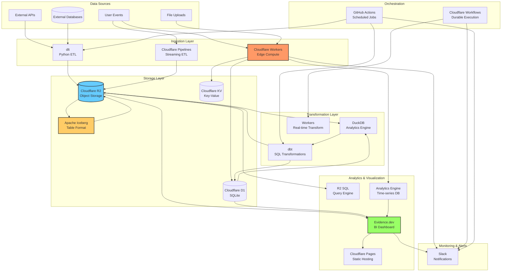
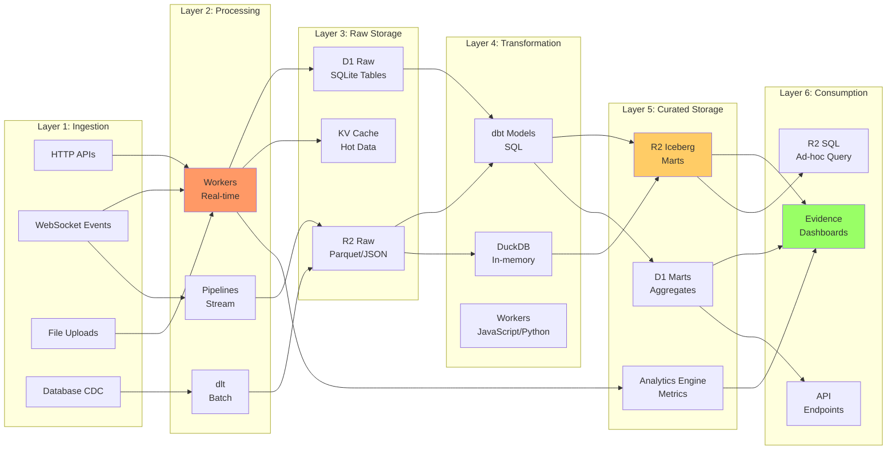
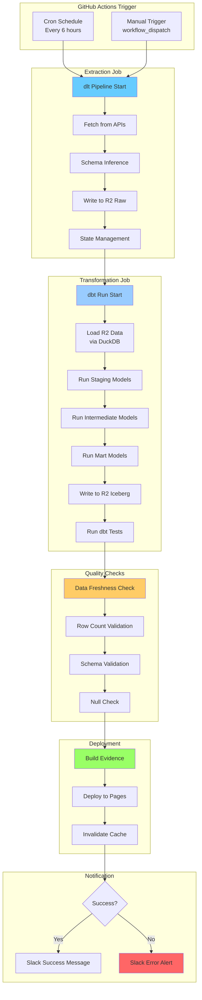
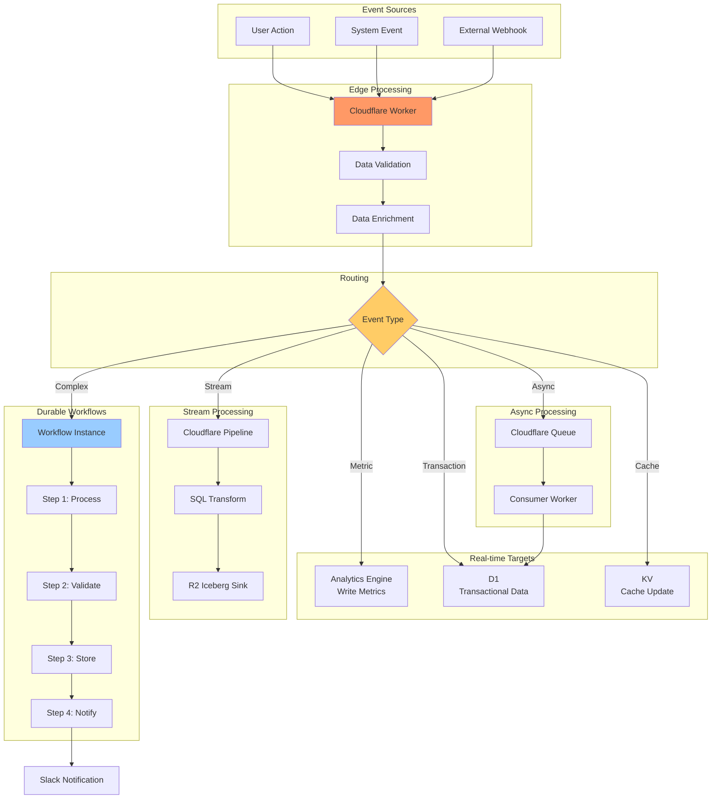
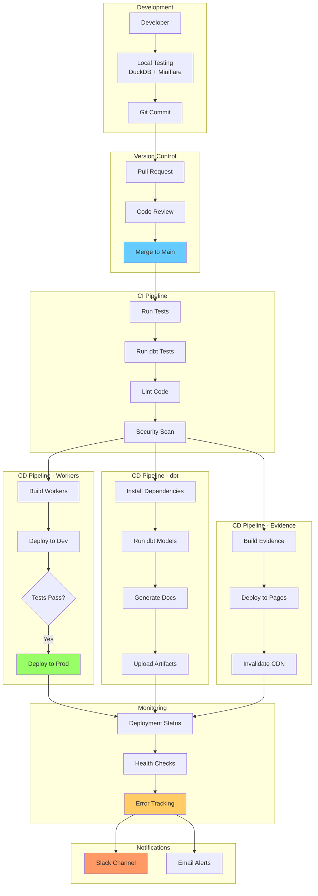
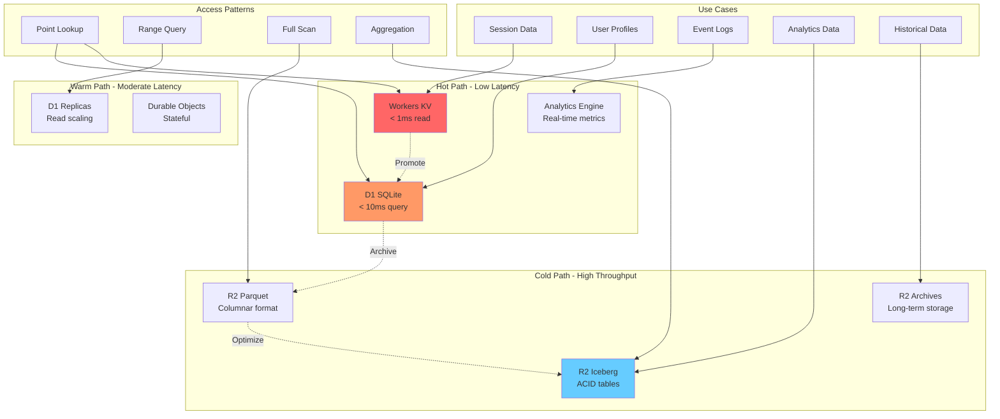
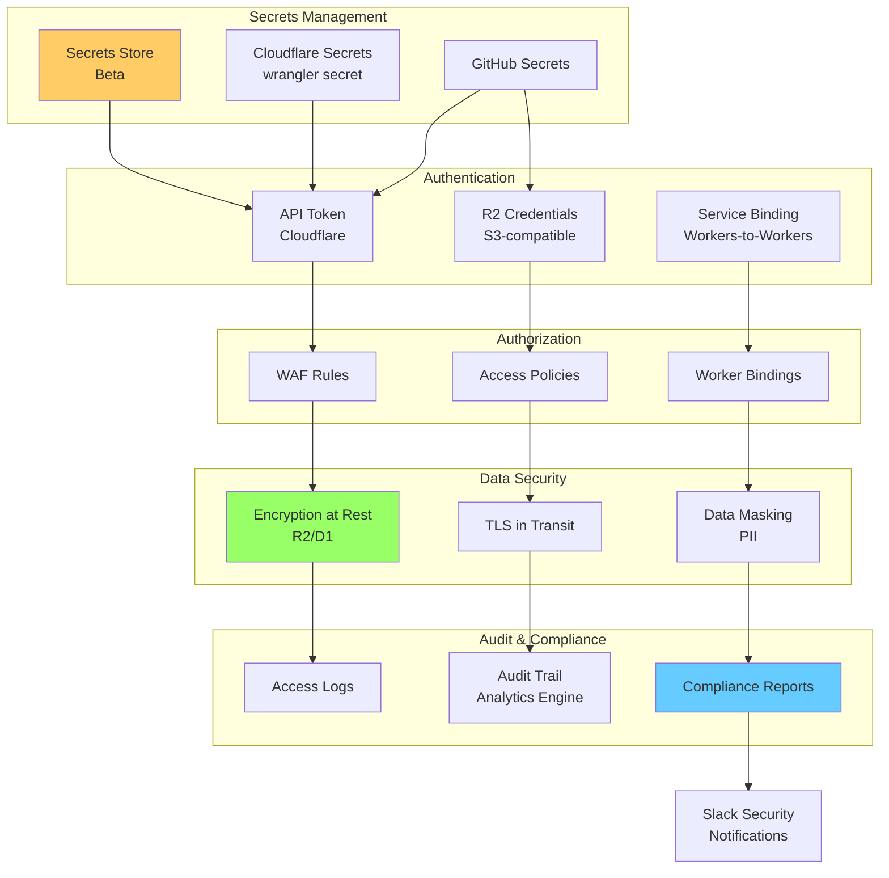
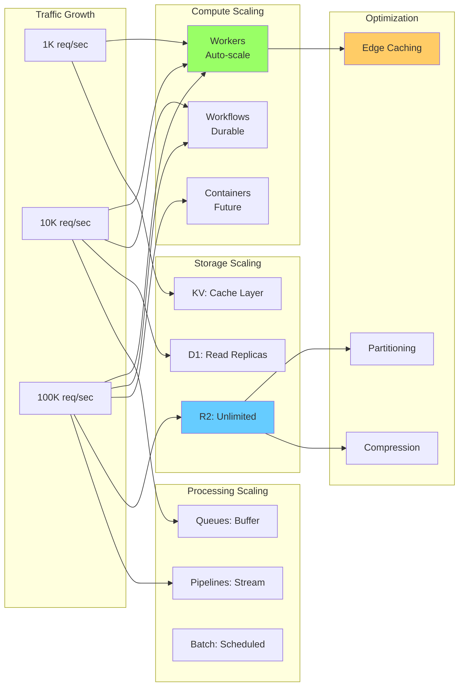
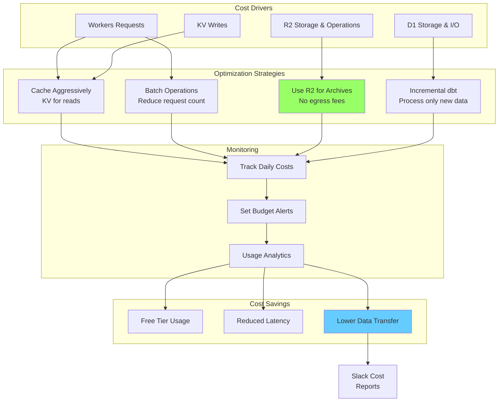

# アーキテクチャ図

本ドキュメントでは、Cloudflareデータ基盤のアーキテクチャをMermaid図で可視化します。

## 目次

- [全体アーキテクチャ](#全体アーキテクチャ)
- [データフロー詳細](#データフロー詳細)
- [ETLパイプライン](#etlパイプライン)
- [リアルタイム処理](#リアルタイム処理)
- [CI/CDパイプライン](#cicdパイプライン)

---

## 全体アーキテクチャ

---

## データフロー詳細

### レイヤー別データフロー

---

## ETLパイプライン

### バッチETLワークフロー

---

## リアルタイム処理

### イベント駆動アーキテクチャ

---

## CI/CDパイプライン

### 開発・デプロイフロー

---

## データストレージ戦略

### ストレージレイヤーの使い分け

---

## セキュリティ・認証フロー

---

## スケーリング戦略

---

## コスト最適化

---

## まとめ

本ドキュメントでは、以下のアーキテクチャ図を提供しました：

1. **全体アーキテクチャ**: Cloudflareデータ基盤の全体像
2. **データフロー詳細**: レイヤー別のデータフロー
3. **ETLパイプライン**: バッチ処理ワークフロー
4. **リアルタイム処理**: イベント駆動アーキテクチャ
5. **CI/CDパイプライン**: 開発・デプロイフロー
6. **ストレージ戦略**: Hot/Warm/Coldパスの使い分け
7. **セキュリティフロー**: 認証・認可・監査
8. **スケーリング戦略**: トラフィック増加への対応
9. **コスト最適化**: コスト削減戦略

これらの図は、GitHubやConfluenceなどでMermaidをサポートする環境で自動レンダリングされます。

---

最終更新: 2025年12月25日
