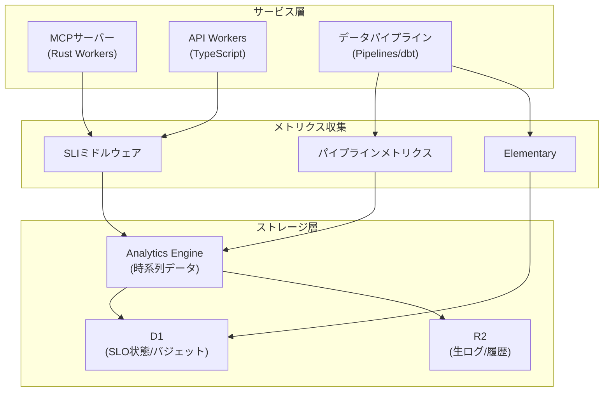
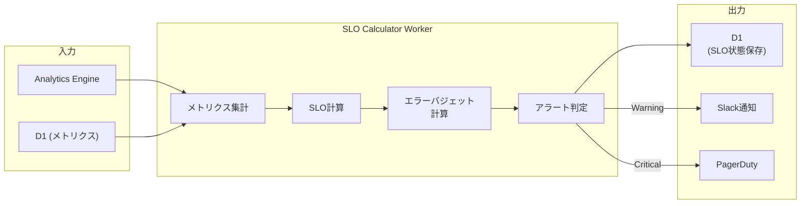
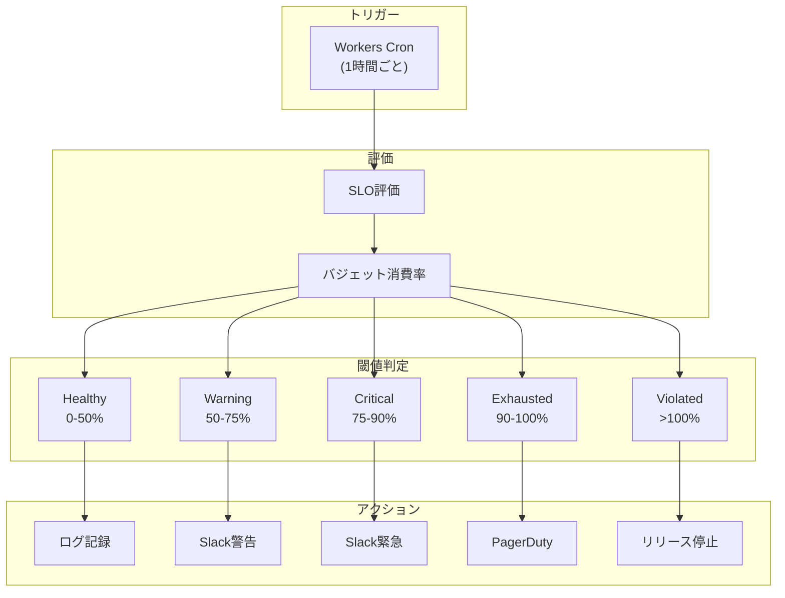
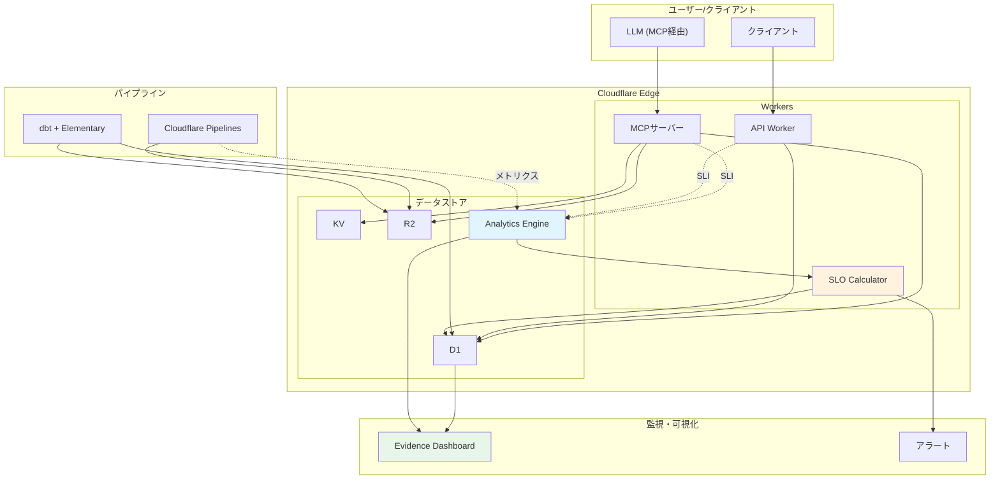
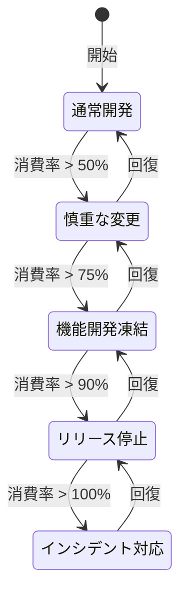
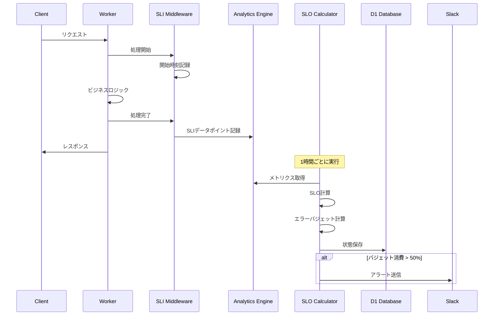

# SRE監視アーキテクチャ図（Mermaid版）

## 1. メトリクス収集フロー

```mermaid
flowchart TB
    subgraph Services["サービス層"]
        MCP["MCPサーバー<br/>(Rust Workers)"]
        API["API Workers<br/>(TypeScript)"]
        Pipeline["データパイプライン<br/>(Pipelines/dbt)"]
    end

    subgraph Collection["メトリクス収集"]
        Middleware["SLIミドルウェア"]
        Elementary["Elementary"]
        PipelineMetrics["パイプラインメトリクス"]
    end

    subgraph Storage["ストレージ層"]
        AE["Analytics Engine<br/>(時系列データ)"]
        D1["D1<br/>(SLO状態/バジェット)"]
        R2["R2<br/>(生ログ/履歴)"]
    end

    MCP --> Middleware
    API --> Middleware
    Pipeline --> PipelineMetrics
    Pipeline --> Elementary

    Middleware --> AE
    PipelineMetrics --> AE
    Elementary --> D1

    AE --> D1
    AE --> R2
```

## 2. SLO計算・エラーバジェット管理

```mermaid
flowchart LR
    subgraph Input["入力"]
        AE["Analytics Engine"]
        D1_in["D1 (メトリクス)"]
    end

    subgraph Calculator["SLO Calculator Worker"]
        direction TB
        Query["メトリクス集計"]
        Calc["SLO計算"]
        Budget["エラーバジェット<br/>計算"]
        Check["アラート判定"]
    end

    subgraph Output["出力"]
        D1_out["D1<br/>(SLO状態保存)"]
        Slack["Slack通知"]
        PagerDuty["PagerDuty"]
    end

    AE --> Query
    D1_in --> Query
    Query --> Calc --> Budget --> Check

    Check --> D1_out
    Check -->|Warning| Slack
    Check -->|Critical| PagerDuty
```

## 3. アラートフロー

```mermaid
flowchart TB
    subgraph Triggers["トリガー"]
        Cron["Workers Cron<br/>(1時間ごと)"]
    end

    subgraph Evaluation["評価"]
        SLO["SLO評価"]
        Budget["バジェット消費率"]
    end

    subgraph Thresholds["閾値判定"]
        H["Healthy<br/>0-50%"]
        W["Warning<br/>50-75%"]
        C["Critical<br/>75-90%"]
        E["Exhausted<br/>90-100%"]
        V["Violated<br/>>100%"]
    end

    subgraph Actions["アクション"]
        Log["ログ記録"]
        SlackW["Slack警告"]
        SlackC["Slack緊急"]
        Page["PagerDuty"]
        Freeze["リリース停止"]
    end

    Cron --> SLO --> Budget

    Budget --> H --> Log
    Budget --> W --> SlackW
    Budget --> C --> SlackC
    Budget --> E --> Page
    Budget --> V --> Freeze
```

## 4. 全体アーキテクチャ

```mermaid
flowchart TB
    subgraph Users["ユーザー/クライアント"]
        Client["クライアント"]
        LLM["LLM (MCP経由)"]
    end

    subgraph Edge["Cloudflare Edge"]
        subgraph Workers["Workers"]
            MCPServer["MCPサーバー"]
            APIWorker["API Worker"]
            SLOCalc["SLO Calculator"]
        end

        subgraph Data["データストア"]
            KV["KV"]
            D1["D1"]
            R2["R2"]
            AE["Analytics Engine"]
        end
    end

    subgraph Pipeline["パイプライン"]
        Pipelines["Cloudflare Pipelines"]
        dbt["dbt + Elementary"]
    end

    subgraph Observability["監視・可視化"]
        Evidence["Evidence Dashboard"]
        Alerts["アラート"]
    end

    Client --> APIWorker
    LLM --> MCPServer

    MCPServer --> KV
    MCPServer --> D1
    MCPServer --> R2
    MCPServer -.->|SLI| AE

    APIWorker --> D1
    APIWorker -.->|SLI| AE

    Pipelines --> R2
    Pipelines -.->|メトリクス| AE
    dbt --> D1
    dbt --> R2

    AE --> SLOCalc
    SLOCalc --> D1
    SLOCalc --> Alerts

    D1 --> Evidence
    AE --> Evidence

    style AE fill:#e1f5fe
    style SLOCalc fill:#fff3e0
    style Evidence fill:#e8f5e9
```

## 5. エラーバジェットポリシー

```mermaid
stateDiagram-v2
    [*] --> Healthy: 開始

    Healthy --> Warning: 消費率 > 50%
    Warning --> Critical: 消費率 > 75%
    Critical --> Exhausted: 消費率 > 90%
    Exhausted --> Violated: 消費率 > 100%

    Warning --> Healthy: 回復
    Critical --> Warning: 回復
    Exhausted --> Critical: 回復
    Violated --> Exhausted: 回復

    Healthy: 通常開発
    Warning: 慎重な変更
    Critical: 機能開発凍結
    Exhausted: リリース停止
    Violated: インシデント対応
```

## 6. データフロー詳細

```mermaid
sequenceDiagram
    participant C as Client
    participant W as Worker
    participant M as SLI Middleware
    participant AE as Analytics Engine
    participant SC as SLO Calculator
    participant D1 as D1 Database
    participant S as Slack

    C->>W: リクエスト
    W->>M: 処理開始
    M->>M: 開始時刻記録
    W->>W: ビジネスロジック
    W->>M: 処理完了
    M->>AE: SLIデータポイント記録
    W->>C: レスポンス

    Note over SC: 1時間ごとに実行
    SC->>AE: メトリクス取得
    SC->>SC: SLO計算
    SC->>SC: エラーバジェット計算
    SC->>D1: 状態保存

    alt バジェット消費 > 50%
        SC->>S: アラート送信
    end
```
