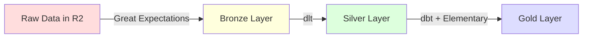

# 外部サービス統合ガイド

本ドキュメントでは、Cloudflareデータ基盤と連携する外部サービスについて解説します。これらのサービスを組み合わせることで、エンドツーエンドのデータパイプラインと分析環境を構築できます。

## 目次

- [アーキテクチャ概要](#アーキテクチャ概要)
- [データ変換・処理](#データ変換処理)
- [データストレージ・フォーマット](#データストレージフォーマット)
- [データ可視化](#データ可視化)
- [CI/CD・開発基盤](#cicd開発基盤)
- [通知・コラボレーション](#通知コラボレーション)
- [統合アーキテクチャ例](#統合アーキテクチャ例)

---

## アーキテクチャ概要

```
┌─────────────────────────────────────────────────────────────────┐
│                        Data Sources                             │
│              (APIs, Databases, Files, Events)                   │
└─────────────────────────────────────────────────────────────────┘
                              │
                              ▼
┌─────────────────────────────────────────────────────────────────┐
│                    Ingestion & Processing                       │
│  ┌──────────┬──────────────┬─────────────┬──────────────┐      │
│  │   dlt    │  Cloudflare  │  Cloudflare │   GitHub     │      │
│  │(Extract) │   Workers    │   Pipelines │   Actions    │      │
│  │          │  (Transform) │  (Stream)   │  (Orchestrate)│     │
│  └──────────┴──────────────┴─────────────┴──────────────┘      │
└─────────────────────────────────────────────────────────────────┘
                              │
                              ▼
┌─────────────────────────────────────────────────────────────────┐
│                      Storage Layer                              │
│  ┌──────────────────┬─────────────────┬──────────────────┐     │
│  │ Cloudflare R2    │  Cloudflare D1  │  Cloudflare KV   │     │
│  │ (Apache Iceberg) │     (SQLite)    │   (Cache)        │     │
│  └──────────────────┴─────────────────┴──────────────────┘     │
└─────────────────────────────────────────────────────────────────┘
                              │
                              ▼
┌─────────────────────────────────────────────────────────────────┐
│                   Transformation Layer                          │
│  ┌──────────────────┬─────────────────┬──────────────────┐     │
│  │       dbt        │     DuckDB      │  Cloudflare      │     │
│  │  (SQL Transform) │   (Analytics)   │   Workers        │     │
│  └──────────────────┴─────────────────┴──────────────────┘     │
└─────────────────────────────────────────────────────────────────┘
                              │
                              ▼
┌─────────────────────────────────────────────────────────────────┐
│                    Visualization & BI                           │
│  ┌──────────────────┬─────────────────┬──────────────────┐     │
│  │   Evidence.dev   │    Cloudflare   │      Slack       │     │
│  │  (Dashboard)     │     Pages       │  (Notifications) │     │
│  └──────────────────┴─────────────────┴──────────────────┘     │
└─────────────────────────────────────────────────────────────────┘
```

---

## データ変換・処理

### Elementary

**公式サイト**: https://www.elementary-data.com/
**ドキュメント**: https://docs.elementary-data.com/

#### 概要
Elementaryは、dbtプロジェクトのためのデータ品質監視およびオブザーバビリティプラットフォームです。dbtパッケージとして統合され、データの異常検知、スキーマ変更の追跡、データ品質テストの監視を自動化します。

#### データ基盤での役割
- **データ品質監視**: dbtテストの実行結果を追跡・可視化
- **異常検知**: 機械学習ベースのデータ異常検知
- **スキーマ監視**: テーブルスキーマの変更を自動検知
- **データリネージュ**: モデル間の依存関係を可視化
- **アラート**: Slackへのリアルタイム通知
- **ダッシュボード**: データ品質の統合ビュー

#### Cloudflareとの統合

##### dbtプロジェクトへの追加
```yaml
# dbt/packages.yml
packages:
  - package: elementary-data/elementary
    version: 0.15.1  # 最新バージョンを確認
```

##### profiles.yml設定（DuckDB + R2）
```yaml
# dbt/profiles.yml
elementary_project:
  target: prod
  outputs:
    prod:
      type: duckdb
      path: ':memory:'
      extensions:
        - httpfs
      settings:
        s3_endpoint: '<account-id>.r2.cloudflarestorage.com'
        s3_access_key_id: '{{ env_var("R2_ACCESS_KEY_ID") }}'
        s3_secret_access_key: '{{ env_var("R2_SECRET_ACCESS_KEY") }}'
        # Elementary用のローカルDB（メタデータ保存）
        elementary_database_path: 'elementary.duckdb'
```

##### dbtモデルでのElementaryテスト
```sql
-- models/staging/stg_events.sql
{{
  config(
    materialized='incremental',
    unique_key='event_id',
    # Elementaryの異常検知テストを有効化
    elementary_enabled=true
  )
}}

SELECT
  event_id,
  user_id,
  event_type,
  event_timestamp,
  event_count
FROM read_parquet('s3://my-bucket/events/*.parquet')

WHERE event_timestamp > (SELECT MAX(event_timestamp) FROM {{ this }})

```

```yaml
# models/staging/schema.yml
version: 2

models:
  - name: stg_events
    description: Staging layer for event data
    columns:
      - name: event_id
        description: Unique event identifier
        tests:
          - unique
          - not_null
          # Elementary異常検知テスト
          - elementary.volume_anomalies:
              timestamp_column: event_timestamp
              sensitivity: 3
          - elementary.dimension_anomalies:
              dimensions:
                - event_type
              timestamp_column: event_timestamp

      - name: event_count
        description: Event count value
        tests:
          # 数値範囲の異常検知
          - elementary.all_columns_anomalies:
              column_anomalies:
                - event_count
              timestamp_column: event_timestamp
```

##### スキーマ変更監視
```yaml
# dbt_project.yml
models:
  my_project:
    staging:
      +elementary_enabled: true
      # スキーマ変更を自動検知
      +elementary_schema_changes: true
```

##### GitHub Actionsでの実行
```yaml
# .github/workflows/elementary-monitor.yml
name: Elementary Data Quality Monitor

on:
  schedule:
    - cron: '0 */6 * * *'  # 6時間ごと
  workflow_dispatch:
  push:
    branches: [main]
    paths:
      - 'dbt/**'

jobs:
  dbt-test-and-monitor:
    runs-on: ubuntu-latest
    steps:
      - uses: actions/checkout@v3

      - uses: actions/setup-python@v4
        with:
          python-version: '3.11'

      - name: Install dependencies
        run: |
          pip install dbt-duckdb
          pip install elementary-data

      - name: Install dbt packages
        working-directory: dbt
        run: dbt deps

      - name: Run dbt models
        working-directory: dbt
        env:
          R2_ACCESS_KEY_ID: ${{ secrets.R2_ACCESS_KEY_ID }}
          R2_SECRET_ACCESS_KEY: ${{ secrets.R2_SECRET_ACCESS_KEY }}
        run: |
          dbt run
          dbt test

      - name: Run Elementary monitoring
        working-directory: dbt
        env:
          R2_ACCESS_KEY_ID: ${{ secrets.R2_ACCESS_KEY_ID }}
          R2_SECRET_ACCESS_KEY: ${{ secrets.R2_SECRET_ACCESS_KEY }}
        run: |
          # Elementary モデルを実行（メタデータ収集）
          dbt run --select elementary

          # Elementary レポート生成
          edr monitor --slack-webhook ${{ secrets.SLACK_WEBHOOK_URL }}

      - name: Generate Elementary Report
        working-directory: dbt
        run: |
          # HTMLレポート生成
          edr report

      - name: Upload Elementary Report
        uses: actions/upload-artifact@v3
        with:
          name: elementary-report
          path: dbt/elementary_report.html

      - name: Deploy Report to Cloudflare Pages
        uses: cloudflare/wrangler-action@v3
        with:
          apiToken: ${{ secrets.CLOUDFLARE_API_TOKEN }}
          accountId: ${{ secrets.CLOUDFLARE_ACCOUNT_ID }}
          command: pages deploy dbt/elementary_output --project-name=data-quality-dashboard
```

##### Slackとの統合
```bash
# Elementary CLIでSlack通知を設定
edr monitor \
  --slack-webhook $SLACK_WEBHOOK_URL \
  --slack-channel data-quality \
  --timezone UTC

# または設定ファイルで管理
# dbt/elementary_config.yml
slack:
  webhook_url: ${SLACK_WEBHOOK_URL}
  channel: data-quality
  workflows:
    - name: daily_monitor
      schedule: '0 8 * * *'
      alerts:
        - test_failures
        - schema_changes
        - volume_anomalies
```

##### Cloudflare Workersでの通知
```javascript
// workers/elementary-webhook.js
// ElementaryからのWebhookを受けてCloudflare環境で処理

export default {
  async fetch(request, env) {
    if (request.method !== 'POST') {
      return new Response('Method not allowed', { status: 405 });
    }

    const alert = await request.json();

    // D1にアラート履歴を保存
    await env.DB.prepare(`
      INSERT INTO data_quality_alerts (
        alert_type,
        model_name,
        test_name,
        status,
        severity,
        message,
        timestamp
      ) VALUES (?, ?, ?, ?, ?, ?, ?)
    `).bind(
      alert.type,
      alert.model,
      alert.test,
      alert.status,
      alert.severity,
      alert.message,
      new Date().toISOString()
    ).run();

    // Slackに通知
    await fetch(env.SLACK_WEBHOOK_URL, {
      method: 'POST',
      headers: { 'Content-Type': 'application/json' },
      body: JSON.stringify({
        text: `🚨 Data Quality Alert: ${alert.message}`,
        blocks: [
          {
            type: 'header',
            text: {
              type: 'plain_text',
              text: `${alert.severity === 'high' ? '🔴' : '⚠️'} ${alert.type}`
            }
          },
          {
            type: 'section',
            fields: [
              {
                type: 'mrkdwn',
                text: `*Model:*\n${alert.model}`
              },
              {
                type: 'mrkdwn',
                text: `*Test:*\n${alert.test}`
              },
              {
                type: 'mrkdwn',
                text: `*Status:*\n${alert.status}`
              },
              {
                type: 'mrkdwn',
                text: `*Severity:*\n${alert.severity}`
              }
            ]
          },
          {
            type: 'section',
            text: {
              type: 'mrkdwn',
              text: `*Message:*\n${alert.message}`
            }
          },
          {
            type: 'actions',
            elements: [
              {
                type: 'button',
                text: {
                  type: 'plain_text',
                  text: 'View Report'
                },
                url: 'https://data-quality-dashboard.pages.dev'
              }
            ]
          }
        ]
      })
    });

    return new Response('Alert processed', { status: 200 });
  }
}
```

##### R2でのElementaryレポート永続化
```python
# scripts/upload_elementary_report.py
import boto3
from datetime import datetime

def upload_report_to_r2(report_path: str):
    """
    ElementaryレポートをR2にアップロード
    """
    s3_client = boto3.client(
        's3',
        endpoint_url=f"https://{R2_ACCOUNT_ID}.r2.cloudflarestorage.com",
        aws_access_key_id=R2_ACCESS_KEY_ID,
        aws_secret_access_key=R2_SECRET_ACCESS_KEY,
        region_name='auto'
    )

    timestamp = datetime.now().strftime('%Y%m%d_%H%M%S')
    s3_key = f"elementary/reports/{timestamp}/report.html"

    s3_client.upload_file(
        report_path,
        'data-lake-gold',  # Gold Layer
        s3_key,
        ExtraArgs={'ContentType': 'text/html'}
    )

    print(f"Report uploaded to: s3://data-lake-gold/{s3_key}")
```

#### Elementary CLI 主要コマンド

```bash
# レポート生成
edr report

# モニタリング実行（Slack通知付き）
edr monitor --slack-webhook <webhook-url>

# レポートをWebサーバーで起動
edr report --serve

# 特定期間のデータを分析
edr report --days-back 7

# レポートのカスタマイズ
edr report \
  --project-dir ./dbt \
  --profiles-dir ./dbt \
  --profile-target prod \
  --output ./reports
```

#### Elementary ダッシュボードの機能

1. **テスト結果**: すべてのdbtテストの実行履歴と結果
2. **モデル実行**: モデルのビルド時間、成功率、エラー
3. **スキーマ変更**: カラムの追加・削除・型変更の履歴
4. **データリネージュ**: モデル間の依存関係グラフ
5. **異常検知**: 機械学習による異常検知結果
6. **カバレッジ**: テストカバレッジの可視化

#### Cloudflare Pagesへのデプロイ例

```yaml
# .github/workflows/deploy-elementary-ui.yml
name: Deploy Elementary UI

on:
  schedule:
    - cron: '0 */6 * * *'
  workflow_dispatch:

jobs:
  deploy:
    runs-on: ubuntu-latest
    steps:
      - uses: actions/checkout@v3

      - uses: actions/setup-python@v4
        with:
          python-version: '3.11'

      - name: Install dependencies
        run: |
          pip install dbt-duckdb elementary-data

      - name: Generate Elementary report
        working-directory: dbt
        env:
          R2_ACCESS_KEY_ID: ${{ secrets.R2_ACCESS_KEY_ID }}
          R2_SECRET_ACCESS_KEY: ${{ secrets.R2_SECRET_ACCESS_KEY }}
        run: |
          dbt deps
          dbt run --select elementary
          edr report --file-path ../elementary_report.html

      - name: Deploy to Cloudflare Pages
        uses: cloudflare/wrangler-action@v3
        with:
          apiToken: ${{ secrets.CLOUDFLARE_API_TOKEN }}
          accountId: ${{ secrets.CLOUDFLARE_ACCOUNT_ID }}
          command: pages deploy elementary_output --project-name=elementary-dashboard
```

#### 推奨度
⭐⭐⭐⭐⭐ - dbtを使用するデータ基盤では必須のデータ品質監視ツール

---

### Great Expectations

**公式サイト**: https://greatexpectations.io/
**ドキュメント**: https://docs.greatexpectations.io/

#### 概要
Great Expectationsは、データの品質を検証し、プロファイリングし、ドキュメント化するPythonベースのオープンソースツールです。「期待値（Expectations）」を定義することで、データが期待通りであることを継続的に検証します。

#### データ基盤での役割
- **データ検証**: データが定義された期待値を満たしているか検証
- **データプロファイリング**: データの統計情報を自動生成
- **Data Docs**: HTMLベースのデータドキュメント自動生成
- **アラート**: 検証失敗時のSlack/メール通知
- **バージョン管理**: 期待値定義をGitで管理
- **R2統合**: DuckDB経由でR2上のデータを直接検証

#### Cloudflareとの統合

##### R2 + DuckDB データソース設定

```yaml
# great_expectations/great_expectations.yml
datasources:
  r2_bronze:
    class_name: Datasource
    execution_engine:
      class_name: SqlAlchemyExecutionEngine
      connection_string: duckdb:///:memory:
    data_connectors:
      r2_parquet_connector:
        class_name: InferredAssetFilesystemDataConnector
        base_directory: /tmp/gx_data/bronze/
        default_regex:
          pattern: (.+)/(.+)\.parquet
```

##### R2データの検証（Python）

```python
import os
import duckdb
import great_expectations as gx

# DuckDB + R2接続
conn = duckdb.connect(":memory:")
conn.execute("INSTALL httpfs; LOAD httpfs;")
conn.execute(f"SET s3_endpoint='{os.getenv('R2_ENDPOINT')}';")
conn.execute(f"SET s3_access_key_id='{os.getenv('R2_ACCESS_KEY_ID')}';")
conn.execute(f"SET s3_secret_access_key='{os.getenv('R2_SECRET_ACCESS_KEY')}';")

# R2からデータ読み込み
df = conn.execute("""
    SELECT * FROM read_parquet('s3://my-bucket/data/**/*.parquet')
""").fetchdf()

# Great Expectations Context
context = gx.get_context()

# データフレームを検証
validator = context.sources.pandas_default.read_dataframe(df)

# Expectationsを定義
validator.expect_table_row_count_to_be_between(min_value=1, max_value=1000000)
validator.expect_column_values_to_not_be_null(column="user_id")
validator.expect_column_values_to_be_unique(column="email")
validator.expect_column_values_to_match_regex(
    column="email",
    regex="^[a-zA-Z0-9._%+-]+@[a-zA-Z0-9.-]+\\.[a-zA-Z]{2,}$"
)

# 検証実行
results = validator.validate()

if not results["success"]:
    print("❌ Validation failed!")
else:
    print("✅ All validations passed!")
```

##### Expectation Suite（JSON定義）

```json
{
  "expectation_suite_name": "api_users_suite",
  "expectations": [
    {
      "expectation_type": "expect_column_values_to_not_be_null",
      "kwargs": {
        "column": "user_id"
      }
    },
    {
      "expectation_type": "expect_column_values_to_be_unique",
      "kwargs": {
        "column": "user_id"
      }
    },
    {
      "expectation_type": "expect_column_values_to_match_regex",
      "kwargs": {
        "column": "email",
        "regex": "^[a-zA-Z0-9._%+-]+@.*"
      }
    },
    {
      "expectation_type": "expect_column_values_to_be_between",
      "kwargs": {
        "column": "age",
        "min_value": 0,
        "max_value": 120
      }
    }
  ]
}
```

##### Checkpoint設定（複数検証の実行）

```yaml
# great_expectations/checkpoints/daily_checkpoint.yml
name: daily_data_quality_checkpoint
config_version: 1.0
class_name: Checkpoint

validations:
  - batch_request:
      datasource_name: r2_bronze
      data_asset_name: api_posts
    expectation_suite_name: api_posts_suite

  - batch_request:
      datasource_name: r2_bronze
      data_asset_name: api_users
    expectation_suite_name: api_users_suite

action_list:
  - name: store_validation_result
    action:
      class_name: StoreValidationResultAction
  - name: update_data_docs
    action:
      class_name: UpdateDataDocsAction
  - name: send_slack_notification
    action:
      class_name: SlackNotificationAction
      slack_webhook: ${SLACK_WEBHOOK_URL}
      notify_on: failure
```

##### GitHub Actionsでの自動検証

```yaml
# .github/workflows/great-expectations.yml
name: Great Expectations Data Validation

on:
  schedule:
    - cron: '0 2 * * *'  # 毎日2:00 UTC
  workflow_dispatch:

jobs:
  validate-data:
    runs-on: ubuntu-latest
    steps:
      - uses: actions/checkout@v4
      - uses: actions/setup-python@v5
        with:
          python-version: '3.11'

      - name: Install Great Expectations
        run: |
          pip install great-expectations==0.18.12
          pip install duckdb

      - name: Run validation
        env:
          R2_ENDPOINT: ${{ secrets.R2_ENDPOINT }}
          R2_ACCESS_KEY_ID: ${{ secrets.R2_ACCESS_KEY_ID }}
          R2_SECRET_ACCESS_KEY: ${{ secrets.R2_SECRET_ACCESS_KEY }}
        run: |
          python scripts/run_great_expectations.py

      - name: Deploy Data Docs to Cloudflare Pages
        uses: cloudflare/wrangler-action@v3
        with:
          apiToken: ${{ secrets.CLOUDFLARE_API_TOKEN }}
          command: pages deploy great_expectations/uncommitted/data_docs --project-name=gx-data-docs
```

##### Cloudflare PagesへのData Docsデプロイ

```bash
# Data Docs生成
great_expectations docs build

# Cloudflare Pagesにデプロイ
wrangler pages deploy great_expectations/uncommitted/data_docs/cloudflare_pages_site \
  --project-name=gx-data-docs \
  --branch=main

# アクセス: https://gx-data-docs.pages.dev
```

##### Cloudflare Workers統合（カスタムアラート）

```javascript
// workers/gx-alert-handler.js
// Great ExpectationsからのWebhookを処理

export default {
  async fetch(request, env) {
    if (request.method !== 'POST') {
      return new Response('Method not allowed', { status: 405 });
    }

    const validation = await request.json();

    // D1に検証結果を保存
    await env.DB.prepare(`
      INSERT INTO data_quality_validations (
        suite_name,
        success,
        statistics,
        timestamp
      ) VALUES (?, ?, ?, ?)
    `).bind(
      validation.meta.expectation_suite_name,
      validation.success,
      JSON.stringify(validation.statistics),
      new Date().toISOString()
    ).run();

    // 失敗時はSlack通知
    if (!validation.success) {
      await fetch(env.SLACK_WEBHOOK_URL, {
        method: 'POST',
        headers: { 'Content-Type': 'application/json' },
        body: JSON.stringify({
          text: `🚨 Data Quality Alert: ${validation.meta.expectation_suite_name}`,
          blocks: [
            {
              type: 'section',
              text: {
                type: 'mrkdwn',
                text: `*Failed Expectations:* ${validation.statistics.unsuccessful_expectations}\n*Success Rate:* ${validation.statistics.success_percent}%`
              }
            }
          ]
        })
      });
    }

    return new Response('Validation processed', { status: 200 });
  }
}
```

#### 主要なExpectation Types

```python
# テーブルレベル
expect_table_row_count_to_be_between(min_value=1, max_value=1000000)
expect_table_columns_to_match_ordered_list(column_list=["id", "name", "email"])

# カラム存在確認
expect_column_to_exist(column="user_id")

# NULL値
expect_column_values_to_not_be_null(column="email")

# ユニーク性
expect_column_values_to_be_unique(column="email")

# データ型
expect_column_values_to_be_in_type_list(column="age", type_list=["INTEGER"])

# 値の範囲
expect_column_values_to_be_between(column="price", min_value=0, max_value=10000)
expect_column_values_to_be_in_set(column="status", value_set=["active", "inactive"])

# 文字列
expect_column_value_lengths_to_be_between(column="title", min_value=1, max_value=500)
expect_column_values_to_match_regex(column="phone", regex="^\\d{3}-\\d{4}-\\d{4}$")

# 統計
expect_column_mean_to_be_between(column="score", min_value=50, max_value=100)
expect_column_median_to_be_between(column="age", min_value=20, max_value=60)
expect_column_stdev_to_be_between(column="price", min_value=0, max_value=1000)

# 日付
expect_column_values_to_be_dateutil_parseable(column="created_at")
expect_column_values_to_be_increasing(column="timestamp")
```

#### Data Docs（HTMLレポート）

Great Expectationsは自動的にHTMLレポートを生成します：

**特徴:**
- 検証結果の可視化
- データプロファイル（統計情報）
- Expectation Suite一覧
- 失敗したExpectationsの詳細
- タイムトラベル（過去の検証結果）

**構造:**
```
data_docs/
├── index.html                    # トップページ
├── expectations/                 # Expectation Suite詳細
│   ├── api_posts_suite.html
│   └── api_users_suite.html
├── validations/                  # 検証結果
│   ├── api_posts_suite/
│   │   └── 20251226T020000.html
│   └── api_users_suite/
│       └── 20251226T020000.html
└── static/                       # CSS/JS
```

#### ElementaryとGreat Expectationsの使い分け

| 観点 | Elementary | Great Expectations |
|------|-----------|-------------------|
| **焦点** | dbt特化、リネージュ | 汎用データ検証 |
| **統合** | dbtパッケージ | Pythonライブラリ |
| **テストタイプ** | 異常検知、スキーマ変更 | 期待値ベース検証 |
| **プロファイリング** | 限定的 | 包括的 |
| **学習曲線** | 低（dbt知識で可） | 中（Pythonが必要） |
| **ユースケース** | dbtモデルの監視 | 生データ検証、EDA |

**推奨の組み合わせ:**
- **Great Expectations**: Bronze層（生データ）の検証
- **Elementary**: Silver/Gold層（dbtモデル）の監視



#### 推奨度
⭐⭐⭐⭐⭐ - データ品質検証とプロファイリングに必須

---

### dbt (data build tool)

**公式サイト**: https://www.getdbt.com/
**ドキュメント**: https://docs.getdbt.com/

#### 概要
dbtは、データウェアハウス内でのデータ変換をSQL中心に実行するツールです。ソフトウェアエンジニアリングのベストプラクティス（バージョン管理、テスト、ドキュメント化）をデータ変換に適用します。

#### データ基盤での役割
- **SQL変換**: D1やR2（DuckDB経由）に対してSQLベースのデータ変換を実行
- **データモデリング**: ステージング、中間、マート層を構造化
- **データ品質**: テストによるデータ品質保証
- **ドキュメント生成**: 自動的にデータリネージュとドキュメントを生成
- **インクリメンタル処理**: 効率的なバッチ処理

#### Cloudflareとの統合

##### DuckDB + dbt + R2
```yaml
# profiles.yml
default:
  target: prod
  outputs:
    prod:
      type: duckdb
      path: ':memory:'
      extensions:
        - httpfs  # R2からのデータ読み取り
      settings:
        s3_endpoint: '<account-id>.r2.cloudflarestorage.com'
        s3_access_key_id: '{{ env_var("R2_ACCESS_KEY_ID") }}'
        s3_secret_access_key: '{{ env_var("R2_SECRET_ACCESS_KEY") }}'
```

##### dbtモデル例
```sql
-- models/staging/stg_events.sql
{{
  config(
    materialized='incremental',
    unique_key='event_id'
  )
}}

SELECT
  event_id,
  user_id,
  event_type,
  event_timestamp,
  properties
FROM read_parquet('s3://my-bucket/raw/events/*.parquet')

WHERE event_timestamp > (SELECT MAX(event_timestamp) FROM {{ this }})

```

#### GitHub Actionsでの実行
```yaml
# .github/workflows/dbt.yml
name: dbt Run

on:
  schedule:
    - cron: '0 */6 * * *'  # 6時間ごと
  workflow_dispatch:

jobs:
  dbt-run:
    runs-on: ubuntu-latest
    steps:
      - uses: actions/checkout@v3
      - uses: actions/setup-python@v4
        with:
          python-version: '3.11'
      - name: Install dbt
        run: pip install dbt-duckdb
      - name: Run dbt
        env:
          R2_ACCESS_KEY_ID: ${{ secrets.R2_ACCESS_KEY_ID }}
          R2_SECRET_ACCESS_KEY: ${{ secrets.R2_SECRET_ACCESS_KEY }}
        run: |
          dbt deps
          dbt run
          dbt test
```

#### 推奨度
⭐⭐⭐⭐⭐ - SQL中心のデータ変換に必須

---

### dlt (data load tool)

**公式サイト**: https://dlthub.com/
**ドキュメント**: https://dlthub.com/docs/

#### 概要
dltは、Pythonベースのデータパイプラインフレームワークです。データソースからの抽出とロードを簡素化し、スキーマ推論と進化を自動化します。

#### データ基盤での役割
- **データ抽出**: 様々なAPIやデータソースからデータを取得
- **スキーマ管理**: 自動スキーマ推論と進化
- **データロード**: R2、D1へのデータ書き込み
- **状態管理**: 増分ロードの状態管理
- **型安全**: Pythonの型ヒントによる安全性

#### Cloudflareとの統合

##### R2へのデータロード
```python
import dlt
from dlt.destinations import filesystem

# R2をS3互換で使用
pipeline = dlt.pipeline(
    pipeline_name="my_pipeline",
    destination=filesystem(
        bucket_url="s3://my-bucket",
        credentials={
            "aws_access_key_id": "your-r2-access-key",
            "aws_secret_access_key": "your-r2-secret-key",
            "endpoint_url": "https://<account-id>.r2.cloudflarestorage.com",
            "region_name": "auto"
        }
    ),
    dataset_name="raw_data"
)

# データソースからロード
@dlt.resource
def get_api_data():
    # APIからデータを取得
    response = requests.get("https://api.example.com/data")
    yield response.json()

# パイプライン実行
pipeline.run(get_api_data())
```

##### Cloudflare Workersでの実行
```python
# dltをWorkers Python Runtimeで実行
# workers/etl_pipeline.py
from js import Response
import dlt

async def on_fetch(request):
    # dltパイプラインを実行
    pipeline = dlt.pipeline(
        pipeline_name="worker_pipeline",
        destination="duckdb",
        dataset_name="extracted_data"
    )

    info = pipeline.run(my_data_source())

    return Response.new(
        f"Pipeline completed: {info}",
        headers={"Content-Type": "text/plain"}
    )
```

##### GitHub Actionsでの定期実行
```yaml
# .github/workflows/dlt-extract.yml
name: dlt Extract

on:
  schedule:
    - cron: '0 * * * *'  # 毎時実行
  workflow_dispatch:

jobs:
  extract:
    runs-on: ubuntu-latest
    steps:
      - uses: actions/checkout@v3
      - uses: actions/setup-python@v4
        with:
          python-version: '3.11'
      - name: Install dlt
        run: pip install dlt[filesystem]
      - name: Run dlt pipeline
        env:
          R2_ACCESS_KEY_ID: ${{ secrets.R2_ACCESS_KEY_ID }}
          R2_SECRET_ACCESS_KEY: ${{ secrets.R2_SECRET_ACCESS_KEY }}
        run: python pipelines/extract_data.py
```

#### 推奨度
⭐⭐⭐⭐⭐ - データ抽出・ロードパイプラインに必須

---

## データストレージ・フォーマット

### Apache Iceberg

**公式サイト**: https://iceberg.apache.org/
**ドキュメント**: https://iceberg.apache.org/docs/latest/

#### 概要
Apache Icebergは、大規模な分析用テーブルフォーマットです。ACIDトランザクション、タイムトラベル、スキーマ進化をサポートします。

#### データ基盤での役割
- **テーブルフォーマット**: R2上でのACIDテーブル管理
- **スキーマ進化**: 後方互換性のあるスキーマ変更
- **タイムトラベル**: 過去のデータバージョンへのアクセス
- **パーティション管理**: 効率的なクエリのための自動パーティショニング
- **メタデータ管理**: R2 Data Catalogとの統合

#### Cloudflareとの統合

##### R2 Data Catalog + Iceberg
Cloudflare R2 Data Catalogは、Apache Icebergテーブルのマネージドカタログです。

```python
# PyIcebergでR2 Data Catalogを使用
from pyiceberg.catalog import load_catalog

catalog = load_catalog(
    "r2_catalog",
    **{
        "type": "rest",
        "uri": "https://api.cloudflare.com/client/v4/accounts/{account_id}/r2/buckets/{bucket_name}/catalog",
        "credential": "your-api-token"
    }
)

# テーブル作成
from pyiceberg.schema import Schema
from pyiceberg.types import NestedField, StringType, TimestampType, IntegerType

schema = Schema(
    NestedField(1, "event_id", StringType(), required=True),
    NestedField(2, "user_id", StringType(), required=True),
    NestedField(3, "event_type", StringType(), required=True),
    NestedField(4, "event_timestamp", TimestampType(), required=True),
    NestedField(5, "value", IntegerType(), required=False)
)

table = catalog.create_table(
    "analytics.events",
    schema=schema,
    location="s3://my-bucket/iceberg/events"
)
```

##### R2 SQLでのクエリ
```sql
-- Cloudflare R2 SQLでIcebergテーブルをクエリ
SELECT
  event_type,
  COUNT(*) as event_count,
  AVG(value) as avg_value
FROM analytics.events
WHERE event_timestamp >= CURRENT_DATE - INTERVAL '7 days'
GROUP BY event_type
ORDER BY event_count DESC;
```

##### dbtでのIcebergテーブル作成
```sql
-- models/marts/fct_daily_events.sql
{{
  config(
    materialized='incremental',
    file_format='iceberg',
    location_root='s3://my-bucket/iceberg/marts/'
  )
}}

SELECT
  DATE(event_timestamp) as event_date,
  event_type,
  COUNT(*) as event_count
FROM {{ ref('stg_events') }}

WHERE event_timestamp > (SELECT MAX(event_timestamp) FROM {{ this }})

GROUP BY 1, 2
```

##### Cloudflare Pipelinesとの統合
Cloudflare Pipelinesは、Apache Icebergテーブルへの直接書き込みをサポートしています。

```javascript
// Workers Pipeline定義
export default {
  async fetch(request, env) {
    const data = await request.json();

    // PipelinesへのイベントPOST
    await env.PIPELINE.write([{
      event_id: data.id,
      user_id: data.user,
      event_type: data.type,
      event_timestamp: new Date().toISOString(),
      value: data.value
    }]);

    return new Response("Event ingested", { status: 200 });
  }
}
```

#### 推奨度
⭐⭐⭐⭐⭐ - R2ベースのデータレイクに必須

---

### DuckDB

**公式サイト**: https://duckdb.org/
**ドキュメント**: https://duckdb.org/docs/

#### 概要
DuckDBは、OLAP（分析処理）に特化した組み込み型SQLデータベースです。高速で、Parquet、CSV、JSONなど様々なフォーマットを直接クエリ可能です。

#### データ基盤での役割
- **ローカル分析**: 開発環境でのデータ分析
- **R2クエリ**: R2上のParquet/CSVファイルを直接クエリ
- **dbt実行**: dbt-duckdbでのデータ変換
- **データエクスポート**: D1やR2からのデータ抽出・分析
- **高速集計**: 大規模データの高速分析

#### Cloudflareとの統合

##### R2データの直接クエリ
```sql
-- DuckDBからR2のParquetファイルをクエリ
INSTALL httpfs;
LOAD httpfs;

SET s3_endpoint='<account-id>.r2.cloudflarestorage.com';
SET s3_access_key_id='your-access-key';
SET s3_secret_access_key='your-secret-key';
SET s3_region='auto';

-- R2上のParquetファイルをクエリ
SELECT
  event_date,
  COUNT(*) as events
FROM read_parquet('s3://my-bucket/events/**/*.parquet')
WHERE event_date >= CURRENT_DATE - INTERVAL '30 days'
GROUP BY event_date
ORDER BY event_date;
```

##### Iceberg テーブルのクエリ
```sql
-- DuckDB 0.10.0+でIcebergサポート
INSTALL iceberg;
LOAD iceberg;

-- Icebergテーブルをクエリ
SELECT * FROM iceberg_scan('s3://my-bucket/iceberg/events/metadata/v1.metadata.json');
```

##### Python統合
```python
import duckdb

# R2への接続設定
con = duckdb.connect()
con.execute("""
    INSTALL httpfs;
    LOAD httpfs;
    SET s3_endpoint='<account-id>.r2.cloudflarestorage.com';
    SET s3_access_key_id='your-access-key';
    SET s3_secret_access_key='your-secret-key';
""")

# R2データをクエリ
result = con.execute("""
    SELECT event_type, COUNT(*) as count
    FROM read_parquet('s3://my-bucket/events/*.parquet')
    GROUP BY event_type
""").fetchdf()

print(result)
```

##### dbt-duckdb統合
```yaml
# profiles.yml
my_project:
  target: dev
  outputs:
    dev:
      type: duckdb
      path: 'analytics.duckdb'
      extensions:
        - httpfs
        - parquet
      settings:
        s3_endpoint: '<account-id>.r2.cloudflarestorage.com'
        s3_access_key_id: '{{ env_var("R2_ACCESS_KEY_ID") }}'
        s3_secret_access_key: '{{ env_var("R2_SECRET_ACCESS_KEY") }}'
```

#### 推奨度
⭐⭐⭐⭐⭐ - R2データ分析に必須

---

## データ可視化

### Evidence.dev

**公式サイト**: https://evidence.dev/
**ドキュメント**: https://docs.evidence.dev/

#### 概要
Evidence.devは、コードベースのビジネスインテリジェンス（BI）ツールです。Markdownでレポートを記述し、SQLクエリの結果を埋め込んでインタラクティブなダッシュボードを生成します。

#### データ基盤での役割
- **データダッシュボード**: SQLベースのインタラクティブダッシュボード
- **レポート生成**: Markdown + SQLでのレポート作成
- **バージョン管理**: Gitでダッシュボードをバージョン管理
- **セルフサービスBI**: 開発者向けのBI環境
- **静的サイト生成**: Cloudflare Pagesへのデプロイ

#### Cloudflareとの統合

##### DuckDB接続設定
```yaml
# sources/r2_data.yaml
name: r2_data
type: duckdb
filename: :memory:

options:
  initStatements:
    - INSTALL httpfs
    - LOAD httpfs
    - SET s3_endpoint='<account-id>.r2.cloudflarestorage.com'
    - SET s3_access_key_id='{{ env.R2_ACCESS_KEY_ID }}'
    - SET s3_secret_access_key='{{ env.R2_SECRET_ACCESS_KEY }}'
```

##### Evidenceページ例
```markdown
<!-- pages/daily-metrics.md -->
# Daily Metrics Dashboard

Last updated: {new Date().toISOString()}

## Events Overview

```sql events_by_type
SELECT
  DATE(event_timestamp) as date,
  event_type,
  COUNT(*) as count
FROM read_parquet('s3://my-bucket/events/**/*.parquet')
WHERE event_timestamp >= CURRENT_DATE - INTERVAL '30 days'
GROUP BY date, event_type
ORDER BY date DESC
\```

<LineChart
  data={events_by_type}
  x=date
  y=count
  series=event_type
/>

## Top Users

```sql top_users
SELECT
  user_id,
  COUNT(*) as event_count
FROM read_parquet('s3://my-bucket/events/**/*.parquet')
WHERE event_timestamp >= CURRENT_DATE - INTERVAL '7 days'
GROUP BY user_id
ORDER BY event_count DESC
LIMIT 10
\```

<DataTable data={top_users} />
```

##### Cloudflare Pagesへのデプロイ
```yaml
# .github/workflows/deploy-evidence.yml
name: Deploy Evidence to Cloudflare Pages

on:
  push:
    branches: [main]
  workflow_dispatch:

jobs:
  deploy:
    runs-on: ubuntu-latest
    steps:
      - uses: actions/checkout@v3
      - uses: actions/setup-node@v3
        with:
          node-version: '18'
      - name: Install dependencies
        run: npm install
      - name: Build Evidence
        env:
          R2_ACCESS_KEY_ID: ${{ secrets.R2_ACCESS_KEY_ID }}
          R2_SECRET_ACCESS_KEY: ${{ secrets.R2_SECRET_ACCESS_KEY }}
        run: npm run build
      - name: Deploy to Cloudflare Pages
        uses: cloudflare/wrangler-action@v3
        with:
          apiToken: ${{ secrets.CLOUDFLARE_API_TOKEN }}
          accountId: ${{ secrets.CLOUDFLARE_ACCOUNT_ID }}
          command: pages deploy build --project-name=analytics-dashboard
```

##### Evidence + Workers API
```javascript
// workers/analytics-api.js
export default {
  async fetch(request, env) {
    // EvidenceダッシュボードのバックエンドAPI
    const url = new URL(request.url);

    if (url.pathname === '/api/metrics') {
      const result = await env.DB.prepare(`
        SELECT
          date,
          SUM(count) as total
        FROM daily_metrics
        WHERE date >= date('now', '-7 days')
        GROUP BY date
      `).all();

      return Response.json(result.results);
    }

    // 静的ファイルをPagesから提供
    return env.ASSETS.fetch(request);
  }
}
```

#### 推奨度
⭐⭐⭐⭐⭐ - コードベースのBIツールとして最適

---

## CI/CD・開発基盤

### GitHub

**公式サイト**: https://github.com/
**ドキュメント**: https://docs.github.com/

#### データ基盤での役割
- **バージョン管理**: すべてのコード、設定、SQLをGit管理
- **コラボレーション**: プルリクエスト、レビュー、イシュー管理
- **ドキュメント**: README、Wikiでのドキュメント管理
- **Secrets管理**: GitHub Secretsで認証情報を安全に管理
- **CI/CDトリガー**: GitHub Actionsとの統合

#### 推奨リポジトリ構造
```
data-engineering-with-cloudflare/
├── .github/
│   ├── workflows/           # GitHub Actions
│   │   ├── deploy-workers.yml
│   │   ├── dbt-run.yml
│   │   ├── dlt-extract.yml
│   │   └── deploy-evidence.yml
│   └── dependabot.yml
├── workers/                 # Cloudflare Workers
│   ├── ingestion/
│   ├── transformation/
│   └── api/
├── pipelines/              # dltパイプライン
│   ├── sources/
│   └── destinations/
├── dbt/                    # dbtプロジェクト
│   ├── models/
│   ├── tests/
│   └── macros/
├── evidence/               # Evidenceダッシュボード
│   ├── pages/
│   └── sources/
├── scripts/                # ユーティリティスクリプト
├── docs/                   # ドキュメント
└── wrangler.toml          # Wrangler設定
```

#### 推奨度
⭐⭐⭐⭐⭐ - バージョン管理・コラボレーションに必須

---

### GitHub Actions

**ドキュメント**: https://docs.github.com/en/actions

#### データ基盤での役割
- **CI/CD**: 自動デプロイとテスト
- **スケジュール実行**: CronベースのETLパイプライン
- **ワークフローオーケストレーション**: 複数ジョブの連携
- **通知**: Slackへの実行結果通知
- **セキュリティ**: Secretsによる認証情報管理

#### 主要ワークフロー例

##### 1. Workers自動デプロイ
```yaml
# .github/workflows/deploy-workers.yml
name: Deploy Workers

on:
  push:
    branches: [main]
    paths:
      - 'workers/**'
  workflow_dispatch:

jobs:
  deploy:
    runs-on: ubuntu-latest
    steps:
      - uses: actions/checkout@v3
      - uses: actions/setup-node@v3
        with:
          node-version: '18'
      - name: Install dependencies
        run: npm install
      - name: Deploy to Cloudflare
        uses: cloudflare/wrangler-action@v3
        with:
          apiToken: ${{ secrets.CLOUDFLARE_API_TOKEN }}
          accountId: ${{ secrets.CLOUDFLARE_ACCOUNT_ID }}
          command: deploy workers/ingestion/index.js
      - name: Notify Slack
        if: always()
        uses: slackapi/slack-github-action@v1
        with:
          webhook-url: ${{ secrets.SLACK_WEBHOOK_URL }}
          payload: |
            {
              "text": "Workers deployment ${{ job.status }}",
              "blocks": [
                {
                  "type": "section",
                  "text": {
                    "type": "mrkdwn",
                    "text": "*Workers Deployment*\nStatus: ${{ job.status }}\nCommit: ${{ github.sha }}"
                  }
                }
              ]
            }
```

##### 2. ETLパイプライン（dlt + dbt）
```yaml
# .github/workflows/etl-pipeline.yml
name: ETL Pipeline

on:
  schedule:
    - cron: '0 */6 * * *'  # 6時間ごと
  workflow_dispatch:

jobs:
  extract:
    runs-on: ubuntu-latest
    steps:
      - uses: actions/checkout@v3
      - uses: actions/setup-python@v4
        with:
          python-version: '3.11'
      - name: Install dlt
        run: pip install dlt[filesystem]
      - name: Run extraction
        env:
          R2_ACCESS_KEY_ID: ${{ secrets.R2_ACCESS_KEY_ID }}
          R2_SECRET_ACCESS_KEY: ${{ secrets.R2_SECRET_ACCESS_KEY }}
          API_KEY: ${{ secrets.SOURCE_API_KEY }}
        run: python pipelines/extract.py
      - name: Upload logs
        if: always()
        uses: actions/upload-artifact@v3
        with:
          name: extraction-logs
          path: logs/

  transform:
    needs: extract
    runs-on: ubuntu-latest
    steps:
      - uses: actions/checkout@v3
      - uses: actions/setup-python@v4
        with:
          python-version: '3.11'
      - name: Install dbt
        run: pip install dbt-duckdb
      - name: Run dbt
        env:
          R2_ACCESS_KEY_ID: ${{ secrets.R2_ACCESS_KEY_ID }}
          R2_SECRET_ACCESS_KEY: ${{ secrets.R2_SECRET_ACCESS_KEY }}
        run: |
          cd dbt
          dbt deps
          dbt run
          dbt test
      - name: Generate docs
        run: |
          cd dbt
          dbt docs generate
      - name: Upload dbt docs
        uses: actions/upload-artifact@v3
        with:
          name: dbt-docs
          path: dbt/target/

  notify:
    needs: [extract, transform]
    runs-on: ubuntu-latest
    if: always()
    steps:
      - name: Notify Slack
        uses: slackapi/slack-github-action@v1
        with:
          webhook-url: ${{ secrets.SLACK_WEBHOOK_URL }}
          payload: |
            {
              "text": "ETL Pipeline completed",
              "blocks": [
                {
                  "type": "section",
                  "text": {
                    "type": "mrkdwn",
                    "text": "*ETL Pipeline*\nExtract: ${{ needs.extract.result }}\nTransform: ${{ needs.transform.result }}"
                  }
                }
              ]
            }
```

##### 3. データ品質チェック
```yaml
# .github/workflows/data-quality.yml
name: Data Quality Checks

on:
  schedule:
    - cron: '0 8 * * *'  # 毎朝8時
  workflow_dispatch:

jobs:
  quality-checks:
    runs-on: ubuntu-latest
    steps:
      - uses: actions/checkout@v3
      - uses: actions/setup-python@v4
        with:
          python-version: '3.11'
      - name: Install dependencies
        run: |
          pip install duckdb great-expectations
      - name: Run quality checks
        env:
          R2_ACCESS_KEY_ID: ${{ secrets.R2_ACCESS_KEY_ID }}
          R2_SECRET_ACCESS_KEY: ${{ secrets.R2_SECRET_ACCESS_KEY }}
        run: python scripts/quality_checks.py
      - name: Notify on failure
        if: failure()
        uses: slackapi/slack-github-action@v1
        with:
          webhook-url: ${{ secrets.SLACK_WEBHOOK_URL }}
          payload: |
            {
              "text": "⚠️ Data quality checks failed!",
              "blocks": [
                {
                  "type": "section",
                  "text": {
                    "type": "mrkdwn",
                    "text": "*Data Quality Alert*\nQuality checks have failed. Please review the logs."
                  }
                },
                {
                  "type": "actions",
                  "elements": [
                    {
                      "type": "button",
                      "text": {
                        "type": "plain_text",
                        "text": "View Logs"
                      },
                      "url": "${{ github.server_url }}/${{ github.repository }}/actions/runs/${{ github.run_id }}"
                    }
                  ]
                }
              ]
            }
```

#### 推奨度
⭐⭐⭐⭐⭐ - CI/CD・オーケストレーションに必須

---

## 通知・コラボレーション

### Slack

**公式サイト**: https://slack.com/
**API ドキュメント**: https://api.slack.com/

#### データ基盤での役割
- **アラート通知**: パイプライン失敗、データ品質問題の通知
- **進捗報告**: ETL実行完了、デプロイ成功の通知
- **モニタリング**: メトリクスの定期報告
- **コラボレーション**: チーム内でのデータに関する議論
- **承認フロー**: 本番デプロイ前の承認リクエスト

#### Cloudflareとの統合

##### Workersからの通知
```javascript
// workers/slack-notifier.js
export default {
  async fetch(request, env) {
    const { webhook_url } = env;

    const alert = await request.json();

    const slackMessage = {
      text: `Alert: ${alert.title}`,
      blocks: [
        {
          type: "header",
          text: {
            type: "plain_text",
            text: alert.title
          }
        },
        {
          type: "section",
          text: {
            type: "mrkdwn",
            text: alert.message
          }
        },
        {
          type: "context",
          elements: [
            {
              type: "mrkdwn",
              text: `Timestamp: ${new Date().toISOString()}`
            }
          ]
        }
      ]
    };

    await fetch(webhook_url, {
      method: 'POST',
      headers: { 'Content-Type': 'application/json' },
      body: JSON.stringify(slackMessage)
    });

    return new Response('Notification sent', { status: 200 });
  }
}
```

##### Workflowsからの通知
```typescript
// workflows/etl-with-notifications.ts
import { WorkflowEntrypoint, WorkflowStep } from 'cloudflare:workers';

export class ETLWorkflow extends WorkflowEntrypoint {
  async run(event, step: WorkflowStep) {
    try {
      // データ抽出
      const data = await step.do('extract', async () => {
        // 抽出処理
        return extractData();
      });

      // データ変換
      const transformed = await step.do('transform', async () => {
        return transformData(data);
      });

      // データロード
      await step.do('load', async () => {
        await loadToR2(transformed);
      });

      // 成功通知
      await step.do('notify-success', async () => {
        await notifySlack({
          title: '✅ ETL Pipeline Succeeded',
          message: `Processed ${data.length} records`,
          color: 'good'
        });
      });

    } catch (error) {
      // エラー通知
      await step.do('notify-error', async () => {
        await notifySlack({
          title: '❌ ETL Pipeline Failed',
          message: `Error: ${error.message}`,
          color: 'danger'
        });
      });

      throw error;
    }
  }
}
```

##### 定期レポート
```javascript
// workers/daily-report.js
export default {
  async scheduled(event, env) {
    // D1から日次メトリクスを取得
    const metrics = await env.DB.prepare(`
      SELECT
        COUNT(*) as total_events,
        COUNT(DISTINCT user_id) as unique_users,
        AVG(session_duration) as avg_session_duration
      FROM events
      WHERE DATE(created_at) = DATE('now', '-1 day')
    `).first();

    // Slackに送信
    await fetch(env.SLACK_WEBHOOK_URL, {
      method: 'POST',
      headers: { 'Content-Type': 'application/json' },
      body: JSON.stringify({
        text: 'Daily Metrics Report',
        blocks: [
          {
            type: 'header',
            text: {
              type: 'plain_text',
              text: '📊 Daily Metrics Report'
            }
          },
          {
            type: 'section',
            fields: [
              {
                type: 'mrkdwn',
                text: `*Total Events:*\n${metrics.total_events.toLocaleString()}`
              },
              {
                type: 'mrkdwn',
                text: `*Unique Users:*\n${metrics.unique_users.toLocaleString()}`
              },
              {
                type: 'mrkdwn',
                text: `*Avg Session:*\n${metrics.avg_session_duration.toFixed(2)}s`
              }
            ]
          },
          {
            type: 'actions',
            elements: [
              {
                type: 'button',
                text: {
                  type: 'plain_text',
                  text: 'View Dashboard'
                },
                url: 'https://analytics-dashboard.pages.dev'
              }
            ]
          }
        ]
      })
    });
  }
}
```

```toml
# wrangler.toml
[triggers]
crons = ["0 9 * * *"]  # 毎朝9時に実行
```

#### 推奨度
⭐⭐⭐⭐⭐ - チーム通知・アラートに必須

---

## 統合アーキテクチャ例

### シナリオ1: リアルタイムイベント分析

```
[ユーザーイベント]
     │
     ▼
[Cloudflare Workers] ─────────┐
     │                        │
     ├─> [Analytics Engine]   │ (リアルタイムメトリクス)
     │                        │
     └─> [Pipelines] ─────────┤
              │               │
              ▼               │
         [R2 (Iceberg)]       │
              │               │
              ▼               │
      [DuckDB/dbt変換]        │
              │               │
              ▼               │
    [Evidence Dashboard] ◄────┘
    (Cloudflare Pages)
         │
         ▼
    [Slack通知]
```

**GitHub Actions:**
- dbtモデルの定期実行（6時間ごと）
- データ品質チェック（毎日）
- Dashboard再デプロイ（変更時）

---

### シナリオ2: バッチETLパイプライン

```
[外部API]
     │
     ▼
[GitHub Actions + dlt] ──┐
     │                   │ (定期実行)
     ▼                   │
[R2 Raw Layer]           │
     │                   │
     ▼                   │
[dbt + DuckDB] ──────────┤
     │                   │
     ▼                   │
[R2 Iceberg Tables]      │
     │                   │
     ├─> [R2 SQL]        │ (アドホック分析)
     │                   │
     └─> [Evidence] ◄────┘
              │
              ▼
         [Slack通知]
```

**Workflow:**
1. dltがAPIからデータ抽出 → R2 Raw
2. dbtがDuckDBでデータ変換 → R2 Iceberg
3. Evidenceが最新データで再ビルド → Pages
4. 結果をSlackに通知

---

### シナリオ3: ハイブリッド分析基盤

```
[複数データソース]
     │
     ├─> [Workers] ──> [D1] ──────────┐
     │                                │
     └─> [dlt] ──> [R2 (Iceberg)] ────┤
                                      │
                   [DuckDB統合クエリ]  │
                         │            │
                         ▼            │
                   [dbt変換] ◄─────────┘
                         │
                         ▼
              ┌────────────────┐
              │   Evidence     │
              │  Dashboard     │
              └────────────────┘
                    │
                    ├─> Users (閲覧)
                    └─> Slack (アラート)
```

**特徴:**
- D1: トランザクションデータ、メタデータ
- R2: 大容量ログ、履歴データ
- DuckDB: D1とR2を横断クエリ
- dbt: 統合データマート作成
- Evidence: 統合ダッシュボード

---

## まとめ

### 推奨スタック

| レイヤー | ツール | 理由 |
|---------|--------|------|
| データ抽出 | dlt | 簡単な設定、自動スキーマ管理 |
| ストレージ | Cloudflare R2 + Iceberg | エグレス無料、ACIDトランザクション |
| 変換 | dbt + DuckDB | SQL中心、R2直接アクセス |
| 可視化 | Evidence.dev | コードベース、Pages統合 |
| オーケストレーション | GitHub Actions / Workflows | CI/CD統合、スケジュール実行 |
| 通知 | Slack | チーム連携、アラート |
| バージョン管理 | GitHub | 全てのコードを一元管理 |

### 開発フロー

1. **開発**: ローカルでDuckDB + dbtで開発
2. **テスト**: GitHub PRでdbtテスト自動実行
3. **デプロイ**: マージ後、GitHub Actionsで自動デプロイ
4. **運用**: WorkflowsまたはActionsでスケジュール実行
5. **監視**: Slackで通知、Evidenceで可視化

---

## 参考リンク

### dbt
- [公式サイト](https://www.getdbt.com/)
- [ドキュメント](https://docs.getdbt.com/)
- [dbt-duckdb](https://github.com/duckdb/dbt-duckdb)

### dlt
- [公式サイト](https://dlthub.com/)
- [ドキュメント](https://dlthub.com/docs/)
- [GitHub](https://github.com/dlt-hub/dlt)

### DuckDB
- [公式サイト](https://duckdb.org/)
- [ドキュメント](https://duckdb.org/docs/)
- [S3/R2統合](https://duckdb.org/docs/extensions/httpfs.html)

### Apache Iceberg
- [公式サイト](https://iceberg.apache.org/)
- [ドキュメント](https://iceberg.apache.org/docs/latest/)
- [PyIceberg](https://py.iceberg.apache.org/)

### Evidence.dev
- [公式サイト](https://evidence.dev/)
- [ドキュメント](https://docs.evidence.dev/)
- [GitHub](https://github.com/evidence-dev/evidence)

### GitHub Actions
- [ドキュメント](https://docs.github.com/en/actions)
- [Wrangler Action](https://github.com/cloudflare/wrangler-action)
- [Slack GitHub Action](https://github.com/slackapi/slack-github-action)

### Slack
- [API ドキュメント](https://api.slack.com/)
- [Incoming Webhooks](https://api.slack.com/messaging/webhooks)
- [Block Kit](https://api.slack.com/block-kit)

---

最終更新: 2025年12月25日
