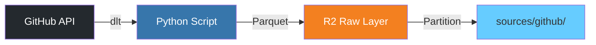

# GitHub データ取得パイプライン

このドキュメントでは、GitHubリポジトリのメトリクスとアクティビティデータを自動収集するパイプラインについて説明します。

## 📊 概要

dltのGitHub公式ソースを使用して、GitHubリポジトリの包括的なデータを収集し、Cloudflare R2のRaw Layer (`data-lake-raw`)に保存します。

### 取得データ

以下のデータが自動的に取得されます:

| カテゴリ | データ内容 |
|---------|----------|
| **リポジトリ情報** | stars, forks, watchers, languages, topics, license |
| **Issues** | オープン/クローズ状態、ラベル、アサイン、マイルストーン |
| **Issue コメント** | コメント内容、作成者、タイムスタンプ |
| **Pull Requests** | マージ状態、レビュー、変更ファイル数 |
| **PR コメント** | レビューコメント、インラインコメント |
| **Commits** | コミット履歴、作成者、変更統計 |
| **Stargazers** | Star獲得の履歴（いつ、誰が） |
| **Releases** | バージョン、リリースノート、アセット |
| **Workflows** | GitHub Actions ワークフロー定義 |
| **Workflow Runs** | ワークフロー実行履歴、成功/失敗、実行時間 |
| **Reactions** | Issue/PR/コメントへのリアクション(👍, ❤️, など) |

## 🏗️ アーキテクチャ



### データフロー

1. **GitHub Actions** (毎日午前2時UTC) が自動実行
2. **dlt GitHub source** が認証ユーザーの全リポジトリを取得
3. 各リポジトリの詳細データをAPIから取得
4. **Parquetフォーマット**でR2に保存
5. **Hiveパーティション**構造で日付別に整理

### ストレージ構造

```
s3://data-lake-raw/sources/github/
├── issues/
│   └── year=2025/month=01/day=03/
│       └── {load_id}.{file_id}.parquet
├── pull_requests/
│   └── year=2025/month=01/day=03/
│       └── {load_id}.{file_id}.parquet
├── commits/
│   └── year=2025/month=01/day=03/
│       └── {load_id}.{file_id}.parquet
├── stargazers/
├── releases/
├── workflows/
├── workflow_runs/
└── reactions/
```

## 🚀 セットアップ

### 1. GitHub Personal Access Token の作成

1. GitHubにログイン → **Settings** → **Developer settings** → **Personal access tokens** → **Tokens (classic)**
2. **Generate new token (classic)** をクリック
3. スコープを選択:
   - ✅ `repo` (プライベートリポジトリにアクセスする場合)
   - ✅ `public_repo` (パブリックリポジトリのみの場合)
   - ✅ `read:org` (Organization のデータを取得する場合)
   - ✅ `read:user`
   - ✅ `user:email`
4. トークンをコピー (後で使用)

### 2. GitHub Secrets の設定

リポジトリの **Settings** → **Secrets and variables** → **Actions** で以下を設定:

| Secret名 | 説明 | 例 |
|---------|------|-----|
| `GH_PAT` | GitHub Personal Access Token | `ghp_xxxxxxxxxxxx` |
| `R2_ENDPOINT` | R2エンドポイントURL | `https://<account-id>.r2.cloudflarestorage.com` |
| `R2_ACCESS_KEY_ID` | R2アクセスキーID | `xxxxxxxxxxxxxxxx` |
| `R2_SECRET_ACCESS_KEY` | R2シークレットアクセスキー | `yyyyyyyyyyyyyyyy` |
| `R2_BUCKET_NAME` | R2バケット名 | `data-lake-raw` |
| `SLACK_WEBHOOK_URL` | Slack通知用WebhookURL (オプション) | `https://hooks.slack.com/...` |

### 3. ローカル実行 (テスト用)

```bash
# 環境変数を設定
export GITHUB_TOKEN="ghp_xxxxxxxxxxxx"
export R2_ENDPOINT="https://<account-id>.r2.cloudflarestorage.com"
export R2_ACCESS_KEY_ID="xxxxxxxxxxxxxxxx"
export R2_SECRET_ACCESS_KEY="yyyyyyyyyyyyyyyy"
export R2_BUCKET_NAME="data-lake-raw"

# 依存関係をインストール
uv pip install 'dlt[filesystem,github]'

# パイプラインを実行
uv run python scripts/github_pipeline.py
```

#### オプション: 特定のリポジトリのみ取得

```bash
# 特定のオーナーを指定
export GITHUB_OWNER="ta93abe"

# 特定のリポジトリを指定 (カンマ区切り)
export GITHUB_REPOS="data-engineering-with-cloudflare,another-repo"

uv run python scripts/github_pipeline.py
```

## ⚙️ GitHub Actions ワークフロー

### 自動実行

ワークフローは **毎日午前2時(UTC)** に自動実行されます。

```yaml
schedule:
  - cron: '0 2 * * *'  # 毎日午前2時UTC (日本時間11時)
```

### 手動実行

1. GitHubリポジトリページで **Actions** タブを開く
2. **GitHub Data Fetch** ワークフローを選択
3. **Run workflow** をクリック
4. オプションを設定:
   - `owner`: 特定のオーナー/Organizationを指定 (空欄で全リポジトリ)
   - `repos`: カンマ区切りのリポジトリ名 (空欄で全リポジトリ)
5. **Run workflow** を実行

### Slack通知

ワークフロー実行後、Slackに通知が送信されます:

- ✅ **成功時**: データ取得完了の通知
- ❌ **失敗時**: エラーアラートとログへのリンク

## 📈 データ分析例

### DuckDB でのクエリ

R2に保存されたParquetファイルは、DuckDBで直接クエリできます:

```sql
-- Issue の統計
SELECT
    repository_name,
    COUNT(*) as total_issues,
    SUM(CASE WHEN state = 'open' THEN 1 ELSE 0 END) as open_issues,
    SUM(CASE WHEN state = 'closed' THEN 1 ELSE 0 END) as closed_issues
FROM read_parquet('s3://data-lake-raw/sources/github/issues/**/*.parquet')
GROUP BY repository_name;

-- Star 獲得の推移
SELECT
    DATE_TRUNC('month', starred_at) as month,
    COUNT(*) as new_stars
FROM read_parquet('s3://data-lake-raw/sources/github/stargazers/**/*.parquet')
GROUP BY month
ORDER BY month;

-- GitHub Actions の成功率
SELECT
    workflow_name,
    COUNT(*) as total_runs,
    SUM(CASE WHEN conclusion = 'success' THEN 1 ELSE 0 END) as successful_runs,
    ROUND(100.0 * SUM(CASE WHEN conclusion = 'success' THEN 1 ELSE 0 END) / COUNT(*), 2) as success_rate
FROM read_parquet('s3://data-lake-raw/sources/github/workflow_runs/**/*.parquet')
GROUP BY workflow_name;
```

### dbt での変換

Raw Layer のデータをdbtでStaging/Martsレイヤーに変換できます:

```sql
-- models/silver/github_issues_enriched.sql
WITH raw_issues AS (
    SELECT * FROM {{ source('github', 'issues') }}
),
raw_comments AS (
    SELECT * FROM {{ source('github', 'issue_comments') }}
)

SELECT
    i.id,
    i.number,
    i.title,
    i.state,
    i.created_at,
    i.closed_at,
    i.user_login as creator,
    COUNT(c.id) as comment_count,
    DATEDIFF('day', i.created_at, COALESCE(i.closed_at, CURRENT_DATE)) as days_to_close
FROM raw_issues i
LEFT JOIN raw_comments c ON i.id = c.issue_id
GROUP BY 1,2,3,4,5,6,7
```

## 🔧 カスタマイズ

### 取得データの調整

`scripts/github_pipeline.py` を編集して、取得するデータを調整できます:

```python
# 特定のリソースのみ取得
source = github_repo_events(
    owner=owner,
    name=repo_name,
    access_token=access_token,
    max_items=1000,  # 最大1000件に制限
)

# または特定のリソースを除外
# 実装詳細はdltドキュメント参照
```

### 実行頻度の変更

`.github/workflows/github-data-fetch.yml` のcron式を編集:

```yaml
schedule:
  # 毎時実行
  - cron: '0 * * * *'

  # 毎週月曜日午前2時
  - cron: '0 2 * * 1'

  # 毎月1日午前2時
  - cron: '0 2 1 * *'
```

## 🐛 トラブルシューティング

### GitHub API Rate Limit

**問題**: `API rate limit exceeded` エラー

**解決策**:
1. Personal Access Token を使用していることを確認
2. GitHub Enterprise の場合は専用トークンを使用
3. `max_items` パラメータでデータ量を制限

### 認証エラー

**問題**: `Bad credentials` エラー

**解決策**:
1. トークンのスコープを確認
2. トークンが有効期限切れでないか確認
3. Secretsが正しく設定されているか確認

### R2接続エラー

**問題**: R2への書き込みエラー

**解決策**:
1. R2_ENDPOINTのURLが正しいか確認
2. アクセスキーの権限を確認
3. バケット名が存在するか確認

## 📚 関連ドキュメント

- [dlt GitHub Source ドキュメント](https://dlthub.com/docs/dlt-ecosystem/verified-sources/github)
- [GitHub REST API ドキュメント](https://docs.github.com/en/rest)
- [Cloudflare R2 ドキュメント](https://developers.cloudflare.com/r2/)
- [アーキテクチャ設計](./architecture-design.md)

## 🔄 更新履歴

- **2025-01-03**: 初版作成
  - dlt GitHub source統合
  - 毎日自動実行ワークフロー
  - 全リポジトリ対応
