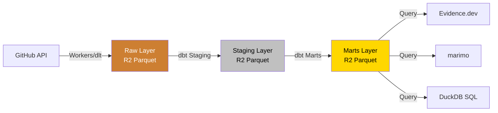

# GitHub データ dbt 変換設計ドキュメント

**ステータス**: 設計フェーズ
**作成日**: 2025-01-03
**対象**: GitHub API データを dbt で Raw → Staging → Marts に変換

## 📋 目次

1. [概要](#概要)
2. [データアーキテクチャ](#データアーキテクチャ)
3. [レイヤー設計](#レイヤー設計)
4. [ソース定義](#ソース定義)
5. [Staging モデル (Staging)](#staging-モデル-silver)
6. [Marts モデル (Marts)](#marts-モデル-gold)
7. [テスト戦略](#テスト戦略)
8. [インクリメンタルモデル](#インクリメンタルモデル)
9. [メトリクス・KPI](#メトリクスkpi)
10. [可視化連携](#可視化連携)
11. [実装計画](#実装計画)

---

## 概要

### 目的

GitHub API から収集した Raw データ (Raw Layer) を dbt で変換し、分析・可視化に最適化された Staging/Marts Layer を構築する。

### データフロー



### レイヤー責務

| Layer | 役割 | フォーマット | マテリアライゼーション |
|-------|------|------------|-------------------|
| **Raw** | Raw データ保存 | Parquet (Hiveパーティション) | - |
| **Staging** | クレンジング、標準化 | Parquet | View |
| **Marts** | 集計、ビジネスロジック | Parquet | Table |

---

## データアーキテクチャ

### R2 ストレージ構造

```
s3://data-lake-raw/
├── sources/github/                    # Raw Layer (Workers/dlt出力)
│   ├── repositories/year=2025/month=01/day=03/*.parquet
│   ├── issues/year=2025/month=01/day=03/*.parquet
│   ├── pull_requests/year=2025/month=01/day=03/*.parquet
│   ├── commits/year=2025/month=01/day=03/*.parquet
│   ├── stargazers/year=2025/month=01/day=03/*.parquet
│   ├── releases/year=2025/month=01/day=03/*.parquet
│   └── workflow_runs/year=2025/month=01/day=03/*.parquet
│
├── staging/github/                    # Staging Layer (dbt出力)
│   ├── stg_github__repositories.parquet
│   ├── stg_github__issues.parquet
│   ├── stg_github__pull_requests.parquet
│   ├── stg_github__commits.parquet
│   ├── stg_github__stargazers.parquet
│   ├── stg_github__releases.parquet
│   └── stg_github__workflow_runs.parquet
│
└── marts/github/                      # Marts Layer (dbt出力)
    ├── fct_repository_activity.parquet
    ├── fct_issue_lifecycle.parquet
    ├── fct_pr_metrics.parquet
    ├── fct_commit_stats.parquet
    ├── dim_repositories.parquet
    ├── dim_contributors.parquet
    └── agg_daily_metrics.parquet
```

### DuckDB + R2 統合

```sql
-- DuckDBでR2のParquetファイルを直接クエリ
SELECT *
FROM read_parquet(
  's3://data-lake-raw/sources/github/issues/**/*.parquet',
  hive_partitioning = true
);
```

---

## レイヤー設計

### Raw Layer (Raw Data)

**特徴**:
- GitHub API からの生データ
- スキーマ変更に対応
- パーティション: `year=YYYY/month=MM/day=DD`
- 更新: Append-only (履歴保持)

**データソース**: Workers または dlt パイプラインが書き込み

### Staging Layer (Staging)

**特徴**:
- クレンジング、型変換、標準化
- カラム名の統一 (snake_case)
- NULL処理、重複削除
- マテリアライゼーション: **View** (ストレージ節約)
- 更新: dbt run で再生成

**命名規則**: `stg_github__<resource>`

### Marts Layer (Marts)

**特徴**:
- ビジネスロジック適用
- 集計、結合、計算フィールド
- ファクト/ディメンションテーブル
- マテリアライゼーション: **Table** (クエリパフォーマンス)
- 更新: dbt run で再生成 (インクリメンタルも可)

**命名規則**:
- ファクトテーブル: `fct_<subject>`
- ディメンションテーブル: `dim_<subject>`
- 集計テーブル: `agg_<granularity>_<subject>`

---

## ソース定義

### `models/sources/github.yml`

```yaml
version: 2

sources:
  - name: github_raw
    description: "GitHub API データ (Raw Layer)"
    database: data-lake-raw
    schema: sources/github
    loader: cloudflare_workers  # または dlt
    loaded_at_field: _extracted_at

    tables:
      - name: repositories
        description: "リポジトリ情報"
        external_location: "s3://data-lake-raw/sources/github/repositories/**/*.parquet"
        columns:
          - name: id
            description: "GitHub リポジトリ ID"
            tests:
              - not_null
              - unique
          - name: full_name
            description: "owner/repo 形式の完全名"
          - name: stargazers_count
            description: "Star 数"
          - name: forks_count
            description: "Fork 数"
          - name: created_at
            description: "作成日時"
          - name: updated_at
            description: "更新日時"
          - name: _extracted_at
            description: "データ取得日時"

      - name: issues
        description: "Issues データ"
        external_location: "s3://data-lake-raw/sources/github/issues/**/*.parquet"
        columns:
          - name: id
            description: "GitHub Issue ID"
            tests:
              - not_null
              - unique
          - name: repository_id
            description: "所属リポジトリID"
            tests:
              - not_null
          - name: number
            description: "Issue 番号"
          - name: title
            description: "Issue タイトル"
          - name: state
            description: "状態 (open/closed)"
          - name: created_at
            description: "作成日時"
          - name: closed_at
            description: "クローズ日時"

      - name: pull_requests
        description: "Pull Requests データ"
        external_location: "s3://data-lake-raw/sources/github/pull_requests/**/*.parquet"

      - name: commits
        description: "Commits データ"
        external_location: "s3://data-lake-raw/sources/github/commits/**/*.parquet"

      - name: stargazers
        description: "Star 履歴"
        external_location: "s3://data-lake-raw/sources/github/stargazers/**/*.parquet"

      - name: releases
        description: "リリース情報"
        external_location: "s3://data-lake-raw/sources/github/releases/**/*.parquet"

      - name: workflow_runs
        description: "GitHub Actions 実行履歴"
        external_location: "s3://data-lake-raw/sources/github/workflow_runs/**/*.parquet"
```

---

## Staging モデル (Staging)

### 1. `stg_github__repositories.sql`

**目的**: リポジトリ情報のクレンジング

```sql
{{
  config(
    materialized='view',
    schema='staging'
  )
}}

with source as (
    select * from {{ source('github_raw', 'repositories') }}
),

renamed as (
    select
        -- Primary Key
        id as repository_id,

        -- Identifiers
        full_name as repository_full_name,
        name as repository_name,
        owner_login as owner,

        -- Attributes
        description,
        language as primary_language,
        topics,
        license_name,

        -- Metrics
        stargazers_count as stars,
        forks_count as forks,
        watchers_count as watchers,
        open_issues_count as open_issues,
        size as size_kb,

        -- Flags
        is_private,
        is_fork,
        is_archived,
        is_template,

        -- Timestamps
        created_at::timestamp as created_at,
        updated_at::timestamp as updated_at,
        pushed_at::timestamp as last_push_at,

        -- Metadata
        _extracted_at::timestamp as extracted_at,
        _run_id as run_id

    from source
),

deduped as (
    -- 同一リポジトリの最新レコードのみ
    select * from renamed
    qualify row_number() over (
        partition by repository_id
        order by extracted_at desc
    ) = 1
)

select * from deduped
```

### 2. `stg_github__issues.sql`

**目的**: Issues データのクレンジング

```sql
{{
  config(
    materialized='view',
    schema='staging'
  )
}}

with source as (
    select * from {{ source('github_raw', 'issues') }}
),

renamed as (
    select
        -- Primary Key
        id as issue_id,

        -- Foreign Keys
        repository_id,

        -- Identifiers
        number as issue_number,
        repository_owner || '/' || repository_name as repository_full_name,

        -- Attributes
        title,
        state,
        user_login as creator,
        assignees,
        labels,

        -- Metrics
        comments_count as comment_count,

        -- Content
        body,

        -- Timestamps
        created_at::timestamp as created_at,
        updated_at::timestamp as updated_at,
        closed_at::timestamp as closed_at,

        -- Calculated Fields
        case
            when closed_at is not null
            then datediff('hour', created_at::timestamp, closed_at::timestamp)
            else null
        end as hours_to_close,

        -- Metadata
        _extracted_at::timestamp as extracted_at,
        _run_id as run_id

    from source
    -- Pull Requests は Issues API にも含まれるため除外
    where pull_request_url is null
),

deduped as (
    select * from renamed
    qualify row_number() over (
        partition by issue_id
        order by extracted_at desc
    ) = 1
)

select * from deduped
```

### 3. `stg_github__pull_requests.sql`

**目的**: Pull Requests データのクレンジング

```sql
{{
  config(
    materialized='view',
    schema='staging'
  )
}}

with source as (
    select * from {{ source('github_raw', 'pull_requests') }}
),

renamed as (
    select
        -- Primary Key
        id as pr_id,

        -- Foreign Keys
        repository_id,

        -- Identifiers
        number as pr_number,
        repository_owner || '/' || repository_name as repository_full_name,

        -- Attributes
        title,
        state,
        user_login as creator,
        head_ref as source_branch,
        base_ref as target_branch,
        draft as is_draft,

        -- Merge Info
        merged_at is not null as is_merged,
        merge_commit_sha,

        -- Metrics
        changed_files,
        additions as lines_added,
        deletions as lines_deleted,
        comments_count as comment_count,
        review_comments_count,
        commits_count,

        -- Timestamps
        created_at::timestamp as created_at,
        updated_at::timestamp as updated_at,
        closed_at::timestamp as closed_at,
        merged_at::timestamp as merged_at,

        -- Calculated Fields
        case
            when merged_at is not null
            then datediff('hour', created_at::timestamp, merged_at::timestamp)
            else null
        end as hours_to_merge,

        lines_added + lines_deleted as total_line_changes,

        -- Metadata
        _extracted_at::timestamp as extracted_at,
        _run_id as run_id

    from source
),

deduped as (
    select * from renamed
    qualify row_number() over (
        partition by pr_id
        order by extracted_at desc
    ) = 1
)

select * from deduped
```

### 4. その他の Staging モデル

- **`stg_github__commits.sql`**: コミット履歴
- **`stg_github__stargazers.sql`**: Star 獲得履歴
- **`stg_github__releases.sql`**: リリース情報
- **`stg_github__workflow_runs.sql`**: GitHub Actions 実行履歴

---

## Marts モデル (Marts)

### ディメンションテーブル

#### 1. `dim_repositories.sql`

**目的**: リポジトリマスタ

```sql
{{
  config(
    materialized='table',
    schema='marts'
  )
}}

with repositories as (
    select * from {{ ref('stg_github__repositories') }}
),

latest_metrics as (
    select
        repository_id,
        stars,
        forks,
        open_issues,
        last_push_at
    from repositories
),

categorized as (
    select
        repository_id,
        repository_full_name,
        repository_name,
        owner,
        description,
        primary_language,
        topics,

        -- Metrics
        stars,
        forks,
        watchers,
        open_issues,

        -- Categories
        case
            when stars >= 1000 then 'Popular (1000+)'
            when stars >= 100 then 'Active (100-999)'
            when stars >= 10 then 'Growing (10-99)'
            else 'New (0-9)'
        end as popularity_tier,

        case
            when is_archived then 'Archived'
            when datediff('day', last_push_at, current_date) > 365 then 'Inactive'
            when datediff('day', last_push_at, current_date) > 90 then 'Low Activity'
            else 'Active'
        end as activity_status,

        -- Flags
        is_private,
        is_fork,
        is_archived,
        is_template,

        -- Timestamps
        created_at,
        updated_at,
        last_push_at,

        -- Calculated
        datediff('day', created_at, current_date) as days_since_creation,

        -- Metadata
        extracted_at

    from repositories
    left join latest_metrics using (repository_id)
)

select * from categorized
```

#### 2. `dim_contributors.sql`

**目的**: コントリビューターマスタ

```sql
{{
  config(
    materialized='table',
    schema='marts'
  )
}}

with issue_creators as (
    select distinct creator as username
    from {{ ref('stg_github__issues') }}
),

pr_creators as (
    select distinct creator as username
    from {{ ref('stg_github__pull_requests') }}
),

commit_authors as (
    select distinct author_login as username
    from {{ ref('stg_github__commits') }}
),

all_contributors as (
    select username from issue_creators
    union
    select username from pr_creators
    union
    select username from commit_authors
),

contributor_stats as (
    select
        username,

        -- Issue Stats
        coalesce(issue_count, 0) as total_issues_created,

        -- PR Stats
        coalesce(pr_count, 0) as total_prs_created,
        coalesce(merged_pr_count, 0) as total_prs_merged,

        -- Commit Stats
        coalesce(commit_count, 0) as total_commits,

        -- Activity Score
        coalesce(issue_count, 0) * 1
        + coalesce(pr_count, 0) * 3
        + coalesce(merged_pr_count, 0) * 5
        + coalesce(commit_count, 0) * 2 as activity_score

    from all_contributors
    left join (
        select creator, count(*) as issue_count
        from {{ ref('stg_github__issues') }}
        group by creator
    ) issues using (username)
    left join (
        select
            creator,
            count(*) as pr_count,
            count(case when is_merged then 1 end) as merged_pr_count
        from {{ ref('stg_github__pull_requests') }}
        group by creator
    ) prs using (username)
    left join (
        select author_login, count(*) as commit_count
        from {{ ref('stg_github__commits') }}
        group by author_login
    ) commits on all_contributors.username = commits.author_login
)

select * from contributor_stats
```

### ファクトテーブル

#### 1. `fct_repository_activity.sql`

**目的**: リポジトリ別のアクティビティメトリクス

```sql
{{
  config(
    materialized='table',
    schema='marts'
  )
}}

with repositories as (
    select * from {{ ref('dim_repositories') }}
),

issue_stats as (
    select
        repository_id,
        count(*) as total_issues,
        count(case when state = 'open' then 1 end) as open_issues,
        count(case when state = 'closed' then 1 end) as closed_issues,
        avg(hours_to_close) as avg_hours_to_close_issue
    from {{ ref('stg_github__issues') }}
    group by repository_id
),

pr_stats as (
    select
        repository_id,
        count(*) as total_prs,
        count(case when state = 'open' then 1 end) as open_prs,
        count(case when is_merged then 1 end) as merged_prs,
        avg(hours_to_merge) as avg_hours_to_merge_pr,
        avg(total_line_changes) as avg_pr_size
    from {{ ref('stg_github__pull_requests') }}
    group by repository_id
),

commit_stats as (
    select
        repository_id,
        count(*) as total_commits,
        count(distinct author_login) as unique_contributors
    from {{ ref('stg_github__commits') }}
    group by repository_id
),

workflow_stats as (
    select
        repository_id,
        count(*) as total_workflow_runs,
        count(case when conclusion = 'success' then 1 end) as successful_runs,
        count(case when conclusion = 'failure' then 1 end) as failed_runs,
        round(
            100.0 * count(case when conclusion = 'success' then 1 end) / count(*),
            2
        ) as success_rate
    from {{ ref('stg_github__workflow_runs') }}
    group by repository_id
),

final as (
    select
        repositories.repository_id,
        repositories.repository_full_name,
        repositories.primary_language,
        repositories.stars,
        repositories.forks,
        repositories.popularity_tier,
        repositories.activity_status,

        -- Issue Metrics
        coalesce(issue_stats.total_issues, 0) as total_issues,
        coalesce(issue_stats.open_issues, 0) as open_issues,
        coalesce(issue_stats.closed_issues, 0) as closed_issues,
        issue_stats.avg_hours_to_close_issue,

        -- PR Metrics
        coalesce(pr_stats.total_prs, 0) as total_prs,
        coalesce(pr_stats.merged_prs, 0) as merged_prs,
        pr_stats.avg_hours_to_merge_pr,
        pr_stats.avg_pr_size,

        -- Commit Metrics
        coalesce(commit_stats.total_commits, 0) as total_commits,
        coalesce(commit_stats.unique_contributors, 0) as unique_contributors,

        -- Workflow Metrics
        coalesce(workflow_stats.total_workflow_runs, 0) as total_workflow_runs,
        workflow_stats.success_rate as ci_success_rate,

        -- Health Score
        case
            when workflow_stats.success_rate >= 95 then 'Excellent'
            when workflow_stats.success_rate >= 80 then 'Good'
            when workflow_stats.success_rate >= 60 then 'Fair'
            else 'Poor'
        end as ci_health,

        -- Timestamps
        repositories.created_at,
        repositories.last_push_at,
        current_timestamp as calculated_at

    from repositories
    left join issue_stats using (repository_id)
    left join pr_stats using (repository_id)
    left join commit_stats using (repository_id)
    left join workflow_stats using (repository_id)
)

select * from final
```

#### 2. `fct_issue_lifecycle.sql`

**目的**: Issue のライフサイクル分析

```sql
{{
  config(
    materialized='table',
    schema='marts'
  )
}}

with issues as (
    select * from {{ ref('stg_github__issues') }}
),

repositories as (
    select repository_id, repository_full_name
    from {{ ref('dim_repositories') }}
),

lifecycle as (
    select
        issues.issue_id,
        issues.issue_number,
        repositories.repository_full_name,
        issues.title,
        issues.state,
        issues.creator,
        issues.labels,

        -- Timestamps
        issues.created_at,
        issues.closed_at,

        -- Lifecycle Metrics
        issues.hours_to_close,
        case
            when issues.hours_to_close is null then null
            when issues.hours_to_close < 24 then '< 1 Day'
            when issues.hours_to_close < 168 then '1-7 Days'
            when issues.hours_to_close < 720 then '1-4 Weeks'
            else '> 1 Month'
        end as resolution_time_bucket,

        -- Engagement
        issues.comment_count,
        case
            when issues.comment_count = 0 then 'No Discussion'
            when issues.comment_count <= 5 then 'Low Discussion'
            when issues.comment_count <= 20 then 'Active Discussion'
            else 'High Discussion'
        end as discussion_level,

        -- Categorization
        case
            when array_contains(issues.labels, 'bug') then 'Bug'
            when array_contains(issues.labels, 'enhancement') then 'Enhancement'
            when array_contains(issues.labels, 'documentation') then 'Documentation'
            else 'Other'
        end as issue_type

    from issues
    inner join repositories using (repository_id)
)

select * from lifecycle
```

#### 3. `fct_pr_metrics.sql`

**目的**: Pull Request メトリクス

```sql
{{
  config(
    materialized='table',
    schema='marts'
  )
}}

with prs as (
    select * from {{ ref('stg_github__pull_requests') }}
),

repositories as (
    select repository_id, repository_full_name
    from {{ ref('dim_repositories') }}
),

pr_analysis as (
    select
        prs.pr_id,
        prs.pr_number,
        repositories.repository_full_name,
        prs.title,
        prs.state,
        prs.creator,
        prs.is_merged,
        prs.is_draft,

        -- Size Metrics
        prs.changed_files,
        prs.lines_added,
        prs.lines_deleted,
        prs.total_line_changes,
        case
            when prs.total_line_changes < 10 then 'XS'
            when prs.total_line_changes < 100 then 'S'
            when prs.total_line_changes < 500 then 'M'
            when prs.total_line_changes < 1000 then 'L'
            else 'XL'
        end as pr_size,

        -- Time Metrics
        prs.created_at,
        prs.merged_at,
        prs.hours_to_merge,
        case
            when prs.hours_to_merge is null then null
            when prs.hours_to_merge < 1 then '< 1 Hour'
            when prs.hours_to_merge < 24 then '1-24 Hours'
            when prs.hours_to_merge < 168 then '1-7 Days'
            else '> 1 Week'
        end as merge_time_bucket,

        -- Review Metrics
        prs.comment_count,
        prs.review_comments_count,
        prs.commits_count,

        -- Branch Info
        prs.source_branch,
        prs.target_branch

    from prs
    inner join repositories using (repository_id)
)

select * from pr_analysis
```

### 集計テーブル

#### 1. `agg_daily_metrics.sql`

**目的**: 日次の集計メトリクス

```sql
{{
  config(
    materialized='incremental',
    unique_key='metric_date',
    schema='marts',
    partition_by='metric_date'
  )
}}

with daily_issues as (
    select
        date_trunc('day', created_at) as metric_date,
        count(*) as issues_created,
        count(case when state = 'closed' then 1 end) as issues_closed
    from {{ ref('stg_github__issues') }}
    
    where created_at >= (select max(metric_date) from {{ this }})
    
    group by 1
),

daily_prs as (
    select
        date_trunc('day', created_at) as metric_date,
        count(*) as prs_created,
        count(case when is_merged then 1 end) as prs_merged
    from {{ ref('stg_github__pull_requests') }}
    
    where created_at >= (select max(metric_date) from {{ this }})
    
    group by 1
),

daily_commits as (
    select
        date_trunc('day', committed_at) as metric_date,
        count(*) as commits_made,
        count(distinct author_login) as active_contributors
    from {{ ref('stg_github__commits') }}
    
    where committed_at >= (select max(metric_date) from {{ this }})
    
    group by 1
),

daily_stars as (
    select
        date_trunc('day', starred_at) as metric_date,
        count(*) as new_stars
    from {{ ref('stg_github__stargazers') }}
    
    where starred_at >= (select max(metric_date) from {{ this }})
    
    group by 1
),

final as (
    select
        coalesce(
            daily_issues.metric_date,
            daily_prs.metric_date,
            daily_commits.metric_date,
            daily_stars.metric_date
        ) as metric_date,

        -- Issue Metrics
        coalesce(daily_issues.issues_created, 0) as issues_created,
        coalesce(daily_issues.issues_closed, 0) as issues_closed,

        -- PR Metrics
        coalesce(daily_prs.prs_created, 0) as prs_created,
        coalesce(daily_prs.prs_merged, 0) as prs_merged,

        -- Commit Metrics
        coalesce(daily_commits.commits_made, 0) as commits_made,
        coalesce(daily_commits.active_contributors, 0) as active_contributors,

        -- Star Metrics
        coalesce(daily_stars.new_stars, 0) as new_stars,

        -- Calculated at
        current_timestamp as calculated_at

    from daily_issues
    full outer join daily_prs using (metric_date)
    full outer join daily_commits using (metric_date)
    full outer join daily_stars using (metric_date)
)

select * from final
order by metric_date
```

---

## テスト戦略

### `models/staging/github/schema.yml`

```yaml
version: 2

models:
  - name: stg_github__repositories
    description: "クレンジング済みリポジトリデータ"
    columns:
      - name: repository_id
        description: "リポジトリID (PK)"
        tests:
          - not_null
          - unique

      - name: repository_full_name
        description: "owner/repo 形式"
        tests:
          - not_null

      - name: stars
        description: "Star 数"
        tests:
          - not_null
          - dbt_utils.accepted_range:
              min_value: 0

      - name: created_at
        description: "作成日時"
        tests:
          - not_null
          - dbt_utils.accepted_range:
              min_value: "'2000-01-01'"
              max_value: "current_date + interval '1 day'"

  - name: stg_github__issues
    description: "クレンジング済み Issues データ"
    tests:
      # Relationship test
      - dbt_utils.relationships_where:
          to: ref('stg_github__repositories')
          field: repository_id
          from_condition: "repository_id is not null"

    columns:
      - name: issue_id
        tests:
          - not_null
          - unique

      - name: state
        tests:
          - accepted_values:
              values: ['open', 'closed']

      - name: hours_to_close
        tests:
          - dbt_utils.accepted_range:
              min_value: 0
              where: "hours_to_close is not null"

  - name: stg_github__pull_requests
    description: "クレンジング済み Pull Requests データ"
    tests:
      - dbt_utils.relationships_where:
          to: ref('stg_github__repositories')
          field: repository_id

    columns:
      - name: pr_id
        tests:
          - not_null
          - unique

      - name: is_merged
        tests:
          - not_null

      - name: total_line_changes
        tests:
          - dbt_utils.accepted_range:
              min_value: 0
```

### Elementary データ品質監視

```yaml
# Elementary anomaly detection
models:
  - name: stg_github__issues
    config:
      elementary:
        timestamp_column: "created_at"
    tests:
      - elementary.volume_anomalies:
          time_bucket:
            period: day
            count: 7

      - elementary.freshness_anomalies:
          timestamp_column: "created_at"

  - name: fct_repository_activity
    tests:
      - elementary.dimension_anomalies:
          dimensions:
            - repository_full_name
          time_bucket:
            period: day
            count: 14
```

---

## インクリメンタルモデル

### `agg_daily_metrics.sql` (再掲)

```sql
{{
  config(
    materialized='incremental',
    unique_key='metric_date',
    on_schema_change='append_new_columns'
  )
}}

-- 最新データのみ処理

where metric_date > (select max(metric_date) from {{ this }})

```

### 利点

- **処理時間短縮**: 新規データのみ処理
- **コスト削減**: DuckDB の処理量削減
- **スケーラビリティ**: 履歴データが増えても高速

---

## メトリクス・KPI

### ダッシュボード用メトリクス

| カテゴリ | メトリクス | 算出方法 |
|---------|----------|---------|
| **リポジトリ健全性** | アクティブリポジトリ数 | `activity_status = 'Active'` |
| | CI成功率 | `avg(ci_success_rate)` |
| **開発速度** | 平均PR マージ時間 | `avg(hours_to_merge) / 24` (日) |
| | 1日あたりコミット数 | `commits_made / days` |
| **コミュニティ** | アクティブコントリビューター | `count(distinct contributors)` |
| | 新規Star獲得率 | `new_stars / total_stars * 100` |
| **Issue 管理** | Issue クローズ率 | `closed_issues / total_issues * 100` |
| | 平均Issue解決時間 | `avg(hours_to_close) / 24` (日) |

### KPI 例

```sql
-- KPI: 週次アクティビティスコア
select
    date_trunc('week', metric_date) as week,
    sum(prs_merged) * 3 +
    sum(issues_closed) * 2 +
    sum(commits_made) * 1 as activity_score
from {{ ref('agg_daily_metrics') }}
group by 1
order by 1 desc
```

---

## 可視化連携

### Evidence.dev

**`pages/github-dashboard.md`**:

```markdown
# GitHub リポジトリダッシュボード

## 概要

```sql repositories
select * from marts.fct_repository_activity
order by stars desc
limit 10
```

<DataTable data={repositories} />

## Star 推移

```sql star_history
select
    metric_date,
    sum(new_stars) over (order by metric_date) as cumulative_stars
from marts.agg_daily_metrics
```

<LineChart data={star_history} x=metric_date y=cumulative_stars />
```

### marimo ノートブック

**`marimo/notebooks/github_analysis.py`**:

```python
import marimo as mo
import duckdb

# R2接続
conn = duckdb.connect(':memory:')
conn.execute("INSTALL httpfs; LOAD httpfs;")
conn.execute(f"SET s3_endpoint='{R2_ENDPOINT}'")

# データ取得
df = conn.execute("""
    SELECT *
    FROM read_parquet('s3://data-lake-raw/marts/github/fct_repository_activity.parquet')
""").df()

# 可視化
mo.ui.table(df)
mo.ui.plotly(px.bar(df, x='repository_full_name', y='stars'))
```

---

## 参考資料

### dbt

- [dbt Documentation](https://docs.getdbt.com/)
- [dbt-duckdb Adapter](https://github.com/duckdb/dbt-duckdb)
- [dbt Best Practices](https://docs.getdbt.com/guides/best-practices)

### DuckDB

- [DuckDB Documentation](https://duckdb.org/docs/)
- [DuckDB S3 Extension](https://duckdb.org/docs/extensions/httpfs.html)
- [DuckDB Parquet](https://duckdb.org/docs/data/parquet.html)

### Elementary

- [Elementary Documentation](https://docs.elementary-data.com/)
- [Elementary dbt Package](https://hub.getdbt.com/elementary-data/elementary/latest/)

---

## 変更履歴

| 日付 | バージョン | 変更内容 |
|-----|-----------|---------|
| 2025-01-03 | 1.0 | 初版作成 |

---

## 承認・レビュー

- [ ] アーキテクチャレビュー
- [ ] データモデルレビュー
- [ ] パフォーマンスレビュー
- [ ] 実装開始承認
