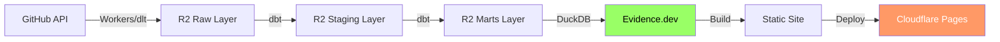

# GitHub データ Evidence.dev 可視化設計ドキュメント

**ステータス**: 設計フェーズ
**作成日**: 2025-01-03
**対象**: Evidence.dev による GitHub データダッシュボード構築

## 📋 目次

1. [概要](#概要)
2. [アーキテクチャ](#アーキテクチャ)
3. [プロジェクト構成](#プロジェクト構成)
4. [データソース設定](#データソース設定)
5. [ダッシュボード設計](#ダッシュボード設計)
6. [ページ詳細設計](#ページ詳細設計)
7. [コンポーネントライブラリ](#コンポーネントライブラリ)
8. [デプロイ戦略](#デプロイ戦略)
9. [実装計画](#実装計画)

---

## 概要

### Evidence.dev とは

Evidence.dev は **コードベースのBI (Business Intelligence) ツール** です。

**特徴**:
- マークダウン + SQL でダッシュボード作成
- Git でバージョン管理
- Cloudflare Pages にデプロイ可能
- リアクティブなチャート・テーブル
- 静的サイト生成 (SSG) で高速

### なぜ Evidence.dev か

| 項目 | Evidence.dev | 従来のBIツール |
|-----|-------------|-------------|
| **バージョン管理** | Git で管理 | ✗ |
| **コードレビュー** | PR でレビュー可能 | ✗ |
| **デプロイ** | Cloudflare Pages | 専用サーバー |
| **コスト** | 無料 (Pages) | 月額課金 |
| **カスタマイズ** | 完全制御 | 制限あり |
| **学習コスト** | Markdown + SQL | 専用UI |

### 対象ユーザー

- **開発チーム**: リポジトリ活動の可視化
- **プロダクトマネージャー**: Issue/PR メトリクス
- **エンジニアリングマネージャー**: チームパフォーマンス
- **経営層**: 全体KPI

---

## アーキテクチャ

### データフロー



### 技術スタック

| レイヤー | 技術 |
|---------|------|
| **データ取得** | Cloudflare Workers / dlt |
| **ストレージ** | Cloudflare R2 (Parquet) |
| **変換** | dbt + DuckDB |
| **可視化** | Evidence.dev |
| **ホスティング** | Cloudflare Pages |

### アクセスパターン

```typescript
// Evidence.dev → DuckDB → R2
DuckDB.query(`
  SELECT *
  FROM read_parquet('s3://data-lake-raw/marts/github/fct_repository_activity.parquet')
`)
```

---

## プロジェクト構成

### ディレクトリ構造

```
evidence/
├── .evidence/
│   └── template/           # Evidence テンプレート
├── sources/
│   └── github.md          # データソース設定 (DuckDB + R2)
├── pages/
│   ├── index.md           # ホームページ
│   ├── overview.md        # 全体ダッシュボード
│   ├── repositories/
│   │   ├── index.md       # リポジトリ一覧
│   │   └── [repo].md      # リポジトリ詳細 (動的ルート)
│   ├── issues-prs/
│   │   ├── issues.md      # Issue 分析
│   │   └── pull-requests.md  # PR 分析
│   ├── contributors/
│   │   ├── index.md       # コントリビューター一覧
│   │   └── [user].md      # コントリビューター詳細
│   ├── ci-cd.md           # CI/CD パフォーマンス
│   └── growth.md          # 成長メトリクス
├── components/
│   ├── KPICard.svelte     # 再利用可能コンポーネント
│   ├── TrendChart.svelte
│   └── RepositoryTable.svelte
├── static/
│   └── logo.png
├── package.json
├── evidence.config.yaml
└── README.md
```

---

## データソース設定

### `sources/github.md`

```yaml
---
name: github
type: duckdb
options:
  filename: ':memory:'
  extensions:
    - httpfs
  settings:
    s3_endpoint: ${R2_ENDPOINT}
    s3_access_key_id: ${R2_ACCESS_KEY_ID}
    s3_secret_access_key: ${R2_SECRET_ACCESS_KEY}
    s3_region: auto
---

# GitHub Data Source

このデータソースは Cloudflare R2 に保存された GitHub データに接続します。

## Available Tables

### Marts Layer

- `fct_repository_activity`: リポジトリ別アクティビティメトリクス
- `fct_issue_lifecycle`: Issue ライフサイクル分析
- `fct_pr_metrics`: Pull Request メトリクス
- `dim_repositories`: リポジトリマスタ
- `dim_contributors`: コントリビューターマスタ
- `agg_daily_metrics`: 日次集計メトリクス

### SQL Helper

```sql repos
CREATE OR REPLACE VIEW repos AS
SELECT * FROM read_parquet('s3://data-lake-raw/marts/github/fct_repository_activity.parquet');
```

```sql daily
CREATE OR REPLACE VIEW daily AS
SELECT * FROM read_parquet('s3://data-lake-raw/marts/github/agg_daily_metrics.parquet');
```
```

### 環境変数設定

**`.env`**:
```bash
R2_ENDPOINT=https://ACCOUNT_ID.r2.cloudflarestorage.com
R2_ACCESS_KEY_ID=your_access_key
R2_SECRET_ACCESS_KEY=your_secret_key
```

---

## ダッシュボード設計

### ページ構成

| ページ | パス | 目的 |
|--------|------|------|
| **ホーム** | `/` | ランディングページ、ナビゲーション |
| **全体概要** | `/overview` | 全リポジトリのKPI、トレンド |
| **リポジトリ一覧** | `/repositories` | 全リポジトリのテーブル |
| **リポジトリ詳細** | `/repositories/[repo]` | 個別リポジトリの詳細分析 |
| **Issue分析** | `/issues-prs/issues` | Issue メトリクス、トレンド |
| **PR分析** | `/issues-prs/pull-requests` | PR メトリクス、マージ時間 |
| **コントリビューター** | `/contributors` | 貢献度ランキング |
| **CI/CD** | `/ci-cd` | ワークフロー成功率、実行時間 |
| **成長指標** | `/growth` | Star成長、アクティビティ推移 |

### ナビゲーション

**サイドバーメニュー**:
```
📊 Overview
📁 Repositories
  ├─ All Repositories
  └─ [Dynamic: Selected Repo]
🐛 Issues & PRs
  ├─ Issues
  └─ Pull Requests
👥 Contributors
⚙️ CI/CD Performance
📈 Growth Metrics
```

---

## ページ詳細設計

### 1. Overview Dashboard (`pages/overview.md`)

**レイアウト**:

```markdown
# GitHub Analytics Overview

<DatePicker />

## Key Performance Indicators

<div class="grid grid-cols-4 gap-4">

```sql kpi_repos
SELECT
  COUNT(*) as total_repositories,
  SUM(CASE WHEN activity_status = 'Active' THEN 1 ELSE 0 END) as active_repos,
  SUM(stars) as total_stars,
  SUM(forks) as total_forks
FROM read_parquet('s3://data-lake-raw/marts/github/fct_repository_activity.parquet')
```

<BigValue data={kpi_repos} value=total_repositories label="Total Repositories" />
<BigValue data={kpi_repos} value=active_repos label="Active Repositories" />
<BigValue data={kpi_repos} value=total_stars label="Total Stars" />
<BigValue data={kpi_repos} value=total_forks label="Total Forks" />

</div>

## Activity Trends

```sql daily_activity
SELECT
  metric_date,
  issues_created,
  prs_merged,
  commits_made,
  new_stars
FROM read_parquet('s3://data-lake-raw/marts/github/agg_daily_metrics.parquet')
WHERE metric_date >= current_date - interval '90 days'
ORDER BY metric_date
```

<LineChart
  data={daily_activity}
  x=metric_date
  y={['issues_created', 'prs_merged', 'commits_made']}
  title="Daily Activity (Last 90 Days)"
/>

## Top Repositories by Stars

```sql top_repos
SELECT
  repository_full_name,
  stars,
  forks,
  open_issues,
  ci_success_rate
FROM read_parquet('s3://data-lake-raw/marts/github/fct_repository_activity.parquet')
ORDER BY stars DESC
LIMIT 10
```

<DataTable data={top_repos} />

## Repository Health Distribution

```sql health_dist
SELECT
  ci_health,
  COUNT(*) as repository_count
FROM read_parquet('s3://data-lake-raw/marts/github/fct_repository_activity.parquet')
GROUP BY ci_health
```

<BarChart
  data={health_dist}
  x=ci_health
  y=repository_count
  title="Repository Health Distribution"
/>
```

### 2. Repository List (`pages/repositories/index.md`)

```markdown
# All Repositories

```sql repos
SELECT
  repository_full_name,
  primary_language,
  stars,
  forks,
  open_issues,
  total_prs,
  ci_success_rate,
  popularity_tier,
  activity_status
FROM read_parquet('s3://data-lake-raw/marts/github/fct_repository_activity.parquet')
ORDER BY stars DESC
```

<DataTable
  data={repos}
  link=repository_full_name
  rows=50
  search=true
>
  <Column id=repository_full_name title="Repository" />
  <Column id=primary_language title="Language" />
  <Column id=stars title="Stars" fmt='#,##0' />
  <Column id=forks title="Forks" fmt='#,##0' />
  <Column id=open_issues title="Open Issues" />
  <Column id=ci_success_rate title="CI Success %" fmt='0.0%' />
  <Column id=activity_status title="Status" />
</DataTable>
```

### 3. Repository Detail (`pages/repositories/[repo].md`)

```markdown
---
queries:
  - repo_detail.sql
  - repo_issues.sql
  - repo_prs.sql
  - repo_commits.sql
---

# {params.repo}

```sql repo_info
SELECT *
FROM read_parquet('s3://data-lake-raw/marts/github/fct_repository_activity.parquet')
WHERE repository_full_name = '${params.repo}'
```

<Details data={repo_info}>

## Overview

<div class="grid grid-cols-4 gap-4">

<BigValue data={repo_info} value=stars label="Stars" />
<BigValue data={repo_info} value=forks label="Forks" />
<BigValue data={repo_info} value=total_issues label="Total Issues" />
<BigValue data={repo_info} value=total_prs label="Total PRs" />

</div>

## Issue Trends

```sql issue_trends
SELECT
  DATE_TRUNC('month', created_at) as month,
  COUNT(*) as issue_count,
  AVG(hours_to_close) / 24 as avg_days_to_close
FROM read_parquet('s3://data-lake-raw/marts/github/fct_issue_lifecycle.parquet')
WHERE repository_full_name = '${params.repo}'
GROUP BY month
ORDER BY month
```

<LineChart
  data={issue_trends}
  x=month
  y=issue_count
  y2=avg_days_to_close
  title="Issue Activity"
/>

## Pull Request Metrics

```sql pr_metrics
SELECT
  pr_size,
  COUNT(*) as pr_count,
  AVG(hours_to_merge) / 24 as avg_days_to_merge
FROM read_parquet('s3://data-lake-raw/marts/github/fct_pr_metrics.parquet')
WHERE repository_full_name = '${params.repo}' AND is_merged = true
GROUP BY pr_size
ORDER BY
  CASE pr_size
    WHEN 'XS' THEN 1
    WHEN 'S' THEN 2
    WHEN 'M' THEN 3
    WHEN 'L' THEN 4
    WHEN 'XL' THEN 5
  END
```

<BarChart
  data={pr_metrics}
  x=pr_size
  y=pr_count
  title="PR Size Distribution"
/>

## Top Contributors

```sql contributors
SELECT
  c.username,
  c.total_commits,
  c.total_prs_merged,
  c.total_issues_created
FROM read_parquet('s3://data-lake-raw/marts/github/dim_contributors.parquet') c
-- Filter by repository (需要 commits/prs テーブルと JOIN)
ORDER BY c.activity_score DESC
LIMIT 10
```

<DataTable data={contributors} />

</Details>
```

### 4. Issue Analysis (`pages/issues-prs/issues.md`)

```markdown
# Issue Analysis

## Issue Lifecycle

```sql issue_lifecycle
SELECT
  resolution_time_bucket,
  COUNT(*) as issue_count,
  AVG(hours_to_close) / 24 as avg_days_to_close
FROM read_parquet('s3://data-lake-raw/marts/github/fct_issue_lifecycle.parquet')
WHERE state = 'closed'
GROUP BY resolution_time_bucket
ORDER BY
  CASE resolution_time_bucket
    WHEN '< 1 Day' THEN 1
    WHEN '1-7 Days' THEN 2
    WHEN '1-4 Weeks' THEN 3
    WHEN '> 1 Month' THEN 4
  END
```

<BarChart
  data={issue_lifecycle}
  x=resolution_time_bucket
  y=issue_count
  title="Issue Resolution Time Distribution"
/>

## Issue Type Breakdown

```sql issue_types
SELECT
  issue_type,
  COUNT(*) as count,
  AVG(hours_to_close) / 24 as avg_days_to_close
FROM read_parquet('s3://data-lake-raw/marts/github/fct_issue_lifecycle.parquet')
GROUP BY issue_type
```

<BarChart
  data={issue_types}
  x=issue_type
  y=count
  title="Issue Type Distribution"
/>

## Open vs Closed Trend

```sql issue_trend
SELECT
  DATE_TRUNC('week', created_at) as week,
  SUM(CASE WHEN state = 'open' THEN 1 ELSE 0 END) as open_count,
  SUM(CASE WHEN state = 'closed' THEN 1 ELSE 0 END) as closed_count
FROM read_parquet('s3://data-lake-raw/marts/github/fct_issue_lifecycle.parquet')
GROUP BY week
ORDER BY week
```

<LineChart
  data={issue_trend}
  x=week
  y={['open_count', 'closed_count']}
  title="Issue Open/Close Trend"
/>
```

### 5. Pull Request Analysis (`pages/issues-prs/pull-requests.md`)

```markdown
# Pull Request Analysis

## PR Merge Time Distribution

```sql pr_merge_time
SELECT
  merge_time_bucket,
  COUNT(*) as pr_count
FROM read_parquet('s3://data-lake-raw/marts/github/fct_pr_metrics.parquet')
WHERE is_merged = true
GROUP BY merge_time_bucket
ORDER BY
  CASE merge_time_bucket
    WHEN '< 1 Hour' THEN 1
    WHEN '1-24 Hours' THEN 2
    WHEN '1-7 Days' THEN 3
    WHEN '> 1 Week' THEN 4
  END
```

<BarChart
  data={pr_merge_time}
  x=merge_time_bucket
  y=pr_count
  title="PR Merge Time"
/>

## PR Size vs Merge Time

```sql pr_size_time
SELECT
  pr_size,
  AVG(hours_to_merge) as avg_hours_to_merge,
  COUNT(*) as pr_count
FROM read_parquet('s3://data-lake-raw/marts/github/fct_pr_metrics.parquet')
WHERE is_merged = true
GROUP BY pr_size
```

<ScatterPlot
  data={pr_size_time}
  x=pr_size
  y=avg_hours_to_merge
  size=pr_count
  title="PR Size vs Merge Time"
/>

## Merged vs Not Merged

```sql pr_status
SELECT
  is_merged,
  COUNT(*) as count
FROM read_parquet('s3://data-lake-raw/marts/github/fct_pr_metrics.parquet')
GROUP BY is_merged
```

<BarChart
  data={pr_status}
  x=is_merged
  y=count
  title="PR Status"
/>
```

### 6. Contributors (`pages/contributors/index.md`)

```markdown
# Top Contributors

```sql contributors
SELECT
  username,
  total_commits,
  total_prs_merged,
  total_issues_created,
  activity_score
FROM read_parquet('s3://data-lake-raw/marts/github/dim_contributors.parquet')
ORDER BY activity_score DESC
LIMIT 50
```

<DataTable data={contributors} link=username>
  <Column id=username title="Username" />
  <Column id=total_commits title="Commits" fmt='#,##0' />
  <Column id=total_prs_merged title="PRs Merged" fmt='#,##0' />
  <Column id=total_issues_created title="Issues Created" fmt='#,##0' />
  <Column id=activity_score title="Activity Score" fmt='#,##0' />
</DataTable>

## Activity Distribution

```sql activity_dist
SELECT
  CASE
    WHEN activity_score >= 1000 THEN 'Highly Active (1000+)'
    WHEN activity_score >= 100 THEN 'Active (100-999)'
    WHEN activity_score >= 10 THEN 'Casual (10-99)'
    ELSE 'New (0-9)'
  END as activity_level,
  COUNT(*) as contributor_count
FROM read_parquet('s3://data-lake-raw/marts/github/dim_contributors.parquet')
GROUP BY activity_level
```

<BarChart
  data={activity_dist}
  x=activity_level
  y=contributor_count
  title="Contributor Activity Distribution"
/>
```

### 7. CI/CD Performance (`pages/ci-cd.md`)

```markdown
# CI/CD Performance

## Overall Success Rate

```sql overall_ci
SELECT
  AVG(ci_success_rate) as avg_success_rate,
  SUM(total_workflow_runs) as total_runs
FROM read_parquet('s3://data-lake-raw/marts/github/fct_repository_activity.parquet')
WHERE total_workflow_runs > 0
```

<BigValue data={overall_ci} value=avg_success_rate label="Average CI Success Rate" fmt='0.0%' />

## Repository CI Health

```sql repo_ci
SELECT
  repository_full_name,
  ci_success_rate,
  total_workflow_runs,
  ci_health
FROM read_parquet('s3://data-lake-raw/marts/github/fct_repository_activity.parquet')
WHERE total_workflow_runs > 0
ORDER BY ci_success_rate DESC
```

<DataTable data={repo_ci} />

## CI Health Distribution

```sql health_dist
SELECT
  ci_health,
  COUNT(*) as repo_count
FROM read_parquet('s3://data-lake-raw/marts/github/fct_repository_activity.parquet')
WHERE total_workflow_runs > 0
GROUP BY ci_health
```

<BarChart
  data={health_dist}
  x=ci_health
  y=repo_count
  title="CI Health Distribution"
/>
```

### 8. Growth Metrics (`pages/growth.md`)

```markdown
# Growth Metrics

## Star Growth

```sql star_growth
SELECT
  metric_date,
  SUM(new_stars) OVER (ORDER BY metric_date) as cumulative_stars
FROM read_parquet('s3://data-lake-raw/marts/github/agg_daily_metrics.parquet')
ORDER BY metric_date
```

<LineChart
  data={star_growth}
  x=metric_date
  y=cumulative_stars
  title="Cumulative Star Growth"
/>

## Activity Score Trend

```sql activity_score
SELECT
  DATE_TRUNC('week', metric_date) as week,
  SUM(prs_merged * 3 + issues_closed * 2 + commits_made * 1) as weekly_activity_score
FROM read_parquet('s3://data-lake-raw/marts/github/agg_daily_metrics.parquet')
GROUP BY week
ORDER BY week
```

<LineChart
  data={activity_score}
  x=week
  y=weekly_activity_score
  title="Weekly Activity Score"
/>

## Contributor Growth

```sql contributor_growth
SELECT
  metric_date,
  SUM(active_contributors) OVER (ORDER BY metric_date) as cumulative_contributors
FROM read_parquet('s3://data-lake-raw/marts/github/agg_daily_metrics.parquet')
ORDER BY metric_date
```

<LineChart
  data={contributor_growth}
  x=metric_date
  y=cumulative_contributors
  title="Cumulative Contributor Growth"
/>
```

---

## コンポーネントライブラリ

### 再利用可能コンポーネント

#### 1. KPICard.svelte

```svelte
<script>
  export let title;
  export let value;
  export let change = null;
  export let format = '#,##0';
</script>

<div class="kpi-card">
  <h3>{title}</h3>
  <div class="value">{value}</div>
  {#if change}
    <div class="change" class:positive={change > 0} class:negative={change < 0}>
      {change > 0 ? '↑' : '↓'} {Math.abs(change)}%
    </div>
  {/if}
</div>

<style>
  .kpi-card {
    padding: 1.5rem;
    border-radius: 8px;
    background: white;
    box-shadow: 0 1px 3px rgba(0,0,0,0.1);
  }
  .value {
    font-size: 2rem;
    font-weight: bold;
    margin: 0.5rem 0;
  }
  .change.positive { color: green; }
  .change.negative { color: red; }
</style>
```

#### 2. TrendChart.svelte

再利用可能なトレンドチャート (LineChart のラッパー)

#### 3. RepositoryCard.svelte

リポジトリサマリーカード

---

## デプロイ戦略

### Cloudflare Pages デプロイ

#### 1. プロジェクト設定

**`wrangler.toml`** (Pages用):
```toml
name = "github-analytics"
pages_build_output_dir = "build"

[env.production]
vars = { NODE_ENV = "production" }

[[env.production.r2_buckets]]
binding = "DATA_BUCKET"
bucket_name = "data-lake-raw"
```

#### 2. ビルドコマンド

**`package.json`**:
```json
{
  "scripts": {
    "dev": "evidence dev",
    "build": "evidence build",
    "deploy": "wrangler pages deploy build"
  }
}
```

#### 3. GitHub Actions デプロイ

**`.github/workflows/deploy-evidence.yml`**:
```yaml
name: Deploy Evidence to Cloudflare Pages

on:
  push:
    branches: [main]
    paths:
      - 'evidence/**'
  workflow_dispatch:

jobs:
  deploy:
    runs-on: ubuntu-latest
    steps:
      - uses: actions/checkout@v6

      - uses: actions/setup-node@v6
        with:
          node-version: '20'

      - name: Install dependencies
        working-directory: evidence
        run: npm ci

      - name: Build Evidence
        working-directory: evidence
        env:
          R2_ENDPOINT: ${{ secrets.R2_ENDPOINT }}
          R2_ACCESS_KEY_ID: ${{ secrets.R2_ACCESS_KEY_ID }}
          R2_SECRET_ACCESS_KEY: ${{ secrets.R2_SECRET_ACCESS_KEY }}
        run: npm run build

      - name: Deploy to Cloudflare Pages
        uses: cloudflare/wrangler-action@v3
        with:
          apiToken: ${{ secrets.CLOUDFLARE_API_TOKEN }}
          accountId: ${{ secrets.CLOUDFLARE_ACCOUNT_ID }}
          command: pages deploy evidence/build --project-name=github-analytics
```

#### 4. 環境変数設定

Cloudflare Pages ダッシュボードで設定:
- `R2_ENDPOINT`
- `R2_ACCESS_KEY_ID`
- `R2_SECRET_ACCESS_KEY`

### セキュリティ

#### アクセス制御

**Cloudflare Access** で認証:
```yaml
# Evidence サイトを Cloudflare Access で保護
policies:
  - name: GitHub Analytics Access
    decision: allow
    include:
      - email_domain: example.com
```

---

## 実装計画

### Phase 1: セットアップ (Week 1)

- [ ] Evidence プロジェクト初期化
- [ ] DuckDB + R2 データソース設定
- [ ] 基本ページ構造作成
- [ ] ローカル開発環境確認

### Phase 2: コアページ実装 (Week 2)

- [ ] Overview Dashboard
- [ ] Repository List
- [ ] Repository Detail (動的ルート)
- [ ] 基本コンポーネント

### Phase 3: 詳細ページ実装 (Week 3)

- [ ] Issue Analysis
- [ ] PR Analysis
- [ ] Contributors
- [ ] CI/CD Performance
- [ ] Growth Metrics

### Phase 4: デザイン・UX (Week 4)

- [ ] カスタムテーマ
- [ ] レスポンシブデザイン
- [ ] ナビゲーション改善
- [ ] インタラクティブフィルター

### Phase 5: デプロイ・運用 (Week 5)

- [ ] Cloudflare Pages デプロイ
- [ ] GitHub Actions CI/CD
- [ ] Cloudflare Access 設定
- [ ] ドキュメント整備
- [ ] ユーザートレーニング

---

## パフォーマンス最適化

### 1. クエリ最適化

```sql
-- ❌ Bad: 全データスキャン
SELECT * FROM read_parquet('s3://data-lake-raw/marts/github/**/*.parquet')

-- ✅ Good: 必要なファイルのみ
SELECT * FROM read_parquet('s3://data-lake-raw/marts/github/fct_repository_activity.parquet')
```

### 2. キャッシング

Evidence は静的サイト生成なので、ビルド時にクエリ実行:
- データ更新頻度に応じて再ビルド (1日1回など)
- Cloudflare Pages の CDN でキャッシュ

### 3. データサイズ削減

```sql
-- フィルタリングで返すデータを削減
SELECT repository_full_name, stars, forks
FROM read_parquet('...')
WHERE stars > 100  -- 人気リポジトリのみ
```

---

## トラブルシューティング

### よくある問題

#### 1. R2接続エラー

**エラー**: `IO Error: Connection failed`

**解決策**:
```bash
# 環境変数確認
echo $R2_ENDPOINT
echo $R2_ACCESS_KEY_ID

# DuckDB で手動テスト
duckdb -c "
  INSTALL httpfs; LOAD httpfs;
  SET s3_endpoint='$R2_ENDPOINT';
  SELECT * FROM read_parquet('s3://data-lake-raw/marts/github/dim_repositories.parquet') LIMIT 1;
"
```

#### 2. クエリが遅い

**解決策**:
- Parquet ファイルサイズ確認
- 必要なカラムのみ SELECT
- フィルター条件追加

#### 3. ビルドエラー

**解決策**:
```bash
# Evidence キャッシュクリア
rm -rf .evidence/cache
npm run build
```

---

## 参考資料

### Evidence.dev

- [Evidence Documentation](https://docs.evidence.dev/)
- [Evidence GitHub](https://github.com/evidence-dev/evidence)
- [Component Library](https://docs.evidence.dev/components/)

### Cloudflare Pages

- [Pages Documentation](https://developers.cloudflare.com/pages/)
- [Wrangler CLI](https://developers.cloudflare.com/workers/wrangler/)

### DuckDB

- [DuckDB httpfs Extension](https://duckdb.org/docs/extensions/httpfs.html)

---

## 変更履歴

| 日付 | バージョン | 変更内容 |
|-----|-----------|---------|
| 2025-01-03 | 1.0 | 初版作成 |

---

## 承認・レビュー

- [ ] ダッシュボード設計レビュー
- [ ] UX/UIレビュー
- [ ] セキュリティレビュー
- [ ] 実装開始承認
