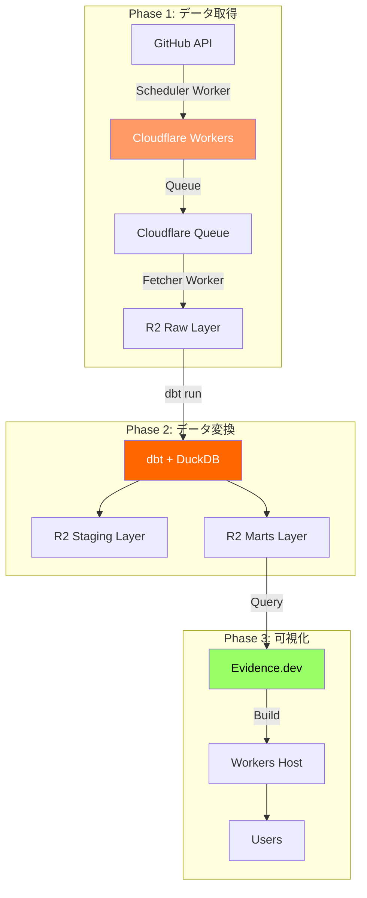
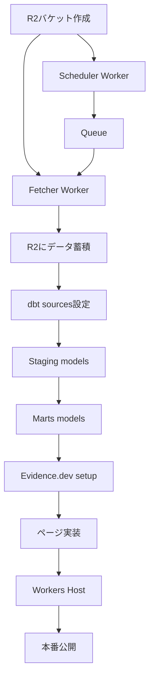

# GitHub データ基盤 実装計画

**作成日**: 2025-01-03
**ステータス**: 実装準備中
**期間**: 6週間 (MVP)

## 📋 目次

1. [概要](#概要)
2. [アーキテクチャ全体像](#アーキテクチャ全体像)
3. [実装フェーズ](#実装フェーズ)
4. [Phase 1: データ取得基盤](#phase-1-データ取得基盤)
5. [Phase 2: dbt変換基盤](#phase-2-dbt変換基盤)
6. [Phase 3: 可視化基盤](#phase-3-可視化基盤)
7. [優先順位と依存関係](#優先順位と依存関係)
8. [リスクと対策](#リスクと対策)

---

## 概要

### 目標

GitHubリポジトリのメトリクスとアクティビティを自動収集・変換・可視化する、End-to-Endのデータ基盤を構築する。

### スコープ

**Phase 1-3 (MVP - 6週間)**:
- ✅ GitHubデータ自動取得
- ✅ dbt変換パイプライン
- ✅ Evidence.devダッシュボード

**Phase 4以降 (拡張)**:
- データ品質監視 (Elementary)
- アラート機能
- 追加データソース

---

## アーキテクチャ全体像



---

## 実装フェーズ

### タイムライン

| Phase | 期間 | 内容 | 成果物 |
|-------|------|------|--------|
| **Phase 1** | Week 1-2 | データ取得基盤 | Workers稼働、R2にデータ蓄積 |
| **Phase 2** | Week 3-4 | dbt変換基盤 | Marts Layer完成 |
| **Phase 3** | Week 5-6 | 可視化基盤 | ダッシュボード公開 |

---

## Phase 1: データ取得基盤

### Week 1: 基本実装

#### Day 1-2: プロジェクトセットアップ

**タスク**:
- [ ] R2バケット作成 (`data-lake-raw`)
- [ ] GitHub Personal Access Token作成
- [ ] Workers プロジェクト初期化
- [ ] Secrets設定

**成果物**:
```bash
workers/
├── github-scheduler/
│   ├── src/index.ts
│   ├── wrangler.toml
│   └── package.json
└── github-fetcher/
    ├── src/index.ts
    ├── wrangler.toml
    └── package.json
```

**コマンド**:
```bash
# R2バケット作成
wrangler r2 bucket create data-lake-raw

# Workersプロジェクト作成
cd workers
npm create cloudflare@latest github-scheduler -- --type=worker
npm create cloudflare@latest github-fetcher -- --type=worker

# Secrets設定
wrangler secret put GITHUB_TOKEN --env production
```

#### Day 3-4: Scheduler Worker実装

**実装内容**:
- GitHub API: リポジトリ一覧取得
- Queue: メッセージ送信
- KV: 実行メタデータ保存

**コード**: `workers/github-scheduler/src/index.ts`

#### Day 5-7: Fetcher Worker実装

**実装内容**:
- Queue Consumer
- GitHub API: 詳細データ取得
- R2: Parquet保存

**コード**: `workers/github-fetcher/src/index.ts`

### Week 2: テスト・デプロイ

#### Day 8-10: テスト

**タスク**:
- [ ] ユニットテスト作成 (Vitest)
- [ ] 統合テスト (Miniflare)
- [ ] ローカルテスト実行

#### Day 11-12: CI/CD構築

**タスク**:
- [ ] GitHub Actions ワークフロー作成
- [ ] 自動デプロイ設定
- [ ] Slack通知設定

**成果物**: `.github/workflows/deploy-workers.yml`

#### Day 13-14: 本番デプロイ・監視

**タスク**:
- [ ] 本番環境デプロイ
- [ ] Cron Trigger設定 (毎日2時)
- [ ] Analytics Engine確認
- [ ] 初回実行・検証

**検証項目**:
- R2にデータが保存されているか
- Parquetファイルが読めるか
- エラーログ確認

---

## Phase 2: dbt変換基盤

### Week 3: Staging Layer

#### Day 15-16: dbtプロジェクトセットアップ

**タスク**:
- [ ] dbt profiles.yml設定 (DuckDB + R2)
- [ ] sources.yml定義
- [ ] 接続テスト

**成果物**:
```
dbt/
├── models/
│   ├── sources/
│   │   └── github.yml
│   ├── staging/
│   │   └── github/
│   └── marts/
│       └── github/
```

#### Day 17-21: Stagingモデル実装

**実装順序**:
1. `stg_github__repositories.sql` (最重要)
2. `stg_github__issues.sql`
3. `stg_github__pull_requests.sql`
4. `stg_github__commits.sql`
5. `stg_github__stargazers.sql`
6. `stg_github__releases.sql`
7. `stg_github__workflow_runs.sql`

**各モデルのタスク**:
- [ ] SQLファイル作成
- [ ] schema.ymlにテスト追加
- [ ] dbt run 実行
- [ ] 結果確認

### Week 4: Marts Layer

#### Day 22-24: ディメンションテーブル

**実装**:
- [ ] `dim_repositories.sql`
- [ ] `dim_contributors.sql`

#### Day 25-27: ファクトテーブル

**実装**:
- [ ] `fct_repository_activity.sql` (最重要)
- [ ] `fct_issue_lifecycle.sql`
- [ ] `fct_pr_metrics.sql`

#### Day 28: 集計テーブル

**実装**:
- [ ] `agg_daily_metrics.sql` (インクリメンタル)

---

## Phase 3: 可視化基盤

### Week 5: Evidence.devセットアップ

#### Day 29-30: プロジェクト初期化

**タスク**:
- [ ] Evidence プロジェクト作成
- [ ] DuckDB + R2 データソース設定
- [ ] 接続テスト

**コマンド**:
```bash
npx degit evidence-dev/template evidence
cd evidence
npm install
npm run dev
```

#### Day 31-33: コアページ実装

**実装順序**:
1. `pages/index.md` - ホーム
2. `pages/overview.md` - 全体概要
3. `pages/repositories/index.md` - リポジトリ一覧

#### Day 34-35: 詳細ページ実装

**実装**:
- [ ] `pages/repositories/[repo].md` - リポジトリ詳細
- [ ] `pages/issues-prs/issues.md`
- [ ] `pages/issues-prs/pull-requests.md`

### Week 6: Workers ホスティング

#### Day 36-37: Workers実装

**タスク**:
- [ ] R2バケット作成 (`github-analytics-static`)
- [ ] Workers実装 (`workers/evidence-host/`)
- [ ] ローカルテスト

**コード**: `workers/evidence-host/src/index.ts`

#### Day 38-39: デプロイ自動化

**タスク**:
- [ ] ビルドスクリプト作成
- [ ] GitHub Actions ワークフロー
- [ ] 本番デプロイ

**成果物**:
- `scripts/deploy-evidence.sh`
- `.github/workflows/deploy-evidence.yml`

#### Day 40-42: 最終調整・公開

**タスク**:
- [ ] デザイン調整
- [ ] Cloudflare Access設定
- [ ] ドキュメント整備
- [ ] ユーザートレーニング

---

## 優先順位と依存関係

### 依存関係図



### クリティカルパス

1. **R2バケット** → **Workersデプロイ** → **データ蓄積** (Week 1-2)
2. **データ蓄積** → **dbt Staging** → **dbt Marts** (Week 3-4)
3. **dbt Marts** → **Evidence.dev** → **Workers Host** (Week 5-6)

### 優先度

| 優先度 | コンポーネント | 理由 |
|-------|-------------|------|
| **P0** | Scheduler Worker | データ取得の起点 |
| **P0** | Fetcher Worker | 実際のデータ取得 |
| **P0** | `fct_repository_activity` | 最も重要なメトリクス |
| **P1** | Staging models | データクレンジング必須 |
| **P1** | Overview Dashboard | 最初のユーザー接点 |
| **P2** | 詳細ページ | 詳細分析用 |
| **P3** | 集計テーブル | パフォーマンス最適化 |

---

## リスクと対策

### 技術リスク

| リスク | 影響 | 確率 | 対策 |
|-------|------|------|------|
| **GitHub API Rate Limit** | 高 | 中 | Exponential backoff、リトライロジック |
| **Workers CPU制限** | 中 | 低 | Queuesで処理分散 |
| **DuckDB + R2接続エラー** | 高 | 低 | 事前テスト、フォールバック |
| **Parquet変換エラー** | 中 | 中 | スキーマ検証、エラーハンドリング |

### スケジュールリスク

| リスク | 対策 |
|-------|------|
| **見積もり超過** | バッファ期間確保、MVP優先 |
| **ブロッカー発生** | 並行タスク準備、エスカレーション |
| **仕様変更** | 変更管理プロセス、影響分析 |

---

## 次のアクション

### 今すぐ開始

1. **R2バケット作成**: `wrangler r2 bucket create data-lake-raw`
2. **GitHub Token作成**: Personal Access Token発行
3. **Workers初期化**: Scheduler/Fetcher プロジェクト作成

### 明日から

- Scheduler Worker実装開始
- 並行してdbt環境準備

---

## 成功の定義

### MVP完成条件

- [ ] 毎日自動でGitHubデータ取得
- [ ] dbt Martsレイヤー完成
- [ ] Evidence.devダッシュボード公開
- [ ] ユーザーがアクセス可能

### メトリクス

- データ取得成功率: > 95%
- dbt実行成功率: > 99%
- ダッシュボードロード時間: < 3秒
- コスト: $0/月 (無料枠内)

---

## 変更履歴

| 日付 | バージョン | 変更内容 |
|-----|-----------|---------|
| 2025-01-03 | 1.0 | 初版作成 |
