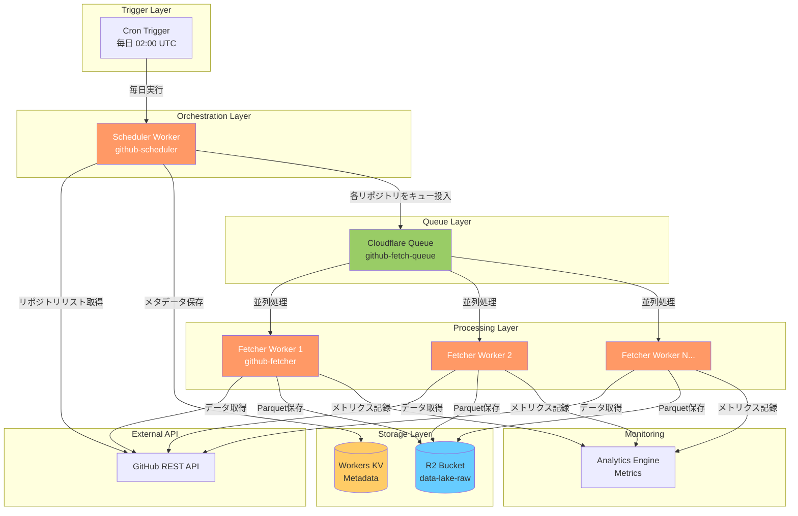
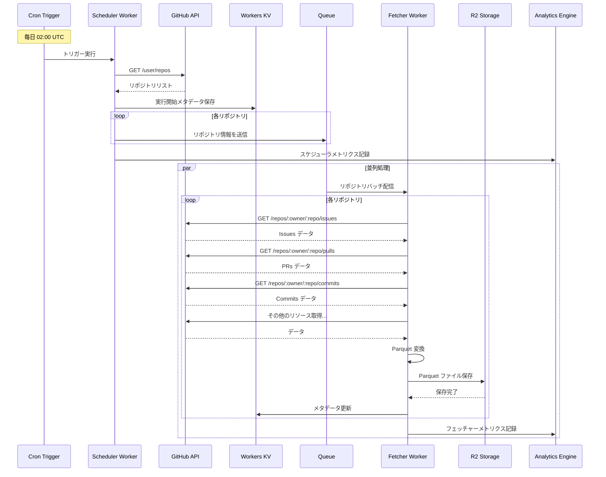

# GitHub データ取得 - Cloudflare Workers 設計ドキュメント

**ステータス**: 設計フェーズ
**作成日**: 2025-01-03
**対象**: GitHub API データを Cloudflare Workers で取得し R2 に保存

## 📋 目次

1. [概要](#概要)
2. [アーキテクチャ](#アーキテクチャ)
3. [Workers構成](#workers構成)
4. [データフロー](#データフロー)
5. [API設計](#api設計)
6. [ストレージ設計](#ストレージ設計)
7. [スケジューリング](#スケジューリング)
8. [エラーハンドリング](#エラーハンドリング)
9. [パフォーマンス最適化](#パフォーマンス最適化)
10. [コスト試算](#コスト試算)
11. [実装計画](#実装計画)

---

## 概要

### 目的

Cloudflare Workers を使用して、GitHub API から全リポジトリのメトリクスとアクティビティデータを自動収集し、R2 に保存する。

### 背景

現在の dlt + GitHub Actions 実装の課題:
- GitHub Actions の実行時間制限 (最大6時間)
- S3互換API経由のR2アクセス (オーバーヘッド)
- Actions 分数の消費
- スケーラビリティの制限

### Workers実装のメリット

| メリット | 詳細 |
|---------|------|
| **ネイティブR2アクセス** | Service Bindings で直接アクセス、レイテンシ削減 |
| **無制限実行時間** | Queues でタスク分割、時間制限なし |
| **グローバルエッジ** | 世界中のデータセンターで実行 |
| **コスト効率** | Workers 無料枠 + 従量課金、Actions 分数不要 |
| **スケーラビリティ** | 自動スケーリング、並列処理 |
| **統合エコシステム** | KV、D1、Queues との連携 |

---

## アーキテクチャ

### システム構成図



### コンポーネント

| コンポーネント | 役割 | 技術 |
|--------------|------|------|
| **Scheduler Worker** | リポジトリ一覧取得、Queueへ投入 | TypeScript Worker |
| **Fetcher Worker** | 各リポジトリのデータ取得、R2保存 | TypeScript Worker |
| **Queue** | タスクの並列処理、リトライ | Cloudflare Queues |
| **R2** | Parquetファイル保存 | R2 Storage |
| **KV** | 実行メタデータ、ステート管理 | Workers KV |
| **Analytics Engine** | メトリクス収集 | Analytics Engine |
| **Cron Trigger** | 定期実行 | Workers Cron |

---

## Workers構成

### 1. Scheduler Worker (`github-scheduler`)

**責務**:
- Cron Trigger で毎日実行
- GitHub API から認証ユーザーの全リポジトリを取得
- リポジトリごとにメッセージを Queue に送信
- 実行メタデータを KV に保存

**エンドポイント**:
- なし (Cron Trigger のみ)

**Bindings**:
```toml
[[queues.producers]]
queue = "github-fetch-queue"
binding = "GITHUB_QUEUE"

[[kv_namespaces]]
binding = "METADATA_KV"
id = "..."

[[analytics_engine_datasets]]
binding = "ANALYTICS"
```

**環境変数**:
- `GITHUB_TOKEN`: GitHub Personal Access Token
- `MAX_REPOS_PER_RUN`: 最大処理リポジトリ数 (デフォルト: 無制限)

**処理フロー**:
```typescript
1. GitHub API で全リポジトリ取得 (ページネーション対応)
2. 各リポジトリの情報を Queue メッセージとして送信
3. 実行開始時刻、リポジトリ数を KV に保存
4. Analytics Engine にメトリクス記録
```

### 2. Fetcher Worker (`github-fetcher`)

**責務**:
- Queue からリポジトリ情報を受信
- GitHub API から詳細データ取得
- Parquet 形式で R2 に保存
- エラー時はリトライ

**エンドポイント**:
- なし (Queue Consumer のみ)

**Bindings**:
```toml
[[queues.consumers]]
queue = "github-fetch-queue"
max_batch_size = 10
max_batch_timeout = 30
max_retries = 3
dead_letter_queue = "github-fetch-dlq"

[[r2_buckets]]
binding = "R2_BUCKET"
bucket_name = "data-lake-raw"

[[kv_namespaces]]
binding = "METADATA_KV"
id = "..."

[[analytics_engine_datasets]]
binding = "ANALYTICS"
```

**環境変数**:
- `GITHUB_TOKEN`: GitHub Personal Access Token
- `FETCH_CONCURRENCY`: 並行取得数 (デフォルト: 5)

**処理フロー**:
```typescript
1. Queue からリポジトリ情報を受信 (バッチ処理)
2. 各リポジトリについて:
   a. Issues を取得 (ページネーション)
   b. Pull Requests を取得
   c. Commits を取得
   d. Stargazers を取得
   e. Releases を取得
   f. Workflow Runs を取得
   g. Reactions を取得
3. 各リソースを Parquet 形式に変換
4. R2 に Hive パーティション形式で保存
5. KV にメタデータ更新 (最終取得時刻など)
6. Analytics Engine にメトリクス記録
```

---

## データフロー

### シーケンス図



### データ取得戦略

#### ページネーション

GitHub API は 1リクエストあたり最大100件まで。大量データは複数リクエストで取得。

```typescript
async function fetchAllIssues(owner: string, repo: string): Promise<Issue[]> {
  const issues: Issue[] = [];
  let page = 1;
  const perPage = 100;

  while (true) {
    const response = await fetch(
      `https://api.github.com/repos/${owner}/${repo}/issues?per_page=${perPage}&page=${page}&state=all`,
      {
        headers: {
          'Authorization': `Bearer ${GITHUB_TOKEN}`,
          'Accept': 'application/vnd.github+json',
        },
      }
    );

    if (!response.ok) {
      throw new Error(`GitHub API error: ${response.status}`);
    }

    const pageIssues = await response.json();

    if (pageIssues.length === 0) break;

    issues.push(...pageIssues);

    // Rate limit チェック
    const remaining = response.headers.get('X-RateLimit-Remaining');
    if (remaining && parseInt(remaining) < 100) {
      // Wait before next request
      await sleep(1000);
    }

    page++;
  }

  return issues;
}
```

#### Rate Limiting

GitHub API Rate Limits:
- **認証済み**: 5,000 リクエスト/時間
- **Secondary Rate Limit**: 同一エンドポイントへの高頻度アクセス制限

対策:
1. `X-RateLimit-Remaining` ヘッダー監視
2. 残数が少ない場合は待機
3. Exponential Backoff でリトライ
4. Secondary Rate Limit 発生時は長めの待機

```typescript
async function fetchWithRateLimit(url: string, token: string): Promise<Response> {
  let retries = 0;
  const maxRetries = 5;

  while (retries < maxRetries) {
    const response = await fetch(url, {
      headers: {
        'Authorization': `Bearer ${token}`,
        'Accept': 'application/vnd.github+json',
      },
    });

    const remaining = parseInt(response.headers.get('X-RateLimit-Remaining') || '0');
    const resetTime = parseInt(response.headers.get('X-RateLimit-Reset') || '0');

    // Secondary rate limit (status 403)
    if (response.status === 403 && response.headers.get('Retry-After')) {
      const retryAfter = parseInt(response.headers.get('Retry-After') || '60');
      console.log(`Secondary rate limit hit. Waiting ${retryAfter}s`);
      await sleep(retryAfter * 1000);
      retries++;
      continue;
    }

    // Primary rate limit exhausted
    if (remaining < 10) {
      const waitTime = (resetTime * 1000) - Date.now();
      if (waitTime > 0) {
        console.log(`Rate limit low. Waiting ${waitTime}ms`);
        await sleep(waitTime);
      }
    }

    if (response.ok) {
      return response;
    }

    // Exponential backoff for other errors
    if (response.status >= 500) {
      const backoff = Math.pow(2, retries) * 1000;
      await sleep(backoff);
      retries++;
      continue;
    }

    throw new Error(`GitHub API error: ${response.status}`);
  }

  throw new Error('Max retries exceeded');
}
```

---

## API設計

### GitHub API エンドポイント

#### 1. リポジトリ一覧取得

```http
GET https://api.github.com/user/repos?per_page=100&page=1&affiliation=owner,collaborator,organization_member
```

**レスポンス**:
```json
[
  {
    "id": 123456,
    "name": "repo-name",
    "full_name": "owner/repo-name",
    "owner": { "login": "owner" },
    "description": "Repository description",
    "stargazers_count": 100,
    "forks_count": 20,
    "language": "TypeScript",
    "created_at": "2024-01-01T00:00:00Z",
    "updated_at": "2025-01-03T00:00:00Z"
  }
]
```

#### 2. Issues 取得

```http
GET https://api.github.com/repos/:owner/:repo/issues?per_page=100&page=1&state=all
```

#### 3. Pull Requests 取得

```http
GET https://api.github.com/repos/:owner/:repo/pulls?per_page=100&page=1&state=all
```

#### 4. Commits 取得

```http
GET https://api.github.com/repos/:owner/:repo/commits?per_page=100&page=1
```

#### 5. Stargazers 取得 (タイムスタンプ付き)

```http
GET https://api.github.com/repos/:owner/:repo/stargazers?per_page=100&page=1
Accept: application/vnd.github.star+json
```

#### 6. Releases 取得

```http
GET https://api.github.com/repos/:owner/:repo/releases?per_page=100&page=1
```

#### 7. Workflow Runs 取得

```http
GET https://api.github.com/repos/:owner/:repo/actions/runs?per_page=100&page=1
```

### Queue メッセージスキーマ

#### Scheduler → Fetcher

```typescript
interface FetchRepositoryMessage {
  owner: string;
  repo: string;
  repoId: number;
  fullName: string;
  runId: string;  // 実行IDでメタデータを追跡
  timestamp: string;  // ISO 8601
  resources: string[];  // 取得するリソース ["issues", "pulls", "commits", ...]
}
```

**例**:
```json
{
  "owner": "ta93abe",
  "repo": "data-engineering-with-cloudflare",
  "repoId": 123456,
  "fullName": "ta93abe/data-engineering-with-cloudflare",
  "runId": "20250103-020000-abc123",
  "timestamp": "2025-01-03T02:00:00Z",
  "resources": ["issues", "pulls", "commits", "stargazers", "releases", "workflow_runs"]
}
```

---

## ストレージ設計

### R2 バケット構造

```
s3://data-lake-raw/sources/github/
├── repositories/
│   └── year=2025/month=01/day=03/
│       └── repo_{owner}_{repo}_{timestamp}.parquet
├── issues/
│   └── year=2025/month=01/day=03/
│       └── issues_{owner}_{repo}_{timestamp}.parquet
├── pull_requests/
│   └── year=2025/month=01/day=03/
│       └── pulls_{owner}_{repo}_{timestamp}.parquet
├── commits/
│   └── year=2025/month=01/day=03/
│       └── commits_{owner}_{repo}_{timestamp}.parquet
├── stargazers/
│   └── year=2025/month=01/day=03/
│       └── stargazers_{owner}_{repo}_{timestamp}.parquet
├── releases/
│   └── year=2025/month=01/day=03/
│       └── releases_{owner}_{repo}_{timestamp}.parquet
└── workflow_runs/
    └── year=2025/month=01/day=03/
        └── workflow_runs_{owner}_{repo}_{timestamp}.parquet
```

### Parquet スキーマ

#### Issues テーブル

```typescript
interface IssueRecord {
  // Metadata
  _extracted_at: string;  // ISO 8601
  _run_id: string;

  // GitHub Data
  id: number;
  number: number;
  title: string;
  state: 'open' | 'closed';
  user_login: string;
  user_id: number;
  labels: string[];  // JSON array
  assignees: string[];  // JSON array
  created_at: string;
  updated_at: string;
  closed_at: string | null;
  body: string | null;
  comments_count: number;

  // Repository Info
  repository_owner: string;
  repository_name: string;
  repository_id: number;
}
```

#### Pull Requests テーブル

```typescript
interface PullRequestRecord {
  _extracted_at: string;
  _run_id: string;

  id: number;
  number: number;
  title: string;
  state: 'open' | 'closed';
  user_login: string;
  user_id: number;
  created_at: string;
  updated_at: string;
  closed_at: string | null;
  merged_at: string | null;
  merge_commit_sha: string | null;
  head_ref: string;
  base_ref: string;
  draft: boolean;

  repository_owner: string;
  repository_name: string;
  repository_id: number;
}
```

### Workers KV スキーマ

#### 実行メタデータ

**キー**: `run:{runId}`

```json
{
  "runId": "20250103-020000-abc123",
  "startedAt": "2025-01-03T02:00:00Z",
  "completedAt": "2025-01-03T03:15:30Z",
  "status": "completed",
  "totalRepos": 150,
  "processedRepos": 150,
  "failedRepos": 2,
  "errorRepos": ["owner/repo1", "owner/repo2"]
}
```

#### リポジトリ取得状態

**キー**: `repo:{owner}/{repo}:last_fetch`

```json
{
  "owner": "ta93abe",
  "repo": "data-engineering-with-cloudflare",
  "lastFetchedAt": "2025-01-03T02:05:30Z",
  "lastRunId": "20250103-020000-abc123",
  "status": "success",
  "resources": {
    "issues": { "count": 45, "fetchedAt": "2025-01-03T02:05:30Z" },
    "pulls": { "count": 12, "fetchedAt": "2025-01-03T02:05:35Z" },
    "commits": { "count": 250, "fetchedAt": "2025-01-03T02:06:00Z" }
  }
}
```

---

## スケジューリング

### Cron Trigger 設定

```toml
# wrangler.toml

[triggers]
crons = ["0 2 * * *"]  # 毎日午前2時 UTC (日本時間 11:00)
```

### 実行頻度オプション

| パターン | Cron 式 | 説明 |
|---------|---------|------|
| 毎日 | `0 2 * * *` | 毎日午前2時 |
| 12時間ごと | `0 */12 * * *` | 0:00, 12:00 |
| 6時間ごと | `0 */6 * * *` | 0:00, 6:00, 12:00, 18:00 |
| 毎週月曜 | `0 2 * * 1` | 毎週月曜午前2時 |

### 手動実行

Scheduler Worker を HTTP エンドポイントとしても公開:

```http
POST https://github-scheduler.example.workers.dev/trigger
Authorization: Bearer <secret-token>
Content-Type: application/json

{
  "repos": ["owner/repo1", "owner/repo2"],  // オプション: 特定リポジトリのみ
  "resources": ["issues", "pulls"]  // オプション: 特定リソースのみ
}
```

---

## エラーハンドリング

### エラー分類

| エラータイプ | ステータスコード | 対応 |
|------------|----------------|------|
| **Rate Limit** | 403 | `Retry-After` ヘッダーに従って待機 |
| **Not Found** | 404 | スキップ (リポジトリが削除された可能性) |
| **Server Error** | 500, 502, 503 | Exponential Backoff でリトライ |
| **Timeout** | - | リトライ |
| **Network Error** | - | リトライ |

### リトライ戦略

#### Queue のリトライ設定

```toml
[[queues.consumers]]
queue = "github-fetch-queue"
max_retries = 3
retry_delay = 60  # 初回リトライまで60秒
```

#### Dead Letter Queue

リトライ上限に達したメッセージは DLQ に送信:

```toml
[[queues.consumers]]
dead_letter_queue = "github-fetch-dlq"
```

**DLQ Consumer**:
- DLQ のメッセージを定期的にチェック
- Slack に通知
- 手動での再処理オプション

### エラーログ

Analytics Engine にエラーメトリクスを記録:

```typescript
await env.ANALYTICS.writeDataPoint({
  blobs: [
    'github_fetch_error',
    owner,
    repo,
    errorType,  // 'rate_limit', 'not_found', 'server_error', etc.
  ],
  doubles: [1],  // エラーカウント
  indexes: ['error_timestamp'],
});
```

---

## パフォーマンス最適化

### 1. 並列処理

**Queue Consumer のバッチサイズ**:
```toml
max_batch_size = 10  # 一度に10リポジトリを処理
max_batch_timeout = 30  # 30秒でバッチをフラッシュ
```

**並行 API リクエスト**:
```typescript
// 1リポジトリ内の複数リソースを並行取得
const [issues, pulls, commits, releases] = await Promise.all([
  fetchAllIssues(owner, repo),
  fetchAllPulls(owner, repo),
  fetchAllCommits(owner, repo),
  fetchAllReleases(owner, repo),
]);
```

### 2. キャッシング

**Workers KV でインクリメンタル取得**:

```typescript
// 前回取得時刻を KV から取得
const lastFetch = await env.METADATA_KV.get(`repo:${owner}/${repo}:last_fetch`, 'json');

// since パラメータで差分のみ取得
const url = lastFetch
  ? `https://api.github.com/repos/${owner}/${repo}/issues?since=${lastFetch.lastFetchedAt}`
  : `https://api.github.com/repos/${owner}/${repo}/issues`;
```

### 3. データ圧縮

Parquet は列指向フォーマットで自動的に圧縮されるが、さらに:
- **Snappy 圧縮**: 高速、適度な圧縮率
- **GZIP 圧縮**: 低速、高圧縮率

```typescript
import { writeParquet } from '@dsnp/parquet-wasm';

const parquetBuffer = writeParquet(data, {
  compression: 'SNAPPY',
});
```

### 4. Rate Limit 管理

**リクエスト間隔の調整**:
```typescript
const REQUESTS_PER_SECOND = 50;  // GitHub API secondary rate limit 対策
const delayMs = 1000 / REQUESTS_PER_SECOND;

for (const page of pages) {
  await fetchPage(page);
  await sleep(delayMs);
}
```

---

## コスト試算

### Workers リクエスト

| 項目 | 無料枠 | 超過料金 |
|-----|-------|---------|
| リクエスト | 100,000/日 | $0.50/百万リクエスト |
| CPU時間 | 10ms/リクエスト | $0.02/百万 GB-s |

**試算** (150リポジトリ、毎日実行):
- Scheduler Worker: 1リクエスト/日
- Fetcher Worker: 150リクエスト/日 (Queue バッチ処理)
- **合計**: 151リクエスト/日 → **無料枠内**

### Queues

| 項目 | 無料枠 | 超過料金 |
|-----|-------|---------|
| 操作 | 100万/月 | $0.40/百万操作 |

**試算**:
- メッセージ送信: 150/日 × 30日 = 4,500/月
- メッセージ配信: 150/日 × 30日 = 4,500/月
- **合計**: 9,000操作/月 → **無料枠内**

### R2 ストレージ

| 項目 | 無料枠 | 超過料金 |
|-----|-------|---------|
| ストレージ | 10 GB/月 | $0.015/GB/月 |
| Class A 操作 | 100万/月 | $4.50/百万操作 |
| Class B 操作 | 1000万/月 | $0.36/百万操作 |

**試算**:
- 1リポジトリあたり 10MB のデータ
- 150リポジトリ × 10MB = 1.5GB
- 書き込み (Class A): 150 × 7リソース × 30日 = 31,500/月
- **ストレージコスト**: 1.5GB → **無料枠内**
- **操作コスト**: 31,500 → **無料枠内**

### Workers KV

| 項目 | 無料枠 | 超過料金 |
|-----|-------|---------|
| 読み取り | 10万/日 | $0.50/1000万リクエスト |
| 書き込み | 1000/日 | $5.00/百万リクエスト |
| ストレージ | 1 GB | $0.50/GB/月 |

**試算**:
- 書き込み: 300/日 (メタデータ更新)
- **コスト**: **無料枠内**

### 月額コスト総計

**前提**: 150リポジトリ、毎日実行

| サービス | 月額コスト |
|---------|----------|
| Workers | $0.00 (無料枠内) |
| Queues | $0.00 (無料枠内) |
| R2 | $0.00 (無料枠内) |
| Workers KV | $0.00 (無料枠内) |
| **合計** | **$0.00** |

> **結論**: 現在の規模では完全に無料枠内で運用可能。

---

## 実装計画

### Phase 1: 基本実装 (Week 1)

- [x] 設計ドキュメント作成
- [ ] Scheduler Worker 実装
  - [ ] GitHub API クライアント
  - [ ] リポジトリ一覧取得
  - [ ] Queue メッセージ送信
  - [ ] KV メタデータ保存
- [ ] Fetcher Worker 基本実装
  - [ ] Queue Consumer セットアップ
  - [ ] Issues 取得
  - [ ] R2 保存 (JSON形式)
- [ ] Cron Trigger 設定
- [ ] ローカルテスト (Miniflare)

### Phase 2: データリソース拡張 (Week 2)

- [ ] Pull Requests 取得
- [ ] Commits 取得
- [ ] Stargazers 取得
- [ ] Releases 取得
- [ ] Workflow Runs 取得
- [ ] Reactions 取得
- [ ] Parquet 変換実装

### Phase 3: エラーハンドリング・最適化 (Week 3)

- [ ] Rate Limit ハンドリング
- [ ] リトライロジック
- [ ] Dead Letter Queue 処理
- [ ] インクリメンタル取得 (KV ベース)
- [ ] 並列処理最適化

### Phase 4: 監視・運用 (Week 4)

- [ ] Analytics Engine 統合
- [ ] Slack 通知
- [ ] ダッシュボード (Grafana/Evidence.dev)
- [ ] アラート設定
- [ ] ドキュメント整備

### Phase 5: 本番デプロイ

- [ ] 本番環境セットアップ
- [ ] Secrets 設定
- [ ] 段階的ロールアウト
- [ ] モニタリング
- [ ] 運用ハンドブック作成

---

## 参考資料

### Cloudflare ドキュメント

- [Workers](https://developers.cloudflare.com/workers/)
- [Queues](https://developers.cloudflare.com/queues/)
- [R2](https://developers.cloudflare.com/r2/)
- [Workers KV](https://developers.cloudflare.com/kv/)
- [Analytics Engine](https://developers.cloudflare.com/analytics/analytics-engine/)
- [Cron Triggers](https://developers.cloudflare.com/workers/configuration/cron-triggers/)

### GitHub API

- [REST API Documentation](https://docs.github.com/en/rest)
- [Rate Limiting](https://docs.github.com/en/rest/rate-limit)
- [Best Practices](https://docs.github.com/en/rest/guides/best-practices-for-using-the-rest-api)

### Parquet

- [@dsnp/parquet-wasm](https://github.com/dsnp/parquet-wasm)
- [Apache Parquet Specification](https://parquet.apache.org/docs/)

---

## 変更履歴

| 日付 | バージョン | 変更内容 |
|-----|-----------|---------|
| 2025-01-03 | 1.0 | 初版作成 |

---

## 承認・レビュー

- [ ] アーキテクチャレビュー
- [ ] コスト承認
- [ ] セキュリティレビュー
- [ ] 実装開始承認
