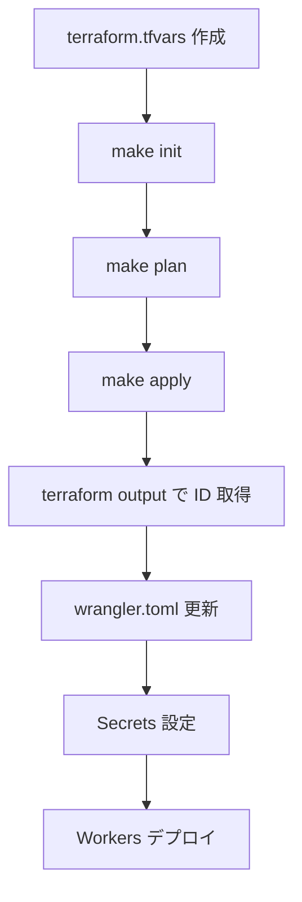

# Terraform Configuration for GitHub Workers

このディレクトリには、Cloudflare Workers を使った GitHub データ取得基盤のインフラストラクチャをコード化した Terraform 設定が含まれています。

## 📦 管理されるリソース

### Terraform で自動作成されるリソース:

- ✅ **R2 Buckets**
  - `data-lake-raw` (本番データ)
  - `data-lake-raw-preview` (テスト用)

- ✅ **Queues**
  - `github-fetch-queue` (メインキュー)
  - `github-fetch-dlq` (Dead Letter Queue)

- ✅ **KV Namespaces**
  - `METADATA_KV` (開発・ステージング用)
  - `METADATA_KV_PRODUCTION` (本番用)

- ✅ **Workers**
  - `github-scheduler` (スケジューラー)
  - `github-fetcher` (フェッチャー)

- ✅ **Queue Consumer**
  - Fetcher Worker の Queue バインディング

- ✅ **Cron Trigger**
  - 毎日 2:00 AM UTC (11:00 AM JST) に実行

### 手動設定が必要なもの:

- ❌ **Secrets** (セキュリティ上、Terraform では管理しない)
  - `GITHUB_TOKEN` (各 Worker に設定)

- ❌ **wrangler.toml の ID 更新**
  - Terraform で作成した KV Namespace ID を反映

詳細は [docs/SETUP_TODO.md](../docs/SETUP_TODO.md) を参照してください。

## 🚀 クイックスタート

```bash
# 1. プロジェクトルートから実行
cd /path/to/data-engineering-with-cloudflare

# 2. 初期セットアップ（terraform.tfvars を作成）
make setup

# 3. terraform.tfvars を編集
nano terraform/terraform.tfvars

# 4. 環境変数を設定
export CLOUDFLARE_API_TOKEN="your-api-token"

# 5. Terraform 初期化
make init

# 6. プランを確認
make plan

# 7. リソース作成
make apply
```

## 📝 設定ファイル

### terraform.tfvars

`terraform.tfvars.example` をコピーして作成:

```bash
cp terraform.tfvars.example terraform.tfvars
```

最低限必要な設定:

```hcl
# 必須: Cloudflare Account ID
cloudflare_account_id = "your-account-id-here"

# 環境 (development, staging, production)
environment = "production"

# R2 バケットのロケーション
r2_location = "APAC"
```

### オプション設定:

```hcl
# Worker へのHTTPルートを有効化する場合
enable_worker_routes = true
cloudflare_zone_id = "your-zone-id"
domain = "example.com"
```

## 🔐 認証

### Cloudflare API Token

環境変数で設定:

```bash
export CLOUDFLARE_API_TOKEN="your-api-token"
```

または `variables.tf` で設定:

```hcl
variable "cloudflare_api_token" {
  description = "Cloudflare API Token"
  type        = string
  sensitive   = true
}
```

### 必要な権限:

- Account | Workers Scripts | Edit
- Account | Workers KV Storage | Edit
- Account | Workers R2 Storage | Edit
- Account | Account Settings | Read

## 📊 Terraform コマンド

### 基本コマンド:

```bash
# 初期化
terraform init

# フォーマット
terraform fmt

# 検証
terraform validate

# プラン
terraform plan

# 適用
terraform apply

# 破棄
terraform destroy

# 出力確認
terraform output
```

### Makefile コマンド（推奨）:

```bash
# 初期化
make init

# プラン確認
make plan

# 適用
make apply

# 破棄
make destroy

# 出力確認
cd terraform && terraform output
```

## 📤 Outputs

Terraform 実行後、以下の情報が出力されます:

```bash
cd terraform
terraform output
```

出力例:

```hcl
kv_namespace_id = "xxxxxxxxxxxxxxxxxxxxxxxxxxxxxxxx"
kv_namespace_production_id = "yyyyyyyyyyyyyyyyyyyyyyyyyyyyyyyy"
queue_name = "github-fetch-queue"
queue_id = "zzzzzzzz-zzzz-zzzz-zzzz-zzzzzzzzzzzz"
r2_bucket_name = "data-lake-raw"
scheduler_worker_name = "github-scheduler"
fetcher_worker_name = "github-fetcher"
```

これらの値を `wrangler.toml` に反映してください。

## 🔄 ワークフロー

### 初回セットアップ:



### 変更適用:

```bash
# 1. Terraform ファイルを編集
nano main.tf

# 2. プラン確認
make plan

# 3. 適用
make apply

# 4. 必要に応じて Workers 再デプロイ
cd workers/github-scheduler && wrangler deploy
cd workers/github-fetcher && wrangler deploy
```

## 🗂️ ディレクトリ構造

```
terraform/
├── README.md                    # このファイル
├── main.tf                      # メインリソース定義
├── variables.tf                 # 変数定義
├── outputs.tf                   # 出力定義
├── terraform.tfvars.example     # 設定ファイルのサンプル
├── terraform.tfvars             # 実際の設定（.gitignoreに追加）
└── .gitignore                   # Git無視ファイル
```

## ⚠️ 注意事項

### 1. State ファイルの管理

現在はローカルに `terraform.tfstate` を保存していますが、本番環境では**リモートバックエンド**の使用を推奨します。

#### Terraform Cloud の場合:

```hcl
terraform {
  backend "remote" {
    organization = "your-org"
    workspaces {
      name = "github-workers-production"
    }
  }
}
```

#### S3 + DynamoDB の場合:

```hcl
terraform {
  backend "s3" {
    bucket         = "your-terraform-state"
    key            = "cloudflare/github-workers/terraform.tfstate"
    region         = "us-east-1"
    dynamodb_table = "terraform-state-lock"
    encrypt        = true
  }
}
```

### 2. Secrets の管理

**絶対に Terraform で管理しないでください:**
- GitHub Personal Access Token
- その他の API キー

これらは `wrangler secret put` コマンドで個別に設定します。

### 3. Workers のソースコード

現在、Worker のソースコードは `file()` 関数で読み込んでいますが、本番環境では以下の方法を検討してください:

- Wrangler CLI でのデプロイ（推奨）
- GitHub Actions による CI/CD
- Workers のバージョニング

### 4. コスト

Terraform で作成されるリソースのほとんどは無料枠内で収まりますが、以下に注意:

- R2: 10GB まで無料
- Workers: 100,000 requests/day まで無料
- KV: 100,000 reads/day まで無料
- Queue: 1,000,000 operations/month まで無料

詳細は [docs/cost-analysis.md](../docs/cost-analysis.md) を参照。

## 🧪 テスト環境

開発/ステージング環境を作成する場合:

```bash
# 別の tfvars ファイルを使用
cp terraform.tfvars terraform.tfvars.staging

# staging 用に編集
nano terraform.tfvars.staging

# 環境を指定して apply
terraform apply -var-file="terraform.tfvars.staging"
```

または Terraform Workspace を使用:

```bash
# 新しいワークスペース作成
terraform workspace new staging

# ワークスペース切り替え
terraform workspace select staging

# 適用
terraform apply
```

## 🔧 トラブルシューティング

### エラー: "Error creating worker"

**原因**: Worker のソースコードに構文エラーがある可能性

**解決策**:
```bash
# TypeScript のコンパイルチェック
cd workers/github-scheduler
npx tsc --noEmit

cd workers/github-fetcher
npx tsc --noEmit
```

### エラー: "Error: Unauthorized"

**原因**: API Token が無効または権限不足

**解決策**:
```bash
# Token を確認
echo $CLOUDFLARE_API_TOKEN

# 再設定
export CLOUDFLARE_API_TOKEN="new-token"

# 権限を確認
# Cloudflare Dashboard → My Profile → API Tokens → Edit Token
```

### エラー: "Error: Queue consumer already exists"

**原因**: 既に Queue Consumer が存在する

**解決策**:
```bash
# State を更新
terraform refresh

# または import
terraform import cloudflare_queue_consumer.github_fetcher <consumer-id>
```

## 📚 参考リソース

- [Terraform Cloudflare Provider](https://registry.terraform.io/providers/cloudflare/cloudflare/latest/docs)
- [Cloudflare Workers Documentation](https://developers.cloudflare.com/workers/)
- [Wrangler CLI Reference](https://developers.cloudflare.com/workers/wrangler/)
- [セットアップ TODO リスト](../docs/SETUP_TODO.md)

---

最終更新: 2025-01-03
